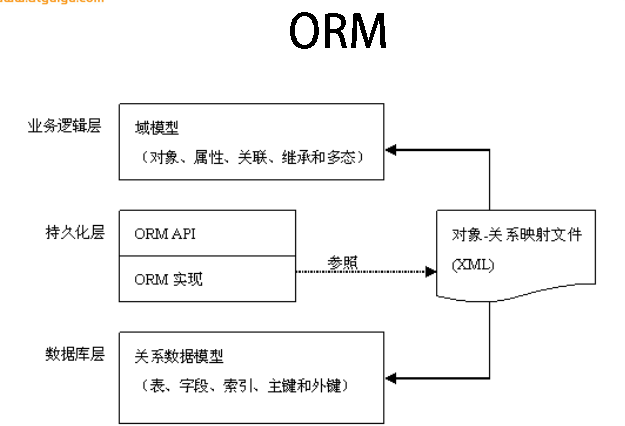

# Hibernate

## 持久化和ORM

### 持久化

- 狭义的理解，“持久化”仅仅指把对象永久保存到数据库中
- 广义的理解，“持久化”包括和数据库相关的各种操作
  - –加载：根据特定的OID（主键：对象标识），把一个对象从数据库加载到内存中。

### ORM

ORM主要解决对象-关系映射

- 思想：将关系数据库中表中的记录映射成为对象，以对象的形式展现，程序员可以把对数据库的操作转化为对对象的操作

- ORM 采用元数据来描述对象-关系映射细节,元数据通常用XML格式，并且存放在专门的对象-关系映射文件中

  

## IDEA ： Hibernate HelloWorld + 配置文件

1. 添加hibernate框架支持，下载hibernate插件，pom.xml依赖对应的包

   ```xml
           <dependency>
               <groupId>mysql</groupId>
               <artifactId>mysql-connector-java</artifactId>
               <version>5.1.43</version>
           </dependency>

           <dependency>
               <groupId>org.hibernate</groupId>
               <artifactId>hibernate-core</artifactId>
               <version>4.3.0.Final</version>
           </dependency>
   ```

2. hibernate.cfg.xml

   ```xml
   <?xml version="1.0" encoding="UTF-8"?>
   <!DOCTYPE hibernate-configuration PUBLIC
           "-//Hibernate/Hibernate Configuration DTD 3.0//EN"
           "http://hibernate.sourceforge.net/hibernate-configuration-3.0.dtd">
   <hibernate-configuration>
       <session-factory>
           <!-- 配置连接数据库的基本信息 -->
           <property name="connection.username">root</property>
           <property name="connection.password">123456</property>
           <property name="connection.driver_class">com.mysql.jdbc.Driver</property>
           <property name="connection.url">jdbc:mysql://localhost:3306/db_hibernate</property>

           <!-- 配置 hibernate 的基本信息 -->
           <!-- hibernate 所使用的数据库方言 -->
           <property name="dialect">org.hibernate.dialect.MySQLInnoDBDialect</property>

           <!-- 执行操作时是否在控制台打印 SQL -->
           <property name="show_sql">true</property>

           <!-- 是否对 SQL 进行格式化 -->
           <property name="format_sql">true</property>

           <!-- 指定自动生成数据表的策略 -->
           <property name="hbm2ddl.auto">update</property>

            <!--指定关联的 .hbm.xml 文件 -->
           <mapping class="com.hibernate.test.TUserEntity"/>
       </session-factory>
   </hibernate-configuration>
   ```

   - 两个选配置项
     - hbm2ddl.auto：生成表策略，属性如下
       - create：会根据.hbm.xml文件来生成数据表，但是每次运行都会删除上一次的表，重新生成表
       - create-drop：会根据.hbm.xml文件来生成数据表，但是SessionFactory一关闭，表自动删除
       - update：（最常用）会根据.hbm.xml文件来生成数据表，但是如果.hbm.xml文件和数据库中的表的结构不同，Hibernate会更新表的结构，不会删除已有的行和列
       - validate：会和数据库中的表进行比较，如果.hbm.xml文件中的列所在的数据库表不存在，则抛出异常
     - format_sql：是否将SQL转化为格式良好的SQL，取值true|false

3. 数据库新建表t_user

4. 左下角persistence点开，生成mapping

   - 可以生成带注解的实体类
   - 也可以生成mxl+实体类

5. RUN：

   ```java
   public class test {
       private static SessionFactory sessionFactory;
       private static Session session;
       private static Transaction transaction;

       public static void main(String[] args) {
         //创建配置对象
         Configuration configuration = new Configuration().configure("hibernate.cfg.xml");
           
         StandardServiceRegistryBuilder standardServiceRegistryBuilder = new StandardServiceRegistryBuilder().applySettings(configuration.getProperties());
           
         StandardServiceRegistry standardServiceRegistry = standardServiceRegistryBuilder.build();
          
         SessionFactory sessionFactory = configuration.buildSessionFactory(standardServiceRegistry);
         
         session = sessionFactory.openSession();//开启会话
         transaction = session.beginTransaction();//开启事务

           // 4. 执行保存操作
           //News news = new News("Java12345", "ATGUIGU", new Date(new java.util.Date().getTime()));
           TUserEntity user = new TUserEntity();
           user.setId(6);
           user.setName("haha");
           session.save(user);
           // 5. 提交事务
           transaction.commit();
           // 6. 关闭 Session
           session.close();

           // 7. 关闭 SessionFactory 对象
           sessionFactory.close();
       }
   ```

## 基础

### 持久化java实体类特点

- 提供有一个无参构造器
  - 使Hibernate可以使用Constructor.newInstance() 来实例化持久化类
- 提供一个标识属性（映射为数据库的主键字段）
  - 如果没有该属性，一些功能将不起作用，如：Session.saveOrUpdate()
- getter/setter方法
  - Hibernate对属性实行持久化。
- 使用非final类
  - 在运行时生成代理是 Hibernate 的一个重要的功能. 如果持久化类没有实现任何接口, Hibnernate 使用 CGLIB 生成代理. 如果使用的是 final 类, 则无法生成 CGLIB 代理.
- 重写equals和hashCode方法
  - 如果需要把持久化类的实例放到 Set 中(当需要进行关联映射时), 则应该重写这两个方法

### Configuration类

- Configuration 类负责管理 Hibernate 的配置信息。包括如下内容：

  - Hibernate 运行的底层信息：数据库的URL、用户名、密码、JDBC驱动类，数据库Dialect,数据库连接池等（对应 hibernate.cfg.xml 文件）。
  - 持久化类与数据表的映射关系（*.hbm.xml 文件）

- 创建 Configuration 的两种方式

  - 属性文件（hibernate.properties）`Configuration cfg = new Configuration();`

  - Xml文件（hibernate.cfg.xml）`Configuration cfg = new Configuration().configure();`

  - Configuration 的 configure 方法还支持带参数的访问：

    ```File file = new File(“simpleit.xml”);```

    `Configuration cfg = new Configuration().configure(file);`

### SessionFactory 接口

- 是针对单个数据库映射关系经过编译后的内存对象，是线程安全的

- 生成Session的工厂

- 构造SessionFactory很小号资源，一般情况下一个应用只初始化一个SessionFactory对象

- 创建SessionFactory步骤

  ```java
  //创建Configuration对象
  Configuration configuration = new Configuration().configure("hibernate.cfg.xml");
  //创建StandardServiceRegistryBuilder
  StandardServiceRegistryBuilder standardServiceRegistryBuilder = new StandardServiceRegistryBuilder().applySettings(configuration.getProperties());
  //通过StandardServiceRegistryBuilder创建standardServiceRegistry
  StandardServiceRegistry standardServiceRegistry = standardServiceRegistryBuilder.build();
  //创建SessionFactory
  SessionFactory sessionFactory = configuration.buildSessionFactory(standardServiceRegistry);
  ```

### Session接口

- 应用程序与数据库之间交互操作的一个单线程对象。

  Hibernate 向应用程序提供的操纵数据库的最主要的接口， 它提供了基本的保存，更新，删除和加载 Java 对象的方法。

- Session 对象有一个一级缓存，显式执行 flush 之前，所有的持久层操作的数据都缓存在 session 对象处。

  位于缓存中的对象称为持久化对象，它和数据库中的相关记录对应。Session 能够在某些时间点，按照缓存中对象的变化来执行相关的 SQL 语句，来同步更新数据库，这一过程被称为刷新缓存(flush)

- 方法：

  - 获取持久化对象：
    - get()
    - load()
  - 持久化对象呢保存、更新和删除
    - save()
    - update()
    - saveOrUpdate()
    - delete()
  - 开启事务：
    - beginTransactionn()
  - 管理session的方法：
    - isOpen()
    - flush()
    - clear()
    - evict()
    - close()

### 主键生成策略（还没写）


### Transaction(事务)

- 代表一次原子操作，它具有数据库事务的概念。

  所有持久层都应该在事务管理下进行，即使是只读操作。   

  `Transaction tx = session.beginTransaction();`

- 常用方法：

  - commit()  提交相关联的Session实例
  - rollback()  撤销事务操作
  - wasCommitted()  检查事务是否提交

## Session缓存

- 在 Session 接口的实现中包含一系列的 Java 集合,，这些 Java 集合构成了 Session 缓存。 只要 Session 实例没有结束生命周期, 且没有清理缓存，则存放在它缓存中的对象也不会结束生命周期

  （缓存中有对象，查询的时候直接把缓存中对象的引用给查询结果，查询结果对象对自己进行修改，实际上也是对缓存中的对象进行修改）

- Session 缓存可减少 Hibernate 应用程序访问数据库的频率

### flush缓存

按照缓存对象的属性来同步更新数据库

- 使数据表中的记录和Session缓存中的对象的状态保持一致，为了保持一致，可能会发送sql语句

#### 刷新缓存的时间点

- 显式调用Session中的flush()方法

- 当应用程序调用Transaction()的commit()方法时，先flush再向数据库提交事务

- 当应用程序执行一些查询操作（HQL，Criteria）时，如果缓存中的持久化对象的属性已经发生了变化，会先flush缓存

- flush 缓存的例外情况：如果对象使用 native 生成器生成 OID（自增ID），那么当调用 Session 的 save() 方法保存对象时，会立即执行向数据库插入该实体的 insert 语句。因为sava方法后，必须保证对象的ID是存在且有效的。

- 设置刷新缓存的时间点：

  若希望改变 flush 的默认时间点, 可以通过 Session 的 setFlushMode() 方法显式设定 flush 的时间点 

  

#### reflush和clear缓存

- reflush()：会强制发送select语句，以使Session缓存中对象的状态和数据库表中对应的记录保持一致

  select语句返回的结果会受到数据库事务隔离级别的影响

  eg：在reflush调用前后搜索同一个对象，在两次搜索中间对被搜索的对象在数据库作更改，数据库事务隔离级别是REPEABLETABLE（可重复读）的时候，select返回的两次结果都是对象未被修改前的结果

- clear()：清理缓存

### 数据库的事务隔离级别


- Oracle 支持的 2 种事务隔离级别：READ COMMITED, SERIALIZABLE. 

  Oracle 默认的事务隔离级别为: READ COMMITED 

- Mysql 支持 4 种事务隔离级别

   Mysql 默认的事务隔离级别为: REPEATABLE READ

#### 设置事务隔离级别

##### 在MySql中设置隔离级别

每启动一个 mysql 程序, 就会获得一个单独的数据库连接. 每个数据库连接都有一个全局变量 @@tx_isolation, 表示当前的事务隔离级别. MySQL 默认的隔离级别为 Repeatable Read

- 查看当前的隔离级别: SELECT @@tx_isolation;


- 设置当前 mySQL 连接的隔离级别:  set transaction isolation level read committed;


- 设置数据库系统的全局的隔离级别: set global transaction isolation level read committed;

##### 在Hibernate中设置隔离级别

JDBC 数据库连接使用数据库系统默认的隔离级别. 在 Hibernate 的配置文件中可以显式的设置隔离级别. 每一个隔离级别都对应一个整数:

- 1------READ UNCOMMITED
- 2------READ COMMITED
- 4------REPEATABLE READ
- 8------SERIALIZEABLE

Hibernate 通过为 Hibernate 映射文件指定 hibernate.connection.isolation 属性来设置事务的隔离级别

```xml
        <!-- hibernate.cfg.xml -->
		<!-- 设置hibernate的事务隔离级别 -->
        <property name="connection.isolation">2</property>
```

## 持久化对象的状态

### 临时对象

- 在使用代理主键的情况下，OID通常为null
- 不处于session的缓存中
- 在数据库中没有对应的记录

### 持久化（托管）对象

- OID不为null
- 位于Session缓存中
- 若在数据库中已经有和其对应的记录，持久化对象和数据库中相关的记录对应
- Session在flush缓存时，会根据持久化对象的属性变化，来同步更新数据库
- 在同一个 Session 实例的缓存中, 数据库表中的每条记录只对应唯一的持久化对象