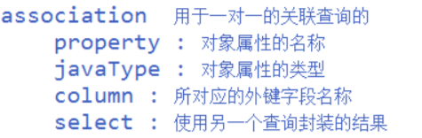
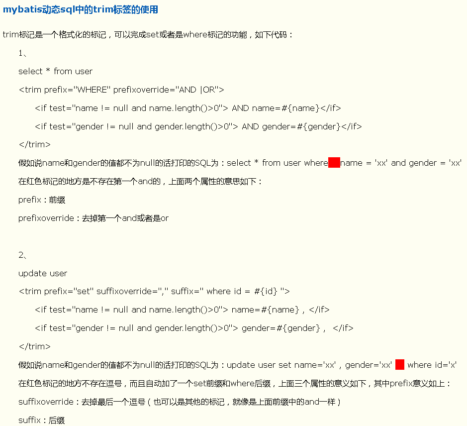
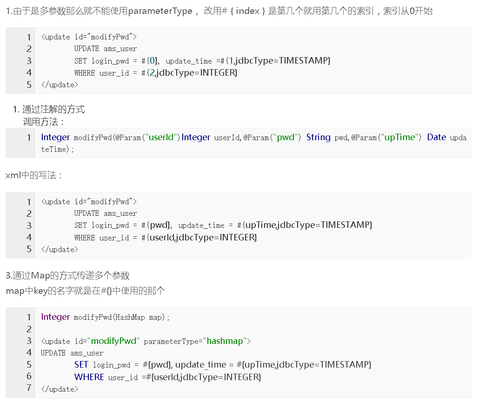

# MyBatis
## xml映射运行程序
### 总配置文件：conf.xml
```xml
<?xml version="1.0" encoding="UTF-8"?>
<!DOCTYPE configuration PUBLIC "-//mybatis.org//DTD Config 3.0//EN"
"http://mybatis.org/dtd/mybatis-3-config.dtd">
<configuration>
    <environments default="development">
        <environment id="development">
            <transactionManager type="JDBC" />
            <dataSource type="POOLED">
                <property name="driver" value="com.mysql.jdbc.Driver" />
                <property name="url" value="jdbc:mysql://localhost:3306/mybatis" />
                <property name="username" value="root" />
                <property name="password" value="root" />
            </dataSource>
        </environment>
    </environments>
    
    <mappers>
        <mapper resource="mapper/User.xml" />
    </mappers>
</configuration>
```
- environments:  
    - deveiopment 开发模式
    - working  工作模式
    - Mybatis可以配置成适应多种环境，这种机制有助于将SQL映射应用于多种数据库之中，例如：开发，测试和生产环境需要不同的配置；或者共享相同的Schema的多个上产数据库，想使用相同的sql映射。
        - 可以配置多个环境，每个 SqlSessionFactory 实例只能选择其一
        - 每个数据库对应一个SqlSessionFactory实例，SqlSessionFactoryBuilder.build()可以构造，如果忽略了环境参数，那么默认环境将会被加载
        - 默认的环境和环境 ID 是一目了然的。随你怎么命名，只要保证默认环境要匹配其中一个环境ID
- 事务管理器有两种：type="[ JDBC | MANAGED ]":
    - JDBC:这个配置就是直接使用了JDBC 的提交和回滚设置，它依赖于从数据源得到的连接来管理事务范围。

    - MANAGED ：这个配置从来都不提交和回滚一个连接，而是让容器来管理事务的整个生命周期（比如JEE应用服务的上下文）。默认情况下他会关闭连接，然而一些容器并不希望这样，因此需要将closeConnection属性设置为false来阻止它默认的关闭行为。
- 三种内建的数据源类型：type=[ UNPOOLED | POOLED | JNDI ]
    - UNPOOLED这个数据源的实现只是每次请求时打开和关闭连接。
    - POOLED 这种数据源的实现利用“池”的概念将JDBC连接对象组织起来，避免了创建先的连接实例时所必须的初始化和认证时间。这是一种使得并发WEb应用快速响应请求的流行的处理方式。
    - JNDI
- mapper：
    - resourse：子xml配置文件的路径
    - class：接口的全类名
    - <package>代替<mapper>：自动识别该包下的所有xml文件

### 子配置文件：xxx.xml
```xml
<mapper namespace=" com.atguigu.mybatis_test.test1.userMapper">
    <select id="getUser" parameterType="int" resultType="com.atguigu.mybatis_test.test1.User">
        select * from users where id=#{id}
    </select>
</mapper>

```
- namespace:名字任意，但必须与其他xml配置文件不冲突，相当于id，一般用比较长的路径名＋自定义名字
- <select></select>
    - id：到时候要使用这个id来使得其中的sql执行
    - parameterType：参数类型
    - resultType：返回结果类型（全类名）
    - 中间的sql：要执行的sql操作语句

### 在java程序中使用
```java
public class Test {
    public static void main(String[] args) throws IOException {
        String resource = "conf.xml";
        //加载 mybatis 的配置文件（它也加载关联的映射文件）
        Reader reader = Resources.getResourceAsReader(resource);
        //构建 sqlSession 的工厂
        SqlSessionFactory sessionFactory = new SqlSessionFactoryBuilder().build(reader);
        //创建能执行映射文件中 sql 的 sqlSession
        SqlSession session = sessionFactory.openSession();
        //映射 sql 的标识字符串
        String statement = "com.atguigu.mybatis.bean.userMapper"+".selectUser";
        //执行查询返回一个唯一 user 对象的 sql
        User user = session.selectOne(statement, 1);
        System.out.println(user);
    }
}
```
- statement: 子配置文件的namespace+修饰<select>的id

## 注解实现运行程序
1. 接口
```java
public interface UserMapper {

	@Insert("insert into users(name, age) values(#{name}, #{age})")
	public int add(User user);
	
	@Delete("delete from users where id=#{id}")
	public int deleteById(int id);
	
	@Update("update users set name=#{name},age=#{age} where id=#{id}")
	public int update(User user);
	
	@Select("select * from users where id=#{id}")
	public User getById(int id);
	
	@Select("select * from users")
	public List<User> getAll();
}
```
2. 在 config 中注册这个映射接口
- <mapper class="com.atguigu.ibatis.crud.ano.UserMapper"/>
3. 实现类中的方法
```java
/*
 * 测试: CRUD操作的注解的实现
 */
public class Test3 {
	
	@Test
	public void testAdd() {
		SqlSessionFactory factory = MybatisUtils.getFactory();
		//默认是手动提交的
		SqlSession session = factory.openSession(true);
		UserMapper mapper = session.getMapper(UserMapper.class);
		int add = mapper.add(new User(-1, "SS", 45));
		System.out.println(add);
		session.close();
	}
	
}
```
- session.getMapper()传接口类做参数,返回该接口的实例化，通过此实例调用接口中的方法

## 几个可以优化的地方
### 把连接数据库的配置单独放在一个 properties 文件中
eg:db.properties如下
```
driver=com.mysql.jdbc.Driver
url=jdbc:mysql://localhost:3306/db_mybatis_test
name=root
password=123456
```
在conf.xml可以作如下修改
- 在<configuration>中加入一句：  
    <properties resource="db.properties" />  
    导入自己的db.properties文件
- conf.xml中的关于数据库的参数可以表示为
```xml
<property name="driver" value="${driver}" />
<property name="url" value="${url}" />
<property name="username" value="${name}" />
<property name="password" value="${password}" />
```
### 为实体类定义别名,简化sql映射xml文件中的引用
在conf.xml的<configuration>中可以配置别名，eg：
```xml
<typeAliases>
    <typeAlias type="com.atguigu.ibatis.bean.User" alias="_User"/>
</typeAliases>
```
- 把com.atguigu.ibatis.bean.User实体类定义别名User，在子映射xml文件中<select>中定义参数类型是时可以用别名，不必再用全类名
- 也可以把整个包定义别名，包中每个实体类的别名就是类名（推荐）,eg:
```xml
<typeAliases>
	<!-- <typeAlias type="com.atguigu.day03_mybaits.test1.User" alias="_User"/> -->
	<package name="com.atguigu.day03_mybaits.bean"/>
</typeAliases>
```
### 可以在src下加入log4j的配置文件,打印日志信息
1. 导入（依赖）log4j-1.2.16.jar
2. log4j的配置文件(放于src目录下)  
  方式一：log4j.properties
```
log4j.properties，
log4j.rootLogger=DEBUG, Console
#Console
log4j.appender.Console=org.apache.log4j.ConsoleAppender
log4j.appender.Console.layout=org.apache.log4j.PatternLayout
log4j.appender.Console.layout.ConversionPattern=%d [%t] %-5p [%c] - %m%n
log4j.logger.java.sql.ResultSet=INFO
log4j.logger.org.apache=INFO
log4j.logger.java.sql.Connection=DEBUG
log4j.logger.java.sql.Statement=DEBUG
log4j.logger.java.sql.PreparedStatement=DEBUG
```
方式二：log4j.xml
```xml
<?xml version="1.0" encoding="UTF-8" ?>
<!DOCTYPE log4j:configuration SYSTEM "log4j.dtd">
<log4j:configuration xmlns:log4j="http://jakarta.apache.org/log4j/">
    <appender name="STDOUT" class="org.apache.log4j.ConsoleAppender">
        <layout class="org.apache.log4j.PatternLayout">
            <param name="ConversionPattern" value="%-5p %d{MM-dd HH:mm:ss,SSS} %m (%F:%L) \n" />
         </layout>
    </appender>
    <logger name="java.sql">
        <level value="debug" />
    </logger>
    <logger name="org.apache.ibatis">
        <level value="debug" />
    </logger>
    <root>
        <level value="debug" />
        <appender-ref ref="STDOUT" />
    </root>
</log4j:configuration>
```
## 接口+xml实现
1. 在conf.xml的<mappers>中注册子xml映射文件
2. 在conf.xml的<mappers>中注册Mapper对应的接口类
3. 创建对应的实体对象
4. 建方法接口和定义操数据库表的sql映射xml文件
    - 子xml文件的namespace应该是接口对应的全类名
    - 子xml的sql语句id要和接口中的方法名称相同

## 字段名与实体类名不相同的冲突
- 方式一: 通过在 sql 语句中定义别名
```xml
<select id="selectOrder" parameterType="int" resultType="_Order">
    select order_id id, order_no orderNo,order_price price from orders where order_id=#{id}
</select>
```
- 方式二: 通过<resultMap>
```xml
<select id="selectOrderResultMap" parameterType="int" resultMap="orderResultMap">
    select * from orders where order_id=#{id}
</select>

<resultMap type="_Order" id="orderResultMap">
    <id property="id" column="order_id"/>
    <result property="orderNo" column="order_no"/>
    <result property="price" column="order_price"/>
</resultMap>
```
## 关联表查询
1. 需求：根据班级 id 查询班级信息(带老师的信息)
2. 两个实体类
```java
public class Teacher {
    private int id;
    private String name;
}
```
```java
public class Classes {
    private int id;
    private String name;
    private Teacher teacher;
}
```
3. 定义sql映射文件
- 方式一: 嵌套结果：使用嵌套结果映射来处理重复的联合结果的子集封装联表查询的数据(去除重复的数据)

```xml
<select id="getClass" parameterType="int" resultMap="ClassResultMap">
    select * from class c, teacher t where c.teacher_id=t.t_id and c.c_id=#{id}
</select>

<resultMap type="_Classes" id="ClassResultMap">
    <id property="id" column="c_id"/>
    <result property="name" column="c_name"/>
    <association property="teacher" column="teacher_id" javaType="_Teacher">
        <id property="id" column="t_id"/>
        <result property="name" column="t_name"/>
    </association>
</resultMap>
```
id表示主键，其他的用result标识
- 方式二：嵌套查询：通过执行另外一个 SQL 映射语句来返回预期的复杂类型
```xml
<select id="getClass2" parameterType="int" resultMap="ClassResultMap2">
    select * from class where c_id=#{id}
</select>

<resultMap type="_Classes" id="ClassResultMap2">
    <id property="id" column="c_id"/>
    <result property="name" column="c_name"/>
    <association property="teacher" column="teacher_id" javaType="_Teacher" select="getTeacher">
    </association>
</resultMap>

<select id="getTeacher" parameterType="int" resultType="_Teacher">
    SELECT t_id id, t_name name FROM teacher WHERE t_id=#{id}
</select>
```
在<association>嵌套一个id为“getTeacher”的查询
> association 用于一对一关联查询  
    property  对象的属性名称  
    javaType  对象属性的类型  
    column    所对应的外键字段名称  
    select   使用另一个查询封装的结果

## CURD操作

```xml

	 <insert id="addUser" parameterType="User">
	 	insert into users(name, age) values(#{name}, #{age})
	 </insert>
	 
	 <delete id="deleteUser" parameterType="int">
	 	delete from users where id=#{id}
	 </delete>
	 
	 <update id="updateUser" parameterType="User">
	 	update users set name=#{name},age=#{age} where id=#{id}
	 </update>
	 
	 <select id="getUser" parameterType="int" resultType="User">
	 	select * from users where id=#{id}
	 </select>
	
	 <select id="getAllUsers" resultType="User">
	 	select * from users
	 </select>
```


## 一对一关联查询

- 方法一：

  ```xml
  <!--
  	方式一：嵌套结果：使用嵌套结果映射来处理重复的联合结果的子集
   		   封装联表查询的数据(去除重复的数据)
  	select * from class c, teacher t where c.teacher_id=t.t_id and c.c_id=1
  -->
  <select id="getClass" parameterType="int" resultMap="ClassResultMap">
  	select * from class c, teacher t where c.teacher_id=t.t_id and c.c_id=#{id}
  </select>

  <resultMap type="_Classes" id="ClassResultMap">
  	<id property="id" column="c_id"/>
  <result property="name" column="c_name"/>
  <association property="teacher" column="teacher_id" javaType="_Teacher">
  	<id property="id" column="t_id"/>
  <result property="name" column="t_name"/>
  </association>
  </resultMap>
  ```

- 方式二：

  ```xml
  <!--
  	xml方式二：嵌套查询：通过执行另外一个 SQL 映射语句来返回预期的复杂类型
  	SELECT * FROM class WHERE c_id=1;
  	SELECT * FROM teacher WHERE t_id=1 //1 是上一个查询得到的 teacher_id 的值
  -->
  <select id="getClass2" parameterType="int" resultMap="ClassResultMap2">
  	select * from class where c_id=#{id}
  </select>

  <resultMap type="_Classes" id="ClassResultMap2">
  	<id property="id" column="c_id"/>
  	
    	<result property="name" column="c_name"/>
  	<association property="teacher" column="teacher_id" javaType="_Teacher" select="getTeacher">
  	</association>
  </resultMap>

  <select id="getTeacher" parameterType="int" resultType="_Teacher">
  	SELECT t_id id, t_name name FROM teacher WHERE t_id=#{id}
  </select>
  ```



## 一对多关联查询

- 方法一:

  ```xml
  <!--
  	方式一: 嵌套结果: 使用嵌套结果映射来处理重复的联合结果的子集
  	SELECT * FROM class c, teacher t,student s WHERE c.teacher_id=t.t_id AND c.C_id=s.class_id AND c.c_id=1
  -->
  <select id="getClass3" parameterType="int" resultMap="ClassResultMap3">
  	select * from class c, teacher t,student s where c.teacher_id=t.t_id and c.C_id=s.class_id and c.c_id=#{id}
  </select>

  <resultMap type="_Classes" id="ClassResultMap3">
  	<id property="id" column="c_id"/>
  	<result property="name" column="c_name"/>
  	<association property="teacher" column="teacher_id" javaType="_Teacher">
  		<id property="id" column="t_id"/>
  		<result property="name" column="t_name"/>
  	</association>
  	<!-- ofType 指定 students 集合中的对象类型 -->
  	<collection property="students" ofType="_Student">
  		<id property="id" column="s_id"/>
  		<result property="name" column="s_name"/>
  	</collection>
  </resultMap>
  ```

- 方法二：

  ```xml
  <!--
  	方式二：嵌套查询：通过执行另外一个 SQL 映射语句来返回预期的复杂类型
  	SELECT * FROM class WHERE c_id=1;
  	SELECT * FROM teacher WHERE t_id=1 //1 是上一个查询得到的 teacher_id 的值
  	SELECT * FROM student WHERE class_id=1 //1 是第一个查询得到的 c_id 字段的值
  -->
  <select id="getClass4" parameterType="int" resultMap="ClassResultMap4">
  	select * from class where c_id=#{id}
  </select>

  <resultMap type="_Classes" id="ClassResultMap4">
  	<id property="id" column="c_id"/>
  	<result property="name" column="c_name"/>
  	<association property="teacher" column="teacher_id" javaType="_Teacher"
  select="getTeacher2">
    	</association>
  	<collection property="students" ofType="_Student" column="c_id" select="getStudent">	</collection>
  </resultMap>

  <select id="getTeacher2" parameterType="int" resultType="_Teacher">
  	SELECT t_id id, t_name name FROM teacher WHERE t_id=#{id}
  </select>

  <select id="getStudent" parameterType="int" resultType="_Student">
  	SELECT s_id id, s_name name FROM student WHERE class_id=#{id}
  </select>
  ```

- collection中对应的colum有毒，目前来看如果搜索的多张表中有相同字段，那么该字段对应的应该是在sql搜索语句中含有该字段的第一张表

- 在接口中如果只是指定返回类型为List，则会返回ArrayList

## 动态sql和模糊搜索

1. 创建查询条件实体类，eg：
```java
private String name;
private int minAge;
private int maxAge;
```
2. 映射文件
```xml
<select id="getUser" parameterType="ConditionUser" resultType="User">
	select * from d_user where 
		
	<if test='name != "%null%"'>
		name like #{name} and 
	</if>
		
	age between #{minAge} and #{maxAge}
</select>
```
- MyBatis中可用的动态SQL标签
    - if
    - choose(when, otherwise)  
      choose标签是按顺序判断其内部when标签中的test条件出否成立，如果有一个成立，则 choose 结束。当 choose 中所有 when 的条件都不满则时，则执行 otherwise 中的sql。
    - trim(where, set)  
        
      直接使用：
        - where 可以忽略第一个and或者or
        - set 可以忽略最后一个“，”
    - foreach  
      mapper中我们要为这个方法传递的是一个容器,将容器中的元素一个一个拼接到xml的方法中就要使用这个forEach这个标签了
    ```xml
    <select id="queryById" resultMap="BaseReslutMap" >
      select * FROM entity where id in 
      <foreach collection="userids" item="userid" index="index" open="(" separator="," close=")">
              #{userid}
      </foreach>
    </select>
    ```
    - concat模糊查询  
      比如说我们想要进行条件查询,但是几个条件不是每次都要使用,那么我们就可以通过判断是否拼接到sql中
    ```xml
    <select id="queryById" resultMap="BascResultMap" parameterType="entity">
        SELECT *  from entity
        <where>
            <if test="name!=null">
                name like concat('%',concat(#{name},'%'))
            </if>
        </where>
    </select>
    ```

## 调用存储过程

```
<!--
已经在数据库中建立好了存储过程ges_user_count(IN class_id INT,OUT student_count INT)
输入参数是班级id，输出班级学生数目
-->
	<select id="getStudentCount" parameterMap="getUserCountMap" statementType="CALLABLE">
        CALL ges_user_count(?, ?)
    </select>
    
    <parameterMap id="getUserCountMap" type="java.util.Map">
        <parameter property="classNumber" mode="IN" jdbcType="INTEGER"/>
        <parameter property="studentCount" mode="OUT" jdbcType="INTEGER"/>
    </parameterMap>
```

- statementType="CALLABLE"调用存储过程

- 用Map传递存储过程的参数,Tset中调用如下

  ```java
          Map<String, Integer> parameterMap = new HashMap<>();
          parameterMap.put("classNumber", 1);
          parameterMap.put("studentCount", -1);
          mapper.getStudentCount(parameterMap);
  ```

  很有趣的是只要用mapper调用了接口中的getStudentCount方法,modo设置为“out”的输出参数是数据库中的学生数目，测试类中的parameterMap的studentCount对应的值也此输出参数的值。

## 一级缓存和二级缓存

- 缓存：	
  1. 映射语句文件中的所有 select 语句将会被缓存。
  2. 映射语句文件中的所有 insert，update 和 delete 语句会刷新缓存。
  3. 缓存会使用 Least Recently Used（LRU，最近最少使用的）算法来收回。
  4. 缓存会根据指定的时间间隔来刷新。
  5. 缓存会存储 1024 个对象

1. 一级缓存（默认开启）: 基于 PerpetualCache 的 HashMap 本地缓存，其存储作用域为 Session，当 Session
  flush 或 close 之后，该 Session 中的所有 Cache 就将清空。

2. 二级缓存(默认不开启)与一级缓存其机制相同，默认也是采用 PerpetualCache，HashMap 存储，不同在于
  其存储作用域为 Mapper(Namespace)，并且可自定义存储源，如 Ehcache。

3. 对于缓存数据更新机制，当某一个作用域(一级缓存 Session/二级缓存 Namespaces)的进行了
  C/U/D 操作后，默认该作用域下所有 select 中的缓存将被 clear。

  - 测试缓存

  1. 一级缓存 : session级的缓存 ，以下情况会被清理缓存

     1. 执行了session.clearCache()
     2. 执行CUD操作
     3. 不是同一个Session对象

  2. 二级缓存: 是一个映射文件级的缓存

     1. 添加一个在 userMapper.xml 中

        ```xml
        <mapper namespace="com.atguigu.mybatis.test8.userMapper">
        	<cache/>
        ```

        补充：  

         ```
        <cache
        eviction="FIFO" //回收策略为先进先出
        flushInterval="60000" //自动刷新时间 60s
        size="512" //最多缓存 512 个引用对象
        readOnly="true"/> //只读
         ```

## MyBatis与Spring的整合

1. 添加jar

   ```
   【mybatis】
   mybatis-3.2.0.jar
   mybatis-spring-1.1.1.jar
   log4j-1.2.17.jar

   【spring】
   spring-aop-3.2.0.RELEASE.jar
   spring-beans-3.2.0.RELEASE.jar
   spring-context-3.2.0.RELEASE.jar
   spring-core-3.2.0.RELEASE.jar
   spring-expression-3.2.0.RELEASE.jar
   spring-jdbc-3.2.0.RELEASE.jar
   spring-test-3.2.4.RELEASE.jar
   spring-tx-3.2.0.RELEASE.jar
   aopalliance-1.0.jar
   cglib-nodep-2.2.3.jar
   commons-logging-1.1.1.jar

   【MYSQL 驱动包】
   mysql-connector-java-5.0.4-bin.jar
   ```

2. 采用前面的第三种方法（xml+接口映射文件）

3. spring 的配置文件: beans.xml

   ```xml
   <?xml version="1.0" encoding="UTF-8"?>
   <beans xmlns="http://www.springframework.org/schema/beans"
   	xmlns:xsi="http://www.w3.org/2001/XMLSchema-instance"
   	xmlns:p="http://www.springframework.org/schema/p"
   	xmlns:context="http://www.springframework.org/schema/context"
   	xmlns:tx="http://www.springframework.org/schema/tx"
   	xsi:schemaLocation="
   	http://www.springframework.org/schema/beans
   	http://www.springframework.org/schema/beans/spring-beans-3.2.xsd
   	http://www.springframework.org/schema/context
   	http://www.springframework.org/schema/context/spring-context-3.2.xsd
   	http://www.springframework.org/schema/tx
   	http://www.springframework.org/schema/tx/spring-tx-3.2.xsd">
     
   	<!-- 1. 数据源 : DriverManagerDataSource -->
   	<bean id="dataSource" class="org.springframework.jdbc.datasource.DriverManagerDataSource">
   		<property name="driverClassName" value="com.mysql.jdbc.Driver"/>
   		<property name="url" value="jdbc:mysql://localhost:3306/mybatis"/>
   		<property name="username" value="root"/>
   		<property name="password" value="root"/>
   	</bean>
     
   	<!-- 2. mybatis 的 SqlSession 的工厂: SqlSessionFactoryBean -->
   	<bean id="sqlSessionFactory" class="org.mybatis.spring.SqlSessionFactoryBean">
   		<property name="dataSource" ref="dataSource"/>
   		<property name="typeAliasesPackage" value="com.atuigu.spring_mybatis2.domain"/>
   	</bean>
     
   	<!-- 3. mybatis 自动扫描加载 Sql 映射文件 : MapperScannerConfigurer -->
   	<bean class="org.mybatis.spring.mapper.MapperScannerConfigurer">
   		<property name="basePackage" value="com.atuigu.spring_mybatis2.mapper"/>
   		<property name="sqlSessionFactory" ref="sqlSessionFactory"/>
   	</bean>
     
   	<!-- 4. 事务管理 : DataSourceTransactionManager -->
   	<bean id="txManager"
   		class="org.springframework.jdbc.datasource.DataSourceTransactionManager">
   		<property name="dataSource" ref="dataSource"/>
   	</bean>
     
   	<!-- 5. 使用声明式事务 -->
   	<tx:annotation-driven transaction-manager="txManager" />
   </beans>
   ```

4. mybatis 的配置文件: mybatis-config.xml

   ```xml
   <?xml version="1.0" encoding="UTF-8" ?>
   <!DOCTYPE configuration
    PUBLIC "-//mybatis.org//DTD Config 3.0//EN"
    "http://mybatis.org/dtd/mybatis-3-config.dtd">
   <configuration>
     <!-- Spring 整合 myBatis 后，这个配置文件基本可以不要了-->
     <!-- 设置外部配置文件 -->
     <!-- 设置类别名 -->
     <!-- 设置数据库连接环境 -->
     <!-- 映射文件 -->
   </configuration>
   ```

   ​

5. 测试

   **注意@Runwith、@ContextConfiguration、@Autowired三个注解**

   ```java
   @RunWith(SpringJUnit4ClassRunner.class) //使用Springtest框架
   @ContextConfiguration("/beans.xml") //加载配置
   public class SMTest {
   	@Autowired //注入
   	private UserMapper userMapper;
   	@Test
   	public void save() {
   		User user = new User();
   		user.setBirthday(new Date());
   		user.setName("marry");
   		user.setSalary(300);
   		userMapper.save(user);
   		System.out.println(user.getId());
   	}
   	@Test
   	public void update() {
   		User user = userMapper.findById(2);
   		user.setSalary(2000);
   		userMapper.update(user);
   	}
   	@Test
   	public void delete() {
   		userMapper.delete(3);
   	}
   	@Test
   	public void findById() {
   		User user = userMapper.findById(1);
   		System.out.println(user);
   	}
   	@Test
   	public void findAll() {
   		List<User> users = userMapper.findAll();
   		System.out.println(users);
   	}
   }
   ```


## mybatis传多参数



第三种方法的jabcType有点坑，每个字母大小写都必须一样，第一个“j”居然小写，，，

# 大坑

- SqlSesson（成员变量）没有关闭，导致ajax请求pending，原因是一个sqlsession对应了多个连接，被多次同时使用，造成阻塞。  **用什么东西记得关啊啊啊**  