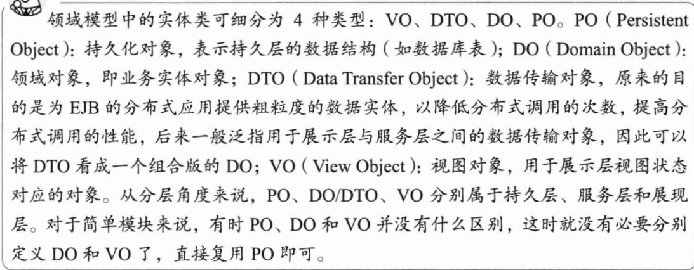

# Tips

## 动态代理

## 领域对象



## 声明式事务

以方法为单位，进行事务控制；抛出异常，事务回滚。

最小的执行单位为方法。决定执行成败是通过是否抛出异常来判断的，抛出异常即执行失败

## 单例模式

单例模式保证一个类仅有一个实例，同时这个类还必须提供一个访问该类的全局访问点。

- 构造函数私有
- 有一个公开的getInstance()方法

```java
public class Singleton 
    { 
        //定义一个私有的静态全局变量来保存该类的唯一实例 
        private static Singleton singleton;

        // 构造函数必须是私有的 
        // 这样在外部便无法使用 new 来创建该类的实例 
        private Singleton() 
        { 
        }

        // 定义一个全局访问点 
        // 设置为静态方法 
        // 则在类的外部便无需实例化就可以调用该方法 
        public static Singleton getInstance() 
        { 
            //这里可以保证只实例化一次 
            //即在第一次调用时实例化 
            //以后调用便不会再实例化 
            if (singleton == null) 
            { 
                singleton = new Singleton(); 
            } 
            return singleton; 
        } 
    } 
```

为支持多进程改进版

```java
 public class Singleton 
    { 
        //定义一个私有的静态全局变量来保存该类的唯一实例 
        private static Singleton singleton;

        //定义一个只读静态对象 
        //且这个对象是在程序运行时创建的 
        private static readonly object syncObject = new object();

        // 构造函数必须是私有的 
        // 这样在外部便无法使用 new 来创建该类的实例 
       private Singleton() 
        {

        }

        // 定义一个全局访问点 
        // 设置为静态方法 
        // 则在类的外部便无需实例化就可以调用该方法 
        public static Singleton getInstance() 
        { 
            //这里可以保证只实例化一次 
            //即在第一次调用时实例化 
            //以后调用便不会再实例化 

            //第一重 singleton == null 
            if (singleton == null) 
            { 
                lock (syncObject) 
                {
                    //第二重 singleton == null
                    if (singleton == null) 
                    { 
                        singleton = new Singleton(); 
                    } 
                } 
            } 
            return singleton; 
        } 
    } 
```

为什么两层判空：

一层判空就可以实现单例，因为对于单例模式的话，new Singleton（）只需要执行一次就 OK 了，而如果没有第一重 singleton == null 的话，每一次有线程进入getInstance（）时，均会执行锁定操作来实现线程同步，这是非常耗费性能的

### 懒汉模式

单例类的唯一实例是在第一次调用 getInstance（）时实例化

```java
        public static Singleton GetInstance() 
        { 
            if (singleton == null) 
            { 
                lock (syncObject) 
                {

                    if (singleton == null) 
                    { 
                        singleton = new Singleton(); 
                    } 
                } 
            } 
            return singleton; 
        }
```

### 饿汉模式

在类装载的时候就完成实例化，避免了线程同步问题。

```java
public class Singleton {

    private final static Singleton INSTANCE = new Singleton();

    private Singleton(){}

    public static Singleton getInstance(){
        return INSTANCE;
    }
}
```

```java
public class Singleton {

    private static Singleton instance;

    static {
        instance = new Singleton();
    }

    private Singleton() {}

    public Singleton getInstance() {
        return instance;
    }
}
```

more:http://www.tuicool.com/articles/NVza2am

## 文件压缩和解压缩

https://segmentfault.com/a/1190000006793053多种压缩包的压缩方法

### ZipEntry

- 构造方法
  - 方法一：参数zipEntry的名称
  - 方法二：参数是另外一个zipEntry对象，把该对象的名称，size，comment等属性赋值给新的zipEntry

### ZipFIle

### ZipInputstream

### ZipOutputStream

### ZipError

### ZipException

## 方法回调

```java
package com.test.archetype.chapter5;

/**
 * Created By huang on 2017/9/9
 */
public class TestReflectMethod {

    private static String s;
    private final static ThreadLocal<String> threadLocal = new ThreadLocal<>();
    private final static InheritableThreadLocal<String> sts = new InheritableThreadLocal<>();

    public static void main(String[] args) throws InterruptedException {
        new TestReflectMethod().something();
    }

    private void something() throws InterruptedException {
        new TestReflectMethod().func(str -> {
            // 子线程
            System.out.println("回调结果：" + str);
            System.out.println(Thread.currentThread().getName());
            s = str;
            sts.set(str);
            System.out.println(sts.get());

        });
        Thread.sleep(2000);
        System.out.println(sts.get());
    }

    //===============================

    public void func(Listener<String> listener){
        new Thread(() -> {
            System.out.println("子线程开启");
            try {
                Thread.sleep(1000);
            } catch (InterruptedException e) {
                e.printStackTrace();
            }
            listener.doSomething("Sthing");
        }).start();
    }

    public interface Listener<T> {
        void doSomething(T str);
    }
}

```

