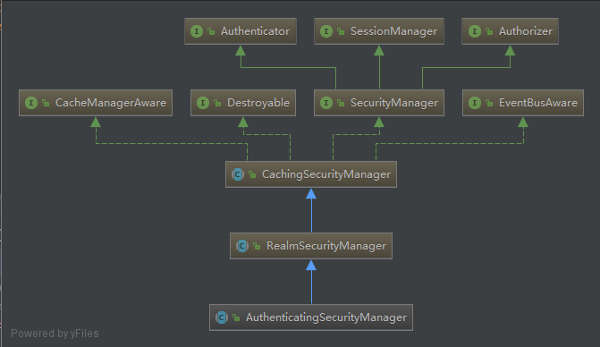
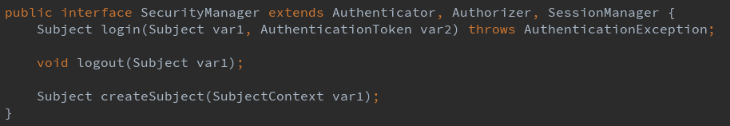
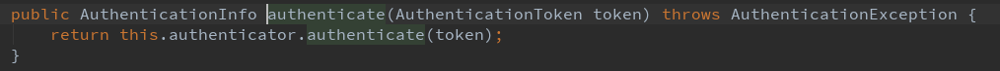

# Shiro Source Code

## 身份认证



1. 自己的controller:

   `subject.login(token)` 

   其实这个subject是DelegatingSubject（实现了Subject）的实例

2.  DelegatingSubject:

   DelegatingSubject的login方法中调用`Subject subject = this.securityManager.login(this, token)`

   这个securityManager是DefaultSecurityManager（实现了SecurityManager）的实例

   

3. DefaultSecurityManager:

   DefaultSecurityManager中的login方法`AuthenticationInfo info = this.authenticate(token);`

   

   DefaultSecurityManager的authenticate()方法中调用认证器authenticator中authenticate()方法

   > 关于authenticator
   >
   > ```java
   > //默认是这个
   > private Authenticator authenticator = new ModularRealmAuthenticator();
   > ```
   >
   > ```java
   > public void setAuthenticator(Authenticator authenticator) throws IllegalArgumentException {
   >     if (authenticator == null) {
   >         String msg = "Authenticator argument cannot be null.";
   >         throw new IllegalArgumentException(msg);
   >     } else {
   >         this.authenticator = authenticator;
   >     }
   > }
   > ```

4. ModularRealmAuthenticator

   抽象父类AbstractAuthenticator的athenticate()方法中

   ``` java
   AuthenticationInfo info;
   info = this.doAuthenticate(token);
   ```

   ```java
   protected abstract AuthenticationInfo doAuthenticate(AuthenticationToken var1) throws AuthenticationException;
   ```

   ModularRealmAuthenticator的doAuthenticate()方法

   ```java
   protected AuthenticationInfo doAuthenticate(AuthenticationToken authenticationToken) throws AuthenticationException {
       this.assertRealmsConfigured();
       Collection<Realm> realms = this.getRealms();
       return realms.size() == 1 ? this.doSingleRealmAuthentication((Realm)realms.iterator().next(), authenticationToken) : this.doMultiRealmAuthentication(realms, authenticationToken);
   }
   ```

   - 获取当前Realm的数目

     如果1：调用doSingleRealmAuthentication()，否则调用doMultiRealmAuthentication()

     截取doMultiRealmAuthentication()：

     ```java
     //获取认证策略
     AuthenticationStrategy strategy = this.getAuthenticationStrategy();

     //初始化Authentication
     AuthenticationInfo aggregate = strategy.beforeAllAttempts(realms, token);

     Iterator var5 = realms.iterator();

     while(var5.hasNext()) {
     	Realm realm = (Realm)var5.next();
         if (realm.supports(token)) {
         	info = realm.getAuthenticationInfo(token);
         	aggregate = strategy.afterAttempt(realm, token, info, aggregate, t);
         ｝  
         aggregate = strategy.afterAllAttempts(token, aggregate);
         return aggregate;
     ｝
     ```

5. MyRealm

   被在ModularRealmAuthenticator中调用父类AuthenticatingRealm的getAuthenticationInfo():

   ```java
   //先从缓存中获取info
   AuthenticationInfo info = this.getCachedAuthenticationInfo(token);
   if (info == null) {
   	//执行MyRealm的doGetAuthenticationInfo方法
       info = this.doGetAuthenticationInfo(token);
   }
   if (info != null) {
     	//判断是否通过认证
       this.assertCredentialsMatch(token, info);
   }
   ```

   - `this.getCachedAuthenticationInfo(token)` 

     ```java
     private AuthenticationInfo getCachedAuthenticationInfo(AuthenticationToken token) {
         AuthenticationInfo info = null;
       	//获取缓存
         Cache<Object, AuthenticationInfo> cache = this.getAvailableAuthenticationCache();
         if (cache != null && token != null) {
           	//通过token获得principle作为Key
             Object key = this.getAuthenticationCacheKey(token);
           	//通过Key拿到当前subject在缓存中的信息  
           	info = (AuthenticationInfo)cache.get(key);
         }
         return info;
     }
     ```

   - `this.doGetAuthenticationInfo(token)`

     会返回一个`SimpleAuthenticationInfo(username, credentials, credentialsSalt, realmName)`

     - SimpleAuthenticationInfo中有三个属性

       principles是一个LinkedHashMap

       储存((Collection)principal, realmName)/(principal, realmName)

       ```
       protected PrincipalCollection principals;
       protected Object credentials;
       protected ByteSource credentialsSalt;
       ```

   - `this.assertCredentialsMatch(token, info)`

     ```java
     protected void assertCredentialsMatch(AuthenticationToken token, AuthenticationInfo info) throws AuthenticationException {
       	//我的测试例子用的是HashCredentialsMatcher
         CredentialsMatcher cm = this.getCredentialsMatcher();
         if (cm != null) {
             if (!cm.doCredentialsMatch(token, info)) {
                 throw new IncorrectCredentialsException(msg);
             }
         }
     }
     ```

6. HashCredentialsMatcher

   ```java
   public boolean doCredentialsMatch(AuthenticationToken token, AuthenticationInfo info) {
     	//从info中获得盐对token中的密码进行加密
       Object tokenHashedCredentials = this.hashProvidedCredentials(token, info);
       Object accountCredentials = this.getCredentials(info);
     	//比对密码
       return this.equals(tokenHashedCredentials, accountCredentials);
   }
   ```

7. 逐级返回，身份验证完毕