# Shiro

## 第一章：简介

### 基本功能

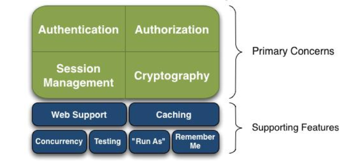

- Authentication：身份验证/登陆，验证用户是不是拥有相应的身份
- Authorization：权限验证，eg：验证某个用户是否拥有某个角色，或者细粒度地验证某个用户对某个资源是否具有某个权限
- SessionManager：会话管理，用户登陆后就是一次会话，在没有退出之前，它的所有信息都在会话中
- Cryptography：加密
- Web Support：Web支持
- Caching：缓存，eg：用户登录后，其用户信息、拥有的角色/权限不用每次去查
- Concurrency：支持多线程应用的并发验证，eg：在一个线程开启另一个线程，能把权限自动传播出去
- Testing：提供测试支持
- Run As：允许一个用户假装另一个用户（如果他们允许）的身份进行访问
- Remember Me：一次登陆后，下次再来就不用登陆了

### Shiro架构

#### 从外部看

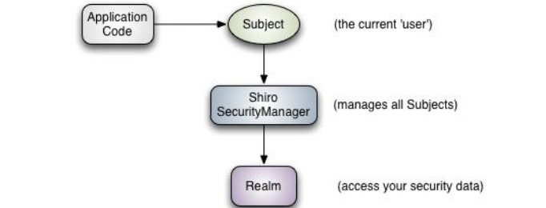

- Subject：（应用代码直接交互的对象，Shiro对外Api的核心）
  - 主体，代表当前“用户”（当前应用交互的任何东西都是Subject，如网络爬虫等）
  - 所有Subject交互都委托给SecurityManager
  - 每个线程都会绑定一个Subject
- SecurityManager：
  - 安全管理器，所有和安全有关的操作都会和它交互，管理所有Subject
  - Shiro的核心，负责与其他组件进行交互，类似mvc中的DispatcherServlet
- Realm：
  - 域，Shiro从Realm中获取安全数据（如用户、角色、权限）
  - 可以看作安全数据源，一般我们都需要实现自己的Realm

#### 从内部看

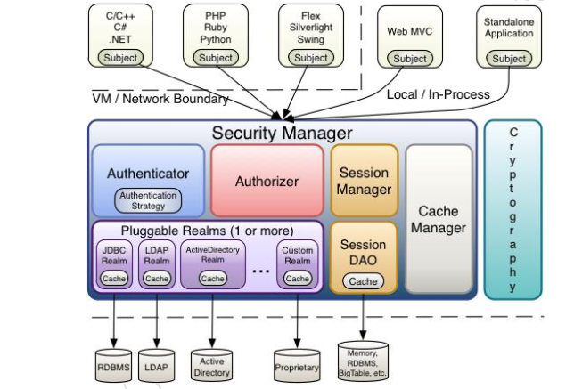

- Authenticator：
  - 认证器，负责主体认证（用户也可以自定义实现）
  - 需要认证策略，即什么情况下用户算是认证通过了
- Authorizer：
  - 授权器，用来决定主体是否有权限进行相应的操作，
- SessionManager：
  - Shiro抽象了一个自己的Session来管理主体与应用之间交互的数据，Session需要有人去管理它的生命周期，这个人就是SessionManager
- SessionDao：
  - 数据访问对象，用于会话的CURD，eg：实现自己的SessionDao就可以实现把Session保存到数据库
  - SessionDao中可以使用Cache进行缓存，以提高性能
- CacheManager：
  - 缓存控制器，来管理如用户、角色、权限等缓存
- Cryptography：
  - 密码模块，加密解密

## 第二章：身份验证

提供以下两个信息，以在应用中证明他就是他本人。。。

- principals：身份，即主体的标识属性，唯一即可（用户名、邮箱等）

  （一个主体可以有多个principals，但是只有一个Primary principals，一般是用户名/密码/手机号）

- creadentials：证明/凭证，只有主体知道的安全值，如密码/数字证书等

### Shiro Helloworld

pom.xml 依赖

```xml
        <dependency>
            <groupId>junit</groupId>
            <artifactId>junit</artifactId>
            <version>4.12</version>
            <scope>test</scope>
        </dependency>
        <dependency>
            <groupId>commons-logging</groupId>
            <artifactId>commons-logging</artifactId>
            <version>1.1.3</version>
        </dependency>
        <dependency>
            <groupId>org.apache.shiro</groupId>
            <artifactId>shiro-core</artifactId>
            <version>1.2.2</version>
        </dependency>
```

shiro.ini

```ini
[users]
zhang=123
wang=123
```

LoginLogoutTest.java

```java
    @Test
    public void testHelloworld() {
      //获得SecurityManager工厂，用ini配置问价初始化
        Factory<SecurityManager> factory = new IniSecurityManagerFactory("classpath:shiro.ini");
      //得到SecurityManager实例，并绑定给SecurityUtils
        SecurityManager securityManager = factory.getInstance();
        SecurityUtils.setSecurityManager(securityManager);
      //得到Subject，获取身份验证token-创建用户名/密码
        Subject subject = SecurityUtils.getSubject();
        UsernamePasswordToken token = new UsernamePasswordToken("zhan", "123");

        try {
            subject.login(token);
            System.out.println("登陆成功");
        } catch (AuthenticationException e) {
            System.out.println("登录失败");
        }
        Assert.assertEquals(true, subject.isAuthenticated());
      //退出
        subject.logout();
    }
```

- 获取SecurityManager并绑定给SecurityUtils，这是一个全局设置，设置一次即可
- 通过SecurityUtils得到Subject，其会自动绑定到当前线程；在Web环境中请求结束时需要解除绑定
- subject.login方法会自动委托给SecurityManager.login方法进行登陆，如果登陆失败要捕获AuthenticationException或其子类（常见如下）：
  - DisabledAccountException：禁用的账号
  - LockedAccountException：锁定的账号
  - UnknownAccountException：错误的账号
  - ExcessiveAttemptsException：登陆失败次数过多
  - IncorrectCreedentialsException：错误的凭证
  - ExpiredCredentialsException：过期的凭证

### 身份认证流程

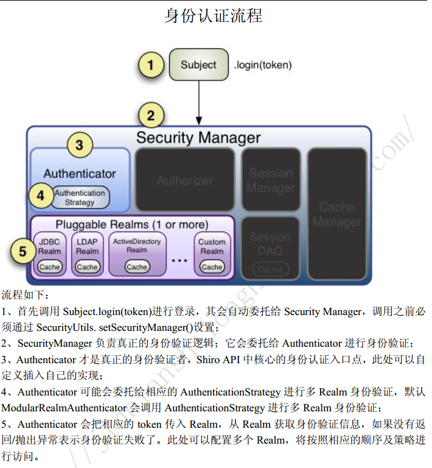

### Realm

域，Shiro从Realm中获取安全数据（如用户、角色、权限）

- org.apache.shiro.realm.Realm接口如下：

  ```java
  String getName();//返回唯一的Realm名字
  boolean support(AuthenticactionToken token);//判断此Realm是否支持Token
  AuthenticationInfo getAuthenticationInfo(AuthenticationToken token) thows AuthenticationException;//根据Token获取认证信息
  ```

#### 单Realm配置

myRealm1.java

```java
public class MyRealm1 implements Realm {
    @Override
    public String getName() {
        return "myRealm1";
    }

    @Override
    public boolean supports(AuthenticationToken token) {
        //仅支持UsernamePasswordToken类型的Token
        return token instanceof UsernamePasswordToken;
    }

    @Override
    public AuthenticationInfo getAuthenticationInfo(AuthenticationToken token)
            throws AuthenticationException {
        //得到用户名
        String username = (String)token.getPrincipal();
        //得到密码
        String password = new String((char[])token.getCredentials());
        if (!"huang".equals(username)) {
            //如果用户名错误
            throw new UnknownAccountException();
        }
        if (!"123".equals(password)) {
            //如果密码错误
            throw new IncorrectCredentialsException();
        }
        //如果身份验证成功，返回一个AuthenticationInfo实现
        return new SimpleAuthenticationInfo(username, password, getName());
    }
}
```

shiro.ini

```ini
#声明一个Realm
myRealm1=com.test.shiro.MyRealm1
#指定securityManager的realms实现
securityManager.realms=$myRealm1

## 亲测后面再配置[users]，就算和users中的用户密码匹配也不会成功了
```

####  多Realm配置

shiro.ini

```ini
#声明一个Realm
myRealm1=com.test.shiro.MyRealm1
myRealm2=com.test.shiro.MyRealm2
#指定securityManager的realms实现
securityManager.realms=$myRealm1,$myRealm2
```

- securityManager会按照realms指定的顺序进行身份验证
- 如果不用securityManager.realms指定顺序，那么securityManager会按照realm声明的顺序进行使用
- 当显式指定realm：` securityManager.realms=$myRealm1`后，其他的realm被忽略

#### shiro默认提供的Realm

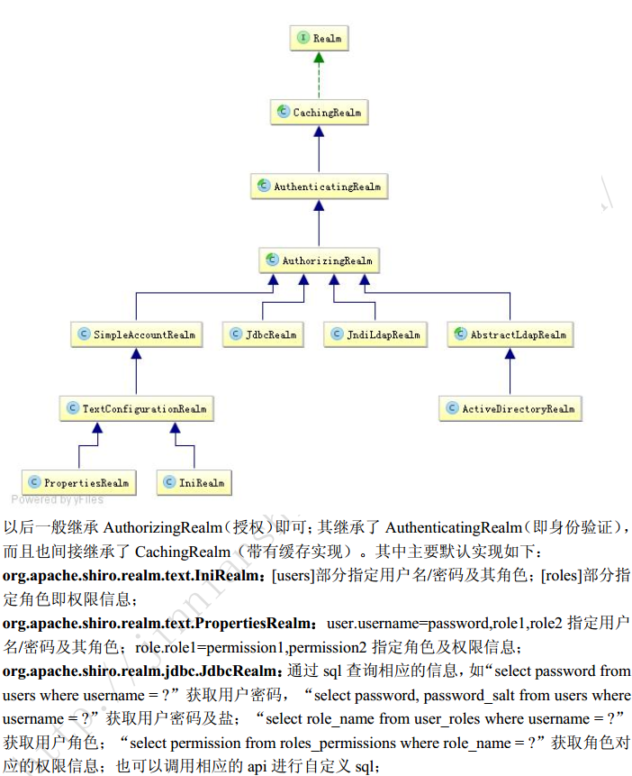

#### JDBC Realm的使用

依赖:

```xml
        <dependency>
            <groupId>mysql</groupId>
            <artifactId>mysql-connector-java</artifactId>
            <version>5.1.25</version>
        </dependency>
        <!-- druid连接池 -->
        <dependency>
            <groupId>com.alibaba</groupId>
            <artifactId>druid</artifactId>
            <version>0.2.23</version>
        </dependency>
```

创建表：

1. users：（用户名/密码），字段是username/password才能成功唉
2. user_roles
3. roles_permissions

shiro.ini

```ini
jdbcRealm=org.apache.shiro.realm.jdbc.JdbcRealm
dataSource=com.alibaba.druid.pool.DruidDataSource
dataSource.driverClassName=com.mysql.jdbc.Driver
dataSource.url=jdbc:mysql://localhost:3306/shiro
dataSource.username=root
dataSource.password=123456
jdbcRealm.dataSource=$dataSource
securityManager.realms=$jdbcRealm
```

- 变量名=全限定类名：会自动创建一个类实例
- 变量名.属性=值：自动调用相应的setter方法
- $变量名：引用之前的一个对象实例

### Authenticator及AuthenticationStrategy

- Authenticator：验证用户账号，是Shiro Api身份验证核心的入口点

  ```java
  pubAuthenticationInfo authenticate(AuthenticationToken var1) throws AuthenticationException;
  ```

  - 如果验证成功，返回AnthenticationInfo验证信息（包含身份及凭证）
  - 如果验证失败，抛出相应的AuthenticationException实现

- ModularRelamAuthenticator：

  用于多Realm时的授权匹配 

  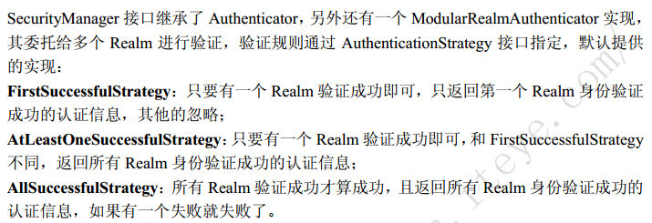

  - ModularRelamAuthenticator默认使用AtLeastOneSuccessfulStrategy策略

- 指定AuthenticationStrategy：

shiro.ini

```ini
#指定securityManager的authenticator实现
authenticator=org.apache.shiro.authc.pam.ModularRealmAuthenticator
securityManager.authenticator=$authenticator

#指定securityManager.authenticator的authenticationStrategy
allSuccessfulStrategy=org.apache.shiro.authc.pam.AllSuccessfulStrategy
securityManager.authenticator.authenticationStrategy=$allSuccessfulStrategy

myRealm1=com.github.zhangkaitao.shiro.chapter2.realm.MyRealm1
myRealm2=com.github.zhangkaitao.shiro.chapter2.realm.MyRealm2
myRealm3=com.github.zhangkaitao.shiro.chapter2.realm.MyRealm3
securityManager.realms=$myRealm1,$myRealm3
```

- 自定义AuthenitcationStrategy：

  一般继承`org.apache.shiro.authc.pam.AbstractAuthencationStrategy` 即可

  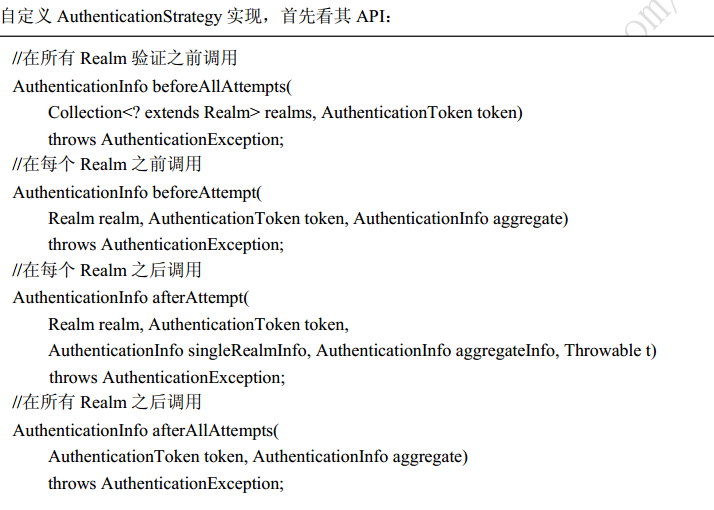

## 第三章：授权

- 主体：访问资源的用户，Shiro中使用Subject代表该用户
- 资源：应用中用户可以访问的任何东西，比如jsp页面，数据，文本等
- 权限：安全策略中的原子授权单位，代表用户有无权利操作某项资源
  - 粗粒度权限：比如用户模块的所有权限
  - 细粒度权限：比如操作某个用户的权限，实例级别的
- 角色：权限的集合
  - 隐式角色：直接通过角色验证用户有没有操作权限，粒度较粗，如果进行修改可能造成多处代码修改
  - 显式角色：在程序中通过权限控制谁能访问某个资源，角色聚合一组权限集合，修改时可以直接对角色代表的权限集合进行修改，无需修改多处代码（以资源/实例为单位，粒度较细）
- 权限级别
  - 资源级别：应用最广泛，最易使用的权限。一个用户可以编辑用户信息或打开一扇门，这里指定的是一类资源，而不是某资源特定的实例。
  - 实例级别：这类权限是针对某类资源的实例。比如：某用户可以编辑IBM公司的客户记录，或者可以打开厨房的门。
  - 属性级别：这类权限针对某类资源或实例的属性。比如：某用户可以编辑IBM公司客户的地址信息。

### 授权方式

Shiro支持三种方式的授权

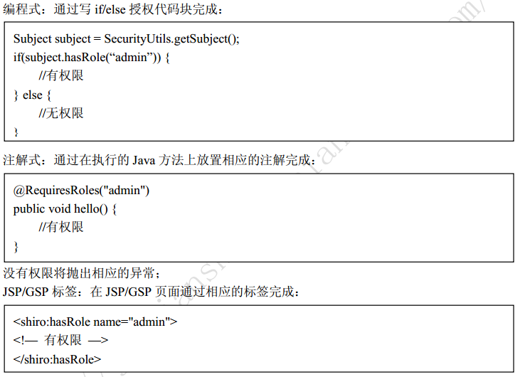

### 授权

- 判断是否拥有某个角色
  - hasRole/hasRoles/hasAllRoles：用于判断用户是否拥有某些角色
  - checkRole/checkRoles：和hasRole的不同是判断为false的时候会抛出UnauthorizedException异常
- 判断是否拥有某个权限
  - isPermitted/isPermittedAll：判断用户是否拥有某个权限
  - checkPermission/checkPermissions：判断用户权限，失败的情况下会抛出UnauthorizedException异常

#### 字符串通配符权限

详细配置见《跟我学Shiro》P24

规则："资源标识符:操作:对象实例ID" ----------->对哪个资源的哪个实例可以进行什么操作

默认支持通配符权限字符串，":"标识资源/操作/实例的分割，"*"表示任意资源/操作/实例

> 对象实例ID实际就是具体被用于操作的实例，比如说`printer:print:F001`资源是打印机，操作是print打印，后面的F001是打印机实例（某一台打印机）

> - 通过`system:user:update,delete`来验证`system:user:update,system:user:delete`是没有问题的，反之不成立
> - Shiro对权限字符串丢失部分的处理
>   - 后缀：`user`可以等价于`user:*`或者`user:*:*`（*可以匹配所有）
>   - 前缀：多个冒号就要多个*匹配

#### 授权流程

1. 首先调用Subject.idPermitted*/hasRole\*接口，其会委托给SecurityManager，而SecurityManager接着委托给Authorizer

2. Authorizer是真正的授权者，我们调用isPermitted("user:view")，会首先通过PermissionResolver把字符串转换成相应的Permission实例

3. 在进行授权之前，会调用相应的Realm获取Subject相应的角色/权限用于匹配传入的角色/权限

4. Authorizer会判断Realm的角色/权限是否和传入的匹配，如果有多个Realm，会委托给ModularRealmAuthorizer进行循环判断

   **ModularRelamAuthorizer进行多Realm匹配流程：**

   1. 检查相应的Realm是否实现了Authorizer

   2. 如果实现了Authorizer，那么接着调用isPermitted*/hasRole\*接口进行匹配

   3. 如果有一个Realm匹配那么将返回true，否则false

      **Realm授权流程：**

      （Realm应该继承AuthorizingRealm）

      1. - 如果调用hasRole*，则直接获取AuthorizationInfo.getRoles()与传入的角色比较即可
         - 如果调用如isPermitted("user:view"),首先通过PermissionResolver将权限字符串转换成相应的Permission实例，默认使用WildcardPermissionResolver，即转换为通配符的WildcardPermission
      2. 通过AuthorizationInfo.getObjectPermission()得到Permission实例集合；通过AuthorizationInfo.getStringPerssions()得到字符串集合并通过PermissionResolver解析为Permission实例；然后获取用户角色，并通过RolePermissionResolver解析角色对应的权限集合（默认没有实现，可以自己提供）
      3. 接着调用Permission.implies(Permission p )逐个与传入的权限比较，如果有匹配的就返回true，否则false

#### Authorizer\PermissionResolver\RolePermissionResolver

- Authorizer：职责是进行授权，提供了用户/权限判断的接口。
  - SecurityManager继承了Authorizer接口，且提供了ModularRealmAuthorizer用于多Realm时授权匹配
- PermissionResolver：用于解析权限字符串到Permission实例
- RolePermissionResolver：根据角色解析相应的权限集合

1. shiro.ini自定义配置

```ini
[main]
#自定义authorizer
authorizer=org.apache.shiro.authz.ModularRealmAuthorizer
#自定义permissionResolver
#permissionResolver=org.apache.shiro.authz.permission.WildcardPermissionResolver
permissionResolver=com.github.zhangkaitao.shiro.chapter3.permission.BitAndWildPermissionResolver
authorizer.permissionResolver=$permissionResolver
#自定义rolePermissionResolver
rolePermissionResolver=com.github.zhangkaitao.shiro.chapter3.permission.MyRolePermissionResolver
authorizer.rolePermissionResolver=$rolePermissionResolver

securityManager.authorizer=$authorizer

#自定义realm 一定要放在securityManager.authorizer赋值之后（因为调用setRealms会将realms设置给authorizer，并给各个Realm设置permissionResolver和rolePermissionResolver）
realm=com.github.zhangkaitao.shiro.chapter3.realm.MyRealm
securityManager.realms=$realm
```

2. 定义BitAndWildPermissionResolver及BitPermission

   BitPermission用于实现位移方式的权限，规则：

   权限字符串格式：+资源字符串+权限位+实例（以+开头，中间通过+分割）

   - 0 所有权限


   - 1 新增 （二进制：0001）
   - 2 修改 （二进制：0010）
   - 4 删除 （二进制：0100）
   - 8 查看 （二进制：1000）

   > +user+10 表示对资源user拥有查看/修改权限
   >
   > 具体实现可以看《跟我学Shiro》P30

## 第四章：INI配置

### 根对象SecurityManager

- Shiro是从根对象SecurityManager进行身份验证和授权的，所有操作都是由它开始
- 这个对象是线程安全的，整个应用只需要一个即可
- Shiro提供了SecurityUtils让我们为它绑定全局，方便后续操作

方法一：纯java代码写法

```java
    public void create() {
        DefaultSecurityManager securityManager = new DefaultSecurityManager();
        //设置authenticator
        ModularRealmAuthenticator authenticator = new ModularRealmAuthenticator();
        authenticator.setAuthenticationStrategy(new AtLeastOneSuccessfulStrategy());
        securityManager.setAuthenticator(authenticator);

        //设置authorizer
        ModularRealmAuthorizer authorizer = new ModularRealmAuthorizer();
        authorizer.setPermissionResolver(new WildcardPermissionResolver());
        securityManager.setAuthorizer(authorizer);

        //设置Realm
        DruidDataSource dataSource = new DruidDataSource();
        dataSource.setDriverClassName("com.mysql.jdbc.Driver");
        dataSource.setUrl("jdbc:mysql://localhost:3306/shiro");
        dataSource.setUsername("root");
        dataSource.setPassword("123456");
        JdbcRealm jdbcRealm = new JdbcRealm();
        jdbcRealm.setDataSource(dataSource);
        jdbcRealm.setPermissionsLookupEnabled(true);
        securityManager.setRealms(Arrays.asList((Realm)jdbcRealm));

        //将SecurityManager设置到SecurityUtils方便全局使用
        SecurityUtils.setSecurityManager(securityManager);
        Subject subject = SecurityUtils.getSubject();
        UsernamePasswordToken token = new UsernamePasswordToken("zhang", "123");
        subject.login(token);
        Assert.assertTrue(subject.isAuthenticated());
    }
```

方法二：等价的INI配置

shiro.ini

```ini
[main]
#覆盖默认的securityManager
#securityManager=org.apache.shiro.mgt.DefaultSecurityManager

#authenticator
authenticator=org.apache.shiro.authc.pam.ModularRealmAuthenticator
authenticationStrategy=org.apache.shiro.authc.pam.AtLeastOneSuccessfulStrategy
authenticator.authenticationStrategy=$authenticationStrategy
securityManager.authenticator=$authenticator

#authorizer
authorizer=org.apache.shiro.authz.ModularRealmAuthorizer
permissionResolver=org.apache.shiro.authz.permission.WildcardPermissionResolver
authorizer.permissionResolver=$permissionResolver
securityManager.authorizer=$authorizer

#realm
dataSource=com.alibaba.druid.pool.DruidDataSource
dataSource.driverClassName=com.mysql.jdbc.Driver
dataSource.url=jdbc:mysql://localhost:3306/shiro
dataSource.username=root
dataSource.password=123456

jdbcRealm=org.apache.shiro.realm.jdbc.JdbcRealm
jdbcRealm.dataSource=$dataSource
jdbcRealm.permissionsLookupEnabled=true
securityManager.realms=$jdbcRealm
```

- 变量名=全限定类名：会自动创建一个类实例
- 变量名.属性=值：自动调用相应的setter方法
- $变量名：引用之前的一个对象实例

test.java

```java
    public void configTest() {
        Factory<SecurityManager> factory = new IniSecurityManagerFactory("classpath:shiro.ini");
        SecurityManager securityManager = factory.getInstance();
        SecurityUtils.setSecurityManager(securityManager);
        Subject subject = SecurityUtils.getSubject();
        UsernamePasswordToken token = new UsernamePasswordToken("zhang", "123");
        subject.login(token);

        Assert.assertTrue(subject.isAuthenticated());
    }
```

上面代码是从INI配置中创建相应的securityManager实例

1. 默认先创建一个名为securityManager，类型为`org.apache.shiro.mgt.DefaultSecurityManager`默认的SecurityManager

   （如果想自定义，在INI配置文件中指定"securityManager=SecurityManager实现类"即可，名字必须为securityManager，他是起始的根）

2. IniSecurityManagerFactory是创建securityManager的工厂，其需要一个INI配置文件路径

   （支持"classpath:"(类路径)，"file"(文件系统)，"url:"(网络)，默认为文件系统）

3. 获取SecurityManager实例

###  INI配置

```ini
[main]
#提供了对根对象 securityManager 及其依赖的配置
securityManager=org.apache.shiro.mgt.DefaultSecurityManager
…………
securityManager.realms=$jdbcRealm
[users]
#提供了对用户/密码及其角色的配置，用户名=密码，角色 1，角色 2
username=password,role1,role2
[roles]
#提供了角色及权限之间关系的配置，角色=权限 1，权限 2
role1=permission1,permission2
[urls]
#用于 web，提供了对 web url 拦截相关的配置，url=拦截器[参数]，拦截器
/index.html = anon
/admin/** = authc, roles[admin], perms["permission1"]
```

#### [main]部分

- 创建对象

  提供了对根对象securityManager及其依赖配置

  `securityManager=org.apache.shiro.mgt.DefaultSecurityManager`

  其构造器必须是public空参数构造器，通过反射创建相应的实例

- 常量值setter注入

  ```ini
  dataSource.driverClassName=com.mysql.jdbc.Driver
  jdbcRealm.permissionsLookupEnabled=true
  ```

  > 自动调用jdbcRealm.setPermissionsLookupEnabled(true) 

- 对象引用setter注入

  ```ini
  authenticator=org.apache.shiro.authc.pam.ModularRealmAuthenticator
  authenticationStrategy=org.apache.shiro.authc.pam.AtLeastOneSuccessfulStrategy
  authenticator.authenticationStrategy=$authenticationStrategy
  securityManager.authenticator=$authenticator
  ```

  > 会自动通过 securityManager.setAuthenticator(authenticator)注入引用依赖 

- 嵌套属性setter注入

  `securityManager.authenticator.authenticationStrategy=$authenticationStrategy `

- byte数组setter注入

  ```ini
  #base64 byte[]
  authenticator.bytes=aGVsbG8=
  #hex byte[]
  authenticator.bytes=0x68656c6c6f
  ```

  默认需要使用 Base64 进行编码，也可以使用 0x 十六进制

- Array/Set/List setter注入

  ```ini
  authenticator.array=1,2,3
  authenticator.set=$jdbcRealm,$jdbcRealm
  ```

  多个之间通过","分割 

- Map setter注入

  `authenticator.map=$jdbcRealm:$jdbcRealm,1:1,key:abc `

  格式是：map=key:value，key:value，可以注入常量及引用值，常量的话都看作字符串

- 实例化/注入顺序

  ```ini
  realm=Realm1
  realm=Realm2
  ```

  后面的覆盖前面的注入

#### [users]部分

用户名=密码，角色1，角色2

#### [roles]部分

角色=权限1，权限2

#### [urls]部分

url=拦截器[参数]，拦截器[参数]

```ini
[urls]
/admin/**=authc,roles[admin],perms["permission1"]
```

## 第五章：编码/解密

### 散列算法

MD5,SHA(SHA256,SHA1,SHA512)等

- 如果直接对密码进行散列相对来说破解更容易，此时我们可以加一些只有系统知道的干扰数据，如用户名和 ID（即盐）；这样散列的对象是“密码+用户名+ID” 

- 另外散列时还可以指定散列次数

   `md5(md5(str))：“new Md5Hash(str, salt, 2).toString()” `

- Shiro提供了通用的散列支持

  ```java
  String str = "hello";
  String salt = "123";
  //内部使用 MessageDigest
  String simpleHash = new SimpleHash("SHA-1", str, salt).toString();
  ```

  通过调用 SimpleHash 时指定散列算法，其内部使用了 Java 的 MessageDigest 实现 

- Shiro 提供了 HashService，默认提供了 DefaultHashService 实现 

  ```java
          //首先创建一个 DefaultHashService，默认使用 SHA-512 算法
          DefaultHashService hashService = new DefaultHashService();
          //修改算法
          hashService.setHashAlgorithmName("SHA-512");
          //私盐，默认无（其在散列时自动与用户传入的公盐混合产生一个新盐）
          hashService.setPrivateSalt(new SimpleByteSource("123"));
          //在用户没有传入公盐的情况下是否生成公盐，默认 false
          hashService.setGeneratePublicSalt(true);
          //用于生成公盐，默认就这个
  		//SecureRandomNumberGenerator 用于生成一个随机数
          hashService.setRandomNumberGenerator(new SecureRandomNumberGenerator());
          //生成 Hash 值的迭代次数
          hashService.setHashIterations(1);
          //需要构建一个 HashRequest，传入算法、数据、公盐、迭代次数
          HashRequest request = new HashRequest.Builder()
                  .setAlgorithmName("MD5").setSource(ByteSource.Util.bytes("hello"))
                  .setSalt(ByteSource.Util.bytes("123")).setIterations(2).build();
  ```

### 加密/解密

Shiro目前只提供对称式的加密/解密算法支持

#### AES算法实现

```java
AesCipherService aesCipherService = new AesCipherService();
aesCipherService.setKeySize(128); //设置 key 长度
//生成 key
Key key = aesCipherService.generateNewKey();
String text = "hello";
//加密
String encrptText =
aesCipherService.encrypt(text.getBytes(), key.getEncoded()).toHex();
//解密
String text2 =
new String(aesCipherService.decrypt(Hex.decode(encrptText), key.getEncoded()).getBytes());
Assert.assertEquals(text, text2);
```

### PasswordService/CredentialsMatcher 

Shiro 提供了 PasswordService 及 CredentialsMatcher 用于提供加密密码及验证密码服务 

PasswordService 接口

```java
public interface PasswordService {
	//输入明文密码得到密文密码
	String encryptPassword(Object plaintextPassword) throws IllegalArgumentException;
}
```

CredentialsMatcher 接口

```java
public interface CredentialsMatcher {
	//匹配用户输入的 token 的凭证（未加密）与系统提供的凭证（已加密）
	boolean doCredentialsMatch(AuthenticationToken token, AuthenticationInfo info);
}
```

- Shiro 默认提供了 PasswordService 实现 DefaultPasswordService


- CredentialsMatcher 实现PasswordMatcher 及 HashedCredentialsMatcher（更强大） 


EG：

MyRealm.java

```java
public class MyRealm extends AuthorizingRealm{
    private PasswordService passwordService;

    public void setPasswordService(PasswordService passwordService) {
        this.passwordService = passwordService;
    }

    @Override
    protected AuthorizationInfo doGetAuthorizationInfo(PrincipalCollection principalCollection) {
        return null;
    }

    @Override
    protected AuthenticationInfo doGetAuthenticationInfo(AuthenticationToken token) throws AuthenticationException {

        return new SimpleAuthenticationInfo(
                "wu",
                passwordService.encryptPassword("123"),
                getName()
        );
    }
}
```

shiro.ini

```ini
[main]
passwordService=org.apache.shiro.authc.credential.DefaultPasswordService
# passwoedService使用DefaultPasswordService，如果必要可自定义
hashService=org.apache.shiro.crypto.hash.DefaultHashService
# hashService定义散列密码使用的HashService，默认使用DefaultHashService（默认SHA-256 算法）
passwordService.hashService=$hashService
# hashFormat 用于对散列出的值进行格式化
hashFormat=org.apache.shiro.crypto.hash.format.Shiro1CryptFormat
passwordService.hashFormat=$hashFormat
hashFormatFactory=org.apache.shiro.crypto.hash.format.DefaultHashFormatFactory
passwordService.hashFormatFactory=$hashFormatFactory

# passwordMatcher 使用 PasswordMatcher，其是一个 CredentialsMatcher 实现
passwordMatcher=org.apache.shiro.authc.credential.PasswordMatcher
passwordMatcher.passwordService=$passwordService

myRealm=com.test.shiro.MyRealm
myRealm.passwordService=$passwordService
myRealm.credentialsMatcher=$passwordMatcher
securityManager.realms=$myRealm
```

> 补充：
>
> - hashFormat 用于对散列出的值进行格式化，默认使用 Shiro1CryptFormat，另外提供了Base64Format 和 HexFormat，对于有 salt 的密码请自定义实现 ParsableHashFormat 然后把
>   salt 格式化到散列值中 
> - hashFormatFactory 用于根据散列值得到散列的密码和 salt；因为如果使用如 SHA 算法，
>   那么会生成一个 salt，此 salt 需要保存到散列后的值中以便之后与传入的密码比较时使用；
>   默认使用 DefaultHashFormatFactory 
> - credentialsMatcher 赋值给 myRealm，myRealm 间接继承了 AuthenticatingRealm，其在调用getAuthenticationInfo 方法获取到 AuthenticationInfo 信 息 后 ， 会 使 用credentialsMatcher 来验证凭据是否匹配，如果不匹配将抛出 IncorrectCredentialsException异常 

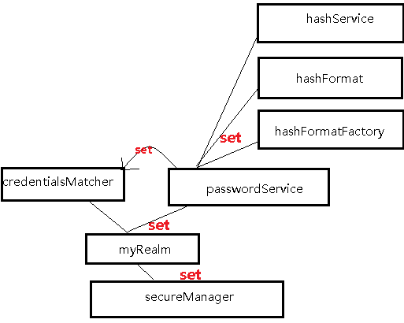


——————————————————————————————————————————————————

#### HashedCredentialsMatcher 实现密码验证服务（密码重试次数限制）

- 和之前的PasswordMatcher 不同的是，它只用于密码验证，且可以提供自己的盐，而不是随机生成盐，
  且生成密码散列值的算法需要自己写，因为能提供自己的盐 

1. shiro.ini

```ini
[main]
credentialsMatcher=org.apache.shiro.authc.credential.HashedCredentialsMatcher
# 指定MD5散列算法
credentialsMatcher.hashAlgorithmName=md5
# 散列迭代次数
credentialsMatcher.hashIterations=2
# 是否储存散列后密码为16进制，默认是base64
credentialsMatcher.storedCredentialsHexEncoded=true

myRealm=com.github.zhangkaitao.shiro.chapter5.hash.realm.MyRealm2
myRealm.credentialsMatcher=$credentialsMatcher
securityManager.realms=$myRealm
```

- HashedCredentialsMatcher 会自动根据 AuthenticationInfo的类型是否是SaltedAuthenticationInfo 来获取 credentialsSalt 盐 

2. MyRealm2.java

```java
String username = "liu"; //用户名及salt1
String salt2 = "0072273a5d87322163795118fdd7c45e";
String password = "be320beca57748ab9632c4121ccac0db"; //加密后的密码
// 在数据库保存着密码和盐，可以直接拿出来使用

SimpleAuthenticationInfo ai = new SimpleAuthenticationInfo(username, password, getName());
ai.setCredentialsSalt(ByteSource.Util.bytes(username + salt2)); //盐是用户名+随机数
return ai;
```

- 把数据封装成 SimpleAuthenticationInfo ， 通过SimpleAuthenticationInfo的credentialsSalt设置盐，HashedCredentialsMatcher 会自动识别这个盐 

3. 测试

```java
@Test
public void test1() {
        login("classpath:shiro-hashedCredentialsMatcher.ini", "liu", "123");
}
```

附：如果使用JdbcRealm，shiro.ini

```ini
[main]
credentialsMatcher=org.apache.shiro.authc.credential.HashedCredentialsMatcher
credentialsMatcher.hashAlgorithmName=md5
credentialsMatcher.hashIterations=2
credentialsMatcher.storedCredentialsHexEncoded=true

dataSource=com.alibaba.druid.pool.DruidDataSource
dataSource.driverClassName=com.mysql.jdbc.Driver
dataSource.url=jdbc:mysql://localhost:3306/shiro
dataSource.username=root
dataSource.password=123456

jdbcRealm=org.apache.shiro.realm.jdbc.JdbcRealm
jdbcRealm.dataSource=$dataSource
jdbcRealm.permissionsLookupEnabled=true
jdbcRealm.saltStyle=COLUMN
jdbcRealm.authenticationQuery=select password, concat(username,password_salt) from users where username = ?
jdbcRealm.credentialsMatcher=$credentialsMatcher
securityManager.realms=$jdbcRealm
```

- saltStyle使用了密码+盐机制，authenticationQuery第一列是密码，第二列是盐

- 通过authenticationQuery指定密码及盐的查询SQL

- 注意：需要设置JdbcRealm的saltStyle 为SaltStyle.COLUMN。saltStyle 是一个枚举类型，然而在ini配置文件中，并不支持设置枚举类型

  - 方法一：Shiro默认使用了apache commons BeanUtils，默认不是进行Enum类型转换型的，此时需要自己注册一个Enum类型转换器

  ````java
      @Test
      public void testHashedCredentialsMatcherWithJdbcRealm() {
  		//注册枚举类型转换器
          BeanUtilsBean.getInstance().getConvertUtils().register(new EnumConverter(), JdbcRealm.SaltStyle.class);

          //使用testGeneratePassword生成的散列密码
          login("classpath:shiro-jdbc-hashedCredentialsMatcher.ini", "liu", "1234");
      }

      private class EnumConverter extends AbstractConverter {
          @Override
          protected String convertToString(final Object value) throws Throwable {
              return ((Enum) value).name();
          }
          @Override
          protected Object convertToType(final Class type, final Object value) throws Throwable {
              return Enum.valueOf(type, value.toString());
          }

          @Override
          protected Class getDefaultType() {
              return null;
          }
      }
  ````

  - 方法二：

    ```java
    Collection<Realm> realms=((RealmSecurityManager) securityManager).getRealms();    
            JdbcRealm jdbcRealm=(JdbcRealm)realms.toArray()[0];
            jdbcRealm.setSaltStyle(SaltStyle.COLUMN);
    ```

#### 密码重试次数限制

一个小时内密码最多重试五次，如果尝试次数超过五次就锁定一小时，一小时后可重试，如果还是重试失败，可以锁定如一天。

- 通过继承HashedCredentialsMatcher，且使用Ehcache记录重试次数和超过时间 

  ```xml
    <dependency>
              <groupId>net.sf.ehcache</groupId>
              <artifactId>ehcache-core</artifactId>
              <version>2.6.6</version>
    </dependency>
  ```

以下例子是输入正确密码则清楚在cache中的记录，否则重试次数加一，超过五次就抛出异常

1. shiro.ini

   ```ini
   [main]
   # 配置自己的RetryLimitHashedCredentialsMatcher来限制密码重试次数
   credentialsMatcher=com.github.zhangkaitao.shiro.chapter5.hash.credentials.RetryLimitHashedCredentialsMatcher
   credentialsMatcher.hashAlgorithmName=md5
   credentialsMatcher.hashIterations=2
   credentialsMatcher.storedCredentialsHexEncoded=true

   myRealm=com.github.zhangkaitao.shiro.chapter5.hash.realm.MyRealm2
   myRealm.credentialsMatcher=$credentialsMatcher
   securityManager.realms=$myRealm
   ```

2. RetryLimitHashedCredentialsMatcher.java

   ```java
   public class RetryLimitHashedCredentialsMatcher extends HashedCredentialsMatcher {

       private Ehcache passwordRetryCache;

       public RetryLimitHashedCredentialsMatcher() {
           CacheManager cacheManager = CacheManager.newInstance(CacheManager.class.getClassLoader().getResource("ehcache.xml"));
           passwordRetryCache = cacheManager.getCache("passwordRetryCache");
       }

       @Override
       public boolean doCredentialsMatch(AuthenticationToken token, AuthenticationInfo info) {
           String username = (String)token.getPrincipal();
           //retry count + 1
           Element element = passwordRetryCache.get(username);
           if(element == null) {
               element = new Element(username , new AtomicInteger(0));
               passwordRetryCache.put(element);
           }
           AtomicInteger retryCount = (AtomicInteger)element.getObjectValue();
           if(retryCount.incrementAndGet() > 5) {
               //if retry count > 5 throw
               throw new ExcessiveAttemptsException();
           }
           boolean matches = super.doCredentialsMatch(token, info);
           if(matches) {
               //clear retry count
               passwordRetryCache.remove(username);
           }
           return matches;
       }
   }
   ```

3. ehcache.xml

   ```xml
   <?xml version="1.0" encoding="UTF-8"?>
   <ehcache name="es">

       <diskStore path="java.io.tmpdir"/>

       <!-- 登录记录缓存 锁定10分钟 -->
       <cache name="passwordRetryCache"
              maxEntriesLocalHeap="2000"
              eternal="false"
              timeToIdleSeconds="3600"
              timeToLiveSeconds="0"
              overflowToDisk="false"
              statistics="true">
       </cache>

   </ehcache>
   ```

4. 测试

   ```java
       @Test(expected = ExcessiveAttemptsException.class)
       public void testRetryLimitHashedCredentialsMatcherWithMyRealm() {
           for(int i = 1; i <= 10; i++) {
               try {
                   login("classpath:shiro-retryLimitHashedCredentialsMatcher.ini", "liu", "234");
               } catch (Exception e) {/*ignore*/
                   System.out.println("登陆失败");
               }
           }
           //login的方法前面有，挺普通的，不copy了了了
           login("classpath:shiro-retryLimitHashedCredentialsMatcher.ini", "liu", "234");
       }
   ```

## 第六章 Realm及相关对象

### 定义实体及关系

用户/角色、角色/权限：多对多关系

- 用户实体：id，username，password，salt，locked
  - locked用于封禁用户是否使用，最好用Enum字段储存，可以实现更加复杂的用户状态实现
- 角色实体：id，role，description，（是否可用）available
- 权限实体：id，permission，description，available
- 用户-角色实体：user_id，role_id，组合为复合主键
- 角色-权限实体：role_id，permission_id，组合为复合主键

### 环境准备

pom.xml-----------------主要加了spring-jdbc依赖

```xml
   <dependencies>
        <dependency>
            <groupId>junit</groupId>
            <artifactId>junit</artifactId>
            <version>4.9</version>
            <scope>test</scope>
        </dependency>
        <dependency>
            <groupId>commons-logging</groupId>
            <artifactId>commons-logging</artifactId>
            <version>1.1.3</version>
        </dependency>
        <dependency>
            <groupId>org.apache.shiro</groupId>
            <artifactId>shiro-core</artifactId>
            <version>1.2.2</version>
        </dependency>
        <dependency>
            <groupId>mysql</groupId>
            <artifactId>mysql-connector-java</artifactId>
            <version>5.1.25</version>
        </dependency>
        <dependency>
            <groupId>com.alibaba</groupId>
            <artifactId>druid</artifactId>
            <version>0.2.23</version>
        </dependency>
        <dependency>
            <groupId>net.sf.ehcache</groupId>
            <artifactId>ehcache-core</artifactId>
            <version>2.6.6</version>
        </dependency>
        <dependency>
            <groupId>org.springframework</groupId>
            <artifactId>spring-jdbc</artifactId>
            <version>4.0.0.RELEASE</version>
        </dependency>
    </dependencies>
```

### Service和Dao

service和dao省略，在《跟我学shiro》第六章源码里面有，基本都是简单的增删查改

此外，还应该有一个加密的工具类，将密码插入数据库的时候要生成盐和储存加密后的密码

```java
public class PasswordHelper {
	private RandomNumberGenerator randomNumberGenerator = new SecureRandomNumberGenerator();
	private String algorithmName = "md5";
	private final int hashIterations = 2;
	public void encryptPassword(User user) {
		user.setSalt(randomNumberGenerator.nextBytes().toHex());
		String newPassword = new SimpleHash(
			algorithmName,
			user.getPassword(),
          	//user.getCredentialsSalt()辅助方法返回 username+salt
			ByteSource.Util.bytes(user.getCredentialsSalt()),
			hashIterations
        ).toHex();
		user.setPassword(newPassword);
	}
}
```

### 定义Realm

UserRealm.java

```java
public class UserRealm extends AuthorizingRealm {

    private UserService userService = new UserServiceImpl();

    @Override
    protected AuthorizationInfo doGetAuthorizationInfo(PrincipalCollection principals) {
        String username = (String)principals.getPrimaryPrincipal();

        SimpleAuthorizationInfo authorizationInfo = new SimpleAuthorizationInfo();
        authorizationInfo.setRoles(userService.findRoles(username));
        authorizationInfo.setStringPermissions(userService.findPermissions(username));

        return authorizationInfo;
    }

    @Override
    protected AuthenticationInfo doGetAuthenticationInfo(AuthenticationToken token) throws AuthenticationException {
        String username = (String)token.getPrincipal();
        User user = userService.findByUsername(username);
        if(user == null) {
            throw new UnknownAccountException();//没找到帐号
        }
        if(Boolean.TRUE.equals(user.getLocked())) {
            throw new LockedAccountException(); //帐号锁定
        }

        //交给AuthenticatingRealm使用CredentialsMatcher进行密码匹配，如果觉得人家的不好可以自定义实现
        SimpleAuthenticationInfo authenticationInfo = new SimpleAuthenticationInfo(
                user.getUsername(), //用户名
                user.getPassword(), //密码
                ByteSource.Util.bytes(user.getCredentialsSalt()),//salt=username+salt
                getName()  //realm name
        );
        return authenticationInfo;
    }
}
```

1. UserRealm的父类AuthorizingRealm将获取Subject相关信息分为两步

   1. 获取身份验证信息（doGetAuthenticationInfo）

      1. 首先根据传入的用户名获取User信息，如果User为空，抛出没有找到账号异常UnknownAccountException；如果User被锁定，抛出锁定异常LockedAccountException

      2. 最后生成AuthenticationInfo信息，交给间接父类AuthenticatingRealm使用CredentialsMatcher进行判断密码是否正确

         - 不正确：IncorrectCredentialsException

         - 密码重复次数太多：ExcessiveAttemptsException

           >  组装SimpleAuthenticationInfo信息需要传入
           >
           > - 身份信息（用户名）
           > - 凭据（密文密码）
           > - 盐（username + salt）
           >
           > **CredentialsMatcher使用盐加密传入的明文密码和此处的密文密码进行匹配**

   2. 获取授权信息（doGetAuthorizationInfo）

      其参数PrincipalCollection是一个身份集合

### AuthenticationToken 

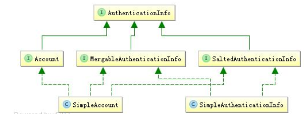

AuthenticationToken 用于收集用户提交的身份及凭据

```java
public interface AuthenticationToken extends Serializable {
	Object getPrincipal(); //身份
	Object getCredentials(); //凭据
}
```

- 拓展接口RememberMeAuthenticationToken：提供了`boolean isRememberMe()` “记住我”功能
- 拓展接口HostAuthenticationToken：提供而来`String getHost()` 获取用户“主机”功能
- Shiro提供了直接使用的UsernamePasswordToken，用于实现用户名/密码Token组

AuthenticationToken  有两个作用：

- 如果Realm是AuthenticatingRealm子类，则提供给AuthenticatingRealm内部使用的CredentialsMatcher进行凭据验证（如果没有继承，就要在自己的Realm中自己实现验证）
- 提供给SecurityManager来创建Subject（提供身份信息）

#### MergableAuthencationInfo

多Realm时合并AuthenticationInfo，主要合并Principal，如果时其他的如credentialsSalt，会用后面的信息覆盖前边的

#### SaltedAuthenticationInfo

HashedCredentialsMatcher在验证时会判断AuthenticationInfo是否是SaltedAuthenticationInfo子类，来获取盐信息

#### Account

Account相当于我们之前的User，SimpleAccount是其中一个实现；

在 IniRealm、PropertiesRealm这种静态创建帐号信息的场景中使用，这些 Realm 直接继承了 SimpleAccountRealm，而SimpleAccountRealm 提供了相关的 API 来动态维护 SimpleAccount；即可以通过这些 API来动态增删改查 SimpleAccount；动态增删改查角色/权限信息。

---------------没看懂

其他情况下一般返回SimpleAuthenticationInfo

### PrincipalCollection

 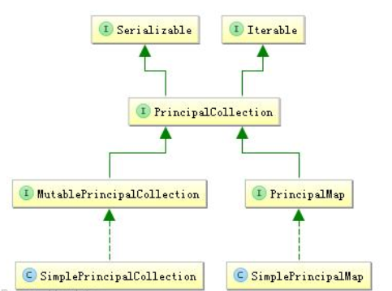

如果配置多个Realm，那么身份信息就可能有多个，因此提供了PrincipalCollection用于聚合这些身份信息

```java
public interface PrincipalCollection extends Iterable, Serializable {
	Object getPrimaryPrincipal(); //得到主要的身份
	<T> T oneByType(Class<T> type); //根据身份类型获取第一个
	<T> Collection<T> byType(Class<T> type); //根据身份类型获取一组
	List asList(); //转换为 List
	Set asSet(); //转换为 Set
	Collection fromRealm(String realmName); //根据 Realm 名字获取
	Set<String> getRealmNames(); //获取所有身份验证通过的 Realm 名字
	boolean isEmpty(); //判断是否为空
}
```

#### MutablePrincipalCollection

MutablePrincipalCollection是一个可变的PrincipalCollection接口，提供了如下可变方法:

```java
public interface MutablePrincipalCollection extends PrincipalCollection {
	void add(Object principal, String realmName); //添加 Realm-Principal 的关联
	void addAll(Collection principals, String realmName); //添加一组 Realm-Principal 的关联
	void addAll(PrincipalCollection principals);//添加 PrincipalCollection
	void clear();//清空
}
```

目前Shiro只提供了一个实现SimplePrincipalCollection

### AuthorizationInfo

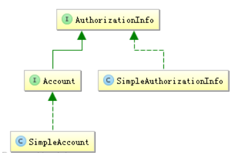

AuthorizationInfo 用于聚合授权信息

```java
public interface AuthorizationInfo extends Serializable {
	Collection<String> getRoles(); //获取角色字符串信息
	Collection<String> getStringPermissions(); //获取权限字符串信息
	Collection<Permission> getObjectPermissions(); //获取 Permission 对象信息
}
```

当我们使用AuthorizingRealm时，如果身份验证成功，在进行授权时就通过doGetAuthorizationInfo方法获取角色/权限信息用于授权验证

- Shiro提供了一个实现SimpleAuthorizationInfo，大多数时候用这个即可
- Account和SimpleAccount，用于SimpleAccountRealm子类，实现动态角色/权限维护（AuthencationInfo中也有介绍，，，，，，，，，，，，两个地方讲得都那么抽象罢了）

### Subject

Subject 是 Shiro 的核心对象，基本所有身份验证、授权都是通过 Subject 完成 

1. 身份信息获取

   ```java
   Object getPrincipal(); //Primary Principal
   PrincipalCollection getPrincipals(); // PrincipalCollection
   ```

2. 身份验证

   ```java
   void login(AuthenticationToken token) throws AuthenticationException;
   boolean isAuthenticated();
   boolean isRemembered();
   ```

   - 通过login登陆，失败将抛出AuthenticationException，如果成功则调用isAuthenticated就会返回true
   - 如果是isRembered返回true，表示记住我功能登陆，而不是login方法登陆的
   - isAuthenticated/isRemembered是互斥的，一个true，另一个就是false

3. 角色授权认证

   ```java
   boolean hasRole(String roleIdentifier);
   boolean[] hasRoles(List<String> roleIdentifiers);
   boolean hasAllRoles(Collection<String> roleIdentifiers);
   void checkRole(String roleIdentifier) throws AuthorizationException;
   void checkRoles(Collection<String> roleIdentifiers) throws AuthorizationException;
   void checkRoles(String... roleIdentifiers) throws AuthorizationException;
   ```

   hasRole\*进行角色验证，验证后返回 true/false；

   checkRole*验证失败时抛出AuthorizationException 异常 

4. 权限授权认证

   ```java
   boolean isPermitted(String permission);
   boolean isPermitted(Permission permission);
   boolean[] isPermitted(String... permissions);
   boolean[] isPermitted(List<Permission> permissions);
   boolean isPermittedAll(String... permissions);
   boolean isPermittedAll(Collection<Permission> permissions);
   void checkPermission(String permission) throws AuthorizationException;
   void checkPermission(Permission permission) throws AuthorizationException;
   void checkPermissions(String... permissions) throws AuthorizationException;
   void checkPermissions(Collection<Permission> permissions) throws AuthorizationException;
   ```

   isPermitted\*进行权限验证，验证后返回 true/false；

   checkPermission*验证失败时抛出AuthorizationException 

5. 会话

   ```java
   Session getSession(); //相当于 getSession(true)
   Session getSession(boolean create);
   ```

   类似于web中的会话，登陆成功就相当于建立了会话，接着就可以使用getSession获取

   如果create=false没有会话就会返回null，而create=true如果没有会话就会强行创建一个

6. 退出

   ```java
   void logout();
   ```

7. RunAs

   ```java
   void runAs(PrincipalCollection principals) throws NullPointerException, IllegalStateException;
   boolean isRunAs();
   PrincipalCollection getPreviousPrincipals();
   PrincipalCollection releaseRunAs();
   ```

   RunAs--------------------------实现“允许A假设B的身份进行访问”

   1. 通过调用subject.runAs(b)进行访问
   2. 通过subject.getPrincipals将获得B的身份
   3. 此时调用isRunAs将返回ture
   4. 而A的身份需要通过subject.getPreviousPrincipals获取
   5. 如果不需要RunAs了，调用subject.releaseRunAs即可

8. 多线程

   ```java
   <V> V execute(Callable<V> callable) throws ExecutionException;
   void execute(Runnable runnable);
   <V> Callable<V> associateWith(Callable<V> callable);
   Runnable associateWith(Runnable runnable);
   ```

   实现线程之间的Subject传播，因为Subject是线程绑定的，因此在多线程执行中需要传播到相应的线程才能获取到相应的Subject：

   1.  最简单的办法就是通过 execute(runnable/callable实例)直接调用 
   2. 或者通过 associateWith(runnable/callable 实例)得到一个包装后的实例 

   这两种方法都是通过：

   1. 把当前线程的subject绑定过去
   2. 在线程执行结束后自动释放

- Subject不会去实现相应的身份验证/授权逻辑，而是通过DelegatingSubject委托给SecurityManager实现

- 创建Subject

  - 一般通过SecurityUtils.getSubject()获取

    ```java
    /**
     * SecurityUtils.getSubject()
     * 首先查看当前线程是否绑定了Subject，如果没有通过Subject.Builder构建一个然后绑定到现场返回
     */
    public static Subject getSubject() {
    	Subject subject = ThreadContext.getSubject();
    	if (subject == null) {
    		subject = (new Subject.Builder()).buildSubject();
    		ThreadContext.bind(subject);
    	}
    	return subject;
    }
    ```

  - 自定义创建

    ```java
    new Subject.Builder().principals(身份).authenticated(true/false).buildSubject()
    ```

    - 这种可以创建相应的 Subject 实例了，然后自己绑定到线程即可。
    - 在 new Builder()时如果没有传入 SecurityManager，自动调用 SecurityUtils.getSecurityManager 获取；也可以自己传入一个实例 

>  对于Subject的一般使用(1,3,5 是必须的)
>
> 1、身份验证（login）
> 2、授权（hasRole*/isPermitted*或 checkRole*/checkPermission*）
> 3、将相应的数据存储到会话（Session）
> 4、切换身份（RunAs）/多线程身份传播
> 5、退出 

## 第七章：与Web集成

### 准备环境

- 创建webapp应用

- 依赖

  ```xml
  <!-- 对比之其前增加servlet和shiro-web -->
  <dependency>
  	<groupId>javax.servlet</groupId>
  	<artifactId>javax.servlet-api</artifactId>
  	<version>3.0.1</version>
  	<scope>provided</scope>
  </dependency>

  <dependency>
  	<groupId>org.apache.shiro</groupId>
  	<artifactId>shiro-web</artifactId>
  	<version>1.2.2</version>
  </dependency>
  ```

- shiro1.2 及以后版本配置方式

  ```xml
      <!-- 
  		Shiro从1.2 之后引入了Environment/WebEnvironment的概念，由它们的实现提供相应的
  		SecurityManager及其相应的依赖；
  		ShiroFilter会自动找到Environment然后获取相应的依赖；
   	-->

  	<!-- 通过EnvironmentListener来创建相应的WebEnvironment，并自动绑定到ServletContext
  		默认使用IniWebEnvironment实现 -->
  	<listener>
          <listener-class>org.apache.shiro.web.env.EnvironmentLoaderListener</listener-class>
      </listener>
      <context-param>
          <param-name>shiroEnvironmentClass</param-name>
          <param-value>org.apache.shiro.web.env.IniWebEnvironment</param-value>
      </context-param>
      <context-param>
          <param-name>shiroConfigLocations</param-name>
        <!-- 默认先从/WEB-INF/shiro.ini，如果没有找到就加载classpath:shiro.ini -->
          <param-value>classpath:shiro.ini</param-value>
      </context-param>
      <filter>
          <filter-name>shiroFilter</filter-name>
          <filter-class>org.apache.shiro.web.servlet.ShiroFilter</filter-class>
      </filter>
      <filter-mapping>
          <filter-name>shiroFilter</filter-name>
          <url-pattern>/*</url-pattern>
      </filter-mapping>
  ```


### Web INI配置

ini部分对比之前只是多了url部分的配置

- [urls] 配置： url=拦截器[参数]，拦截器[参数] 
  - anon拦截器表示匿名访问（即不需要登录即可访问）
  - authc 拦截器表示需要身份认证通过后才能访问
  - roles[admin]拦截器表示需要有 admin 角色授权才能访问
  - perms["user:create"]拦截器表示需要有“user:create”权限才能访问 

> url 模式使用 Ant 风格模式
> Ant 路径通配符支持?、*、**，注意通配符匹配不包括目录分隔符“/”：
>
> - ?：匹配一个字符，如”/admin?”将匹配/admin1，但不匹配/admin ；
> - *：匹配零个或多个字符串，如/admin将匹配/admin、/admin123，但不匹配/admin/1；
> - **：匹配路径中的零个或多个路径，如/admin/将匹配/admin/a 或/admin/a/b 

- url 模式匹配顺序
  按照在配置中的声明顺序匹配，即从头开始使用第一个匹配的 url 模式对应的拦截器链 

  ```ini
  /bb/**=filter1
  /bb/aa=filter2
  /**=filter3

  # 如果请求的 url 是“/bb/aa”，因为按照声明顺序进行匹配，那么将使用 filter1 进行拦截
  ```

For Example:

```ini
[main]
# 访问这些地址时会首先判断用户有没有登录，如果没有登录默会跳转到登录页面，默认是/login.jsp
authc.loginUrl=/login
# unauthorizedUrl:授权失败时跳转的页面
roles.unauthorizedUrl=/unauthorized
perms.unauthorizedUrl=/unauthorized
[users]
zhang=123,admin
wang=123
[roles]
admin=user:*,menu:*
[urls]
/login=anon
/unauthorized=anon
/static/**=anon
/authenticated=authc
/role=authc,roles[admin]
/permission=authc,perms["user:create"]
```

#### 基于Basic的拦截器身份验证

shiro.ini

```ini
[main]
authcBasic.applicationName=please login
………省略 users
[urls]
/role=authcBasic,roles[admin]
```

访问`/role`时，如果没有身份认证（登陆），那么会弹出的登录框 ，并且出现applicationName的提示信息

> - authcBasic 是 org.apache.shiro.web.filter.authc.BasicHttpAuthenticationFilter 类型的实例，其用于实现基于 Basic 的身份验证
> - applicationName 用于弹出的登录框显示信息使用
> - [urls]部分配置了/role 地址需要走 authcBasic 拦截器，即如果访问/role 时还没有通过身
>   份验证那么将弹出对话框进行登录，登录成功即可访问  

#### 基于表单的拦截器身份认证

shiro.ini

```ini
[main]
# loginUrl 指定当身份验证时的登录表单（表单的action）
authc.loginUrl=/formfilterlogin
# usernameParam 指定登录表单提交的用户名参数名
authc.usernameParam=username
# passwordParam 指定登录表单提交的密码参数名
authc.passwordParam=password
# successUrl指定登录成功后重定向的默认地址（默认是“/”）（如果有上一个地址会自动重定向带该地址）
authc.successUrl=/
# failureKeyAttribute 指定登录失败时的 request 属性 key（默认 shiroLoginFailure）
# 这样可以在登录表单得到该错误 key 显示相应的错误消息
authc.failureKeyAttribute=shiroLoginFailure
[urls]
/role=authc,roles[admin]
```

> - authc 是 org.apache.shiro.web.filter.authc.FormAuthenticationFilter 类型的实例 ，其用于实
>   现基于表单的身份验证 
>
> - 会自动进行身份认证，在Servlet中只需要req.getAttribute("shiroLoginFailure")获取错误信息，如果没有就是登陆成功，有就是登陆失败
>
>   eg:
>
>   ```java
>       protected void doPost(HttpServletRequest req, HttpServletResponse resp) throws ServletException, IOException {
>           String errorClassName = (String)req.getAttribute("shiroLoginFailure");
>
>           if(UnknownAccountException.class.getName().equals(errorClassName)) {
>               req.setAttribute("error", "用户名/密码错误");
>           } else if(IncorrectCredentialsException.class.getName().equals(errorClassName)) {
>               req.setAttribute("error", "用户名/密码错误");
>           } else if(errorClassName != null) {
>               req.setAttribute("error", "未知错误：" + errorClassName);
>           }
>
>           req.getRequestDispatcher("index.jsp").forward(req, resp);
>       }
>   ```

#### 授权（角色/权限认真）

shiro.ini

```ini
[main]
roles.unauthorizedUrl=/unauthorized
perms.unauthorizedUrl=/unauthorized
[urls]
/role=authc,roles[admin]
/permission=authc,perms["user:create"]
```

- unauthorizedUrl 属性指定如果授权失败时重定向到的地址 

> - roles 是org.apache.shiro.web.filter.authz.RolesAuthorizationFilter 类型的实例，通过参数指定访问时需要的角色，如“[admin]”，如果有多个使用“，”分割，且验证时是 hasAllRole 验证，即且的关系。
> - Perms 是 org.apache.shiro.web.filter.authz.PermissionsAuthorizationFilter 类型的实例

#### 退出登陆

shiro.ini

```ini
[urls]
/logout=anon
```

指定/logout使用anon拦截器

LogoutServlet

```java
protected void doGet(HttpServletRequest req, HttpServletResponse resp) throws ServletException, IOException {
	SecurityUtils.getSubject().logout();
	req.getRequestDispatcher("/WEB-INF/jsp/logoutSuccess.jsp").forward(req, resp);
}
```

——————————————————————————————————————————————————

Shiro也提供了logout拦截器用于退出

（其是 org.apache.shiro.web.filter.authc.LogoutFilter 类型的实例 ）

shiro.ini

```INI
[main]
#  logout.redirectUrl 指定退出后重定向的地址
logout.redirectUrl=/login
[urls]
# 通过/logout2=logout 指定退出 url 是/logout2
/logout2=logout

# 访问/logout2 即可退出
```

## 第八章：拦截器机制

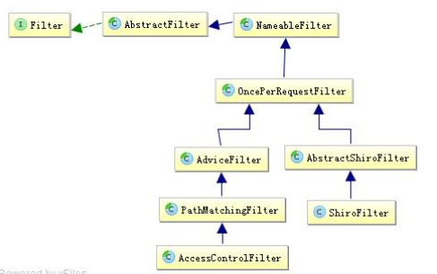

1. NameableFilter

   NameableFilter 给 Filter 起个名字，如果没有设置默认就是 FilterName

2. OncePerRequestFilter

   OncePerRequestFilter 用于防止多次执行 Filter 的 

3. ShiroFilter

4. AdviceFilter

5. PathMatchingFilter

6. AccessControllFilter