# Spring 4.x

## 配置Bean

### Bean的命名

- id和name都可以声明Bean，但是id唯一，name不唯一，getBean的时候会返回最后一个声明的Bean
- id和name都可以为同一个Bean定义多个

```xml
<bean id="id1,id2,id3" class="com.xxx.xxx" />
```

- 如果id和name都不指定，那么可以通过getBean("全类名")来获得bean对象
- 如果存在多个匿名Bean，那么：

```xml
<!--第一个getBean("com.xxx.xxx.Car")获得-->
<bean class="com.xxx.xxx.Car" />
<!--第二个getBean("com.xxx.xxx.Car#1")获得-->
<bean class="com.xxx.xxx.Car" />
<!--第三个getBean("com.xxx.xxx.Car#2")获得-->
<bean class="com.xxx.xxx.Car" />
```

### 依赖注入(属性注入/构造函数注入)

#### 属性注入

- 要求：Bean提供一个默认的构造函数（不带参）、为需要注入的属性提供Setter方法

  > Spring先调用Bean的moren构造函数实例化Bean对象，然后通过反射调用Setter方法注入属性值。

- JavaBean的命名规范：

  1. xxx属性对应setXxx()方法
  2. 变量前两个字母要么全部大写，要么全部小写

#### 构造函数注入

它保证一些**必要的属性**在Bean实例化时就得到设置，确保Bena在实例化后就可以使用

1. 按照类型匹配入参

   Car.java

   ```java
   public class Car {
   ```
   	public Car(String brand, double price) {
   	  this.brand = brand;
   	  this.price = price;
   	}
   }
   ```

   beans.xml

   ​```xml
   <bean id="car1" class="com.xxx.xxx.Car">
   	<constructor-arg type="java.lang.String">
   		<value>红旗</value>
   	</constructor-arg>
   	<constructor-arg type="double">
   		<value>20000</value>
   	</constructor-arg>
   </bean>
   ```

   - 在\<constructor-arg>中的type属性，为Spring提供了判断配置项和构造函数入参对应关系的信息

2. 按照索引匹配入参

   构造函数：

   ```java
   public Car(String brand, String crop, double price) {
     this.brand = brand;
     this.crop = crop;
     this.price = price;
   }
   ```

   两个String类型参数，无法按照类型匹配，需要显式指明索引

   ```xml
   <bean id="car2" calss="com.xxx.xxx.Car">
   	<!--索引从0开始-->
   	<constructor-arg index="0" value="红旗" />
   	<constructor-arg index="1" value="中国一汽" />
   	<constructor-arg index="2" value="20000" />
   </bean>
   ```

3. 联合使用类型和索引匹配入参

   如果前两种方法单独使用还不满足需求，那么可以联合使用来匹配入参

- 总结：构造函数匹配入参的时候，用类型和索引匹配，不产生歧义就好

  > 如果因为歧义有多个可以匹配构造函数，那么Spring容器会正确启动且不会报错，将随机采用一个匹配的构造函数实例化Bean

4. 通过自身类型反射匹配入参

   如果Bean构造函数入参的**类型是可辨别**的（非基础类型数据且入参类型各异），可以通过反射获得构造函数入参类型。

   ```java
   public Boss(String name, Car car, Office office) {
     this.name = name;
     this.car = car;
     this.office = office;
   }
   ```

   ```xml
   <bean id="boss" class="com.smart.ditype.Bosss">
   	<constructor-arg>
         <value>john</value>
   	</constructor-arg>
     	<constructor-arg>
         <ref bean="car"/>
   	</constructor-arg>
     	<constructor-arg>
         <ref bean="office"/>
   	</constructor-arg>
   </bean>
   <bean id="car" class="com.smart.ditype.Car" />
   <bena id="office" class="com.smart.ditype.Office" />
   ```

5. 循环依赖问题

   构造函数配置Bean实例化前提：Bean构造函数入参对象必须已经准备就绪。如果两个Bean互相采用构造函数注入，而且构造函数入参都引用对方，就会发生线程死锁循环以来问题。

   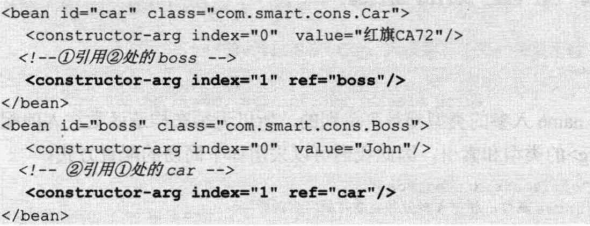

   **修改Bean代码，将构造函数注入改为属性注入就可以**

#### 工厂方法注入(不推荐)

1. 非静态方法注入：要先定义一个工厂类的bean，然后通过factory-bean引用工厂类的实例，最后通过factory-method制定对应的工厂方法（实例化工厂类后再调用工厂方法）

   ```xml
       <!--定义bean工厂-->
       <bean id="carfactory" class="com.spring.chapter5.CarFactory"/>
       
       <!--通过bean工厂实例化bean-->
       <bean id="car" factory-bean="carfactory" factory-method="CarCreat"/>
   ```

2. 静态工厂方法：无需要工厂类中定义工厂类的bean，只需要直接在被实例化的bean中用factory-method指定对应的工厂方法就可以

   ```xml
   	<!--用class指定工厂，并指定工厂方法-->	
   	<bean id="car" class="com.spring.chapter5.CarFactory" factory-method="CarCreat" />
   ```

### 注入特殊字符

方法一：用<!CDATA[字符串]>把包含特殊字符的字符串封装起来

方法二：转义，把特殊字符直接转义掉

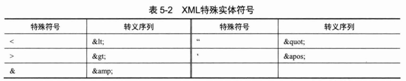

example:

```xml
<property name="brand">
  <value><![CDATA[红旗&CA72]]></value>
</property>

<property name="brand"><value>红旗&amp;CA72</value></property>
```

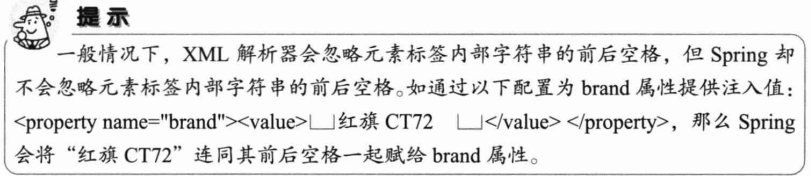

### 引用其他的Bean	--\<ref>标签

\<ref>可以通过以下三个属性引用容器中的其他Bean

1. bean：可以引用同一容器或者父容器的Bean
2. local：只能引用同一配置文件中的Bean
3. parent：引用父容器中的Bean

### 设置null值

```xml
<!--正确方式-->
<property name="brand"><null/></property>

<!--这种方式只会把字符串设置为空字符串-->
<property name="brand"><value></value></property>
```

### 级联属性

直接为Bean的成员变量的成员变量注入值

Spring没有对级联属性的层级数进行限制

eg：

```XML
    <!--相当于调用了Boss.getCar().setBrand("东风日产")-->
	<bean id="boss" class="com.spring.chapter5.Boss">
        <property name="car.brand" value="东风日产"/>
    </bean>
```

进行这个操作，必须要提供Car的非空实例，所以Boss中要把car声明为初始化对象：

```java
	private Car car = new Car();
```

### 集合类型属性

Spring.md里面有List、Set、Map、Properties的注入方法

#### 集合合并

子\<Bean>继承父\<Bean>的同名属性的集合元素

将子\<Bean>中配置的集合属性值和父\<Bean>中配置的同名属性值合并起来作为最终Bean的属性值。

```xml
    <bean id="father" class="com.spring.chapter5.Transport" abstract="true">
        <property name="cars">								<!--没有也可以的-->
            <list>
                <bean class="com.spring.demo.Car">
                    <property name="brand" value="A"/>
                    <property name="maxSpeed" value="200"/>
                </bean>
                <bean class="com.spring.demo.Car">
                    <property name="brand" value="B"/>
                    <property name="maxSpeed" value="100"/>
                </bean>
            </list>
        </property>
    </bean>
														<!--指定父<Bean>-->
    <bean id="child" class="com.spring.chapter5.Transport" parent="father">
        <property name="name" value="huang"/>
        <property name="cars">
            <list merge="true">							<!--和父Bean中同名的属性合并-->
                <ref bean="childcar"/>
            </list>
        </property>
    </bean>

    <bean id="childcar" class="com.spring.demo.Car">
        <property name="brand" value="baby"/>
        <property name="maxSpeed" value="150"/>
    </bean>
```

- abstract="true"：只是在此起了模板的作用，供其他bean继承。

  设置abstract="true"-->该Bean不能被容器实例化。（所以在它的属性在类体中可以不定义，直接在bean的声明中以\<proerty/>声明即可。子bean继承他后需要在提供对应的属性和set方法即可，在子bean中就可获取从父bean继承来的值。）

- parent="     "：继承父Bean

- \<merge="true">：指示子Bean和父Bean的同名属性进行合并。（所以子Bean的cars集合会有3个元素）

### 配置集合类型的Bean--通过util命名空间

1. 配置文件头引入util命名空间的声明

   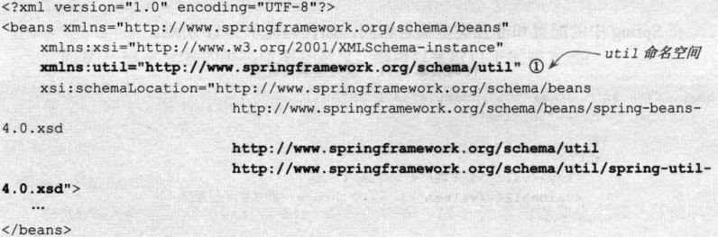

2. 配置Bean：\<util:集合类型 id="">

   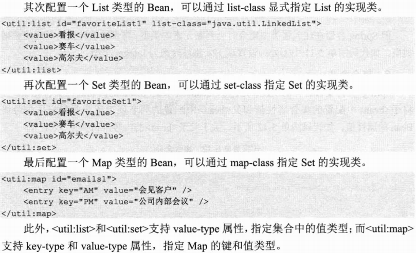

### 简化配置

- 使用p命名空间

  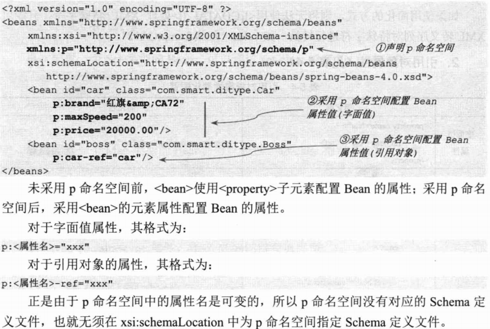

### 自动装配

四种装配类型见Spring.md

- 基于注解的配置方式默认采用byType自动装配策略

### 方法注入（P142）

#### lookup方法注入----\<lookup-method>

在一个singleton的bean中每次用get方法那某个属性的时候，拿到的是新的对象。

（比如Boss中有car属性，那么Boss每次getCar()的时候返回的Car是新的Car对象）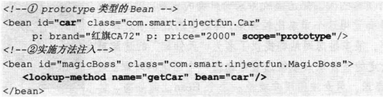

- \<lookup-method name=“方法名” bean=“引用的bean”>为该方法提供动态实现，返回prototype类型的car Bean
- 应用场景：希望通过一个singleton Bean获取一个prototype Bean时使用
- MagicBoss是接口的话，Spring会为其提供动态实现，每次调用getCar()方法都会从容器中获取car Bean

#### 方法替换----\<replaced-method>

```java
public class Boss1 {
	public Car getCar() {
		Car car = new Car();
		car.setBrand("宝马Z4");
		return car;
	}
}
```

用于替换他人方法的Bean必须实现MethodReplacer接口

```java
public class Boss2 implements MethodReplacer {
	public Object reimplement(Object arg0, Method arg1, Object[] arg2)
			throws Throwable {
		Car car = new Car();
		car.setBrand("美人豹");
		return car;
	}
}
```

```xml
  <bean id="boss2" class="com.smart.injectfun.Boss2"/>
    
  <bean id="boss1" class="com.smart.injectfun.Boss1">
     <replaced-method name="getCar" replacer="boss2"></replaced-method>
  </bean>
```

用boss2的方法去替换boss1的getCar()方法

### Bean之间的关系

#### 继承

- 在子\<bean parent=“fatherBean”>可以指定父Bean，建立继承关系
- 子Bean会自动继承父Bean的配置信息，也会覆盖父Bean的配置信息
- 父Bean主要功能是简化子\<Bean>的配置，所以一般声明为abstract=“true”，不实例化父Bean

#### 依赖

当实例化一个Bean时，Spring保证该Bena所依赖的其他Bean已经初始化

- 一般的用\<ref>就好

- 前置依赖Bean：\<bean id="A" class="" depends-on="B"/>

  前置依赖Bean B会在本Bean A实例化之前创建好

  > 如果前置依赖多个Bean，则可以通过逗号、空格或分号的方式创建Bena的名称

#### 引用----\<idref>标签

一个Bean要引用一个Bean的id属性值	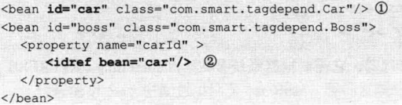

### 整合多个配置文件

- 启动Spring时，可以通过一个String数组指定这些配置文件

- 还可以\<import>将多个文件引入一个文件

  ```xml
  <import resource="classpath:xxx/xxx/xxx.xml"
  ```

  > 如果没有import，两个配置文件互相引用也是可以的，只需要将配置文件都放在配置文件列表即可

### Bean作用域

五种作用域在Spring.md

还有就是其实Bean的作用域可以自定义，不过一般没什么必要

#### 作用域依赖问题

- 非web相关作用域引用web相关作用域（P152）

### FactoryBean

p(153)

要被实现的接口：FactoryBean\<T>

- T getObject()：返回FactoryBean创建的Bean实例

  ​			（在这里里面可以用自己的方法构建bean）

- boolean isSinleton()：确定是singleton还是prototype

- Class<?> getObjectType()：返回Factory创建的Bean类型


### 基于注解配置Bean

#### 使用注解定义Bean

在一个Bean类上方加上

- @Component（其实下面三个和它等效）
- @Repository：DAO实现类
- @Service：Service实现类
- @Controller：Controller实现类
- 后面可以加value属性指定Bean的名称

#### 扫描注解定义的Bean

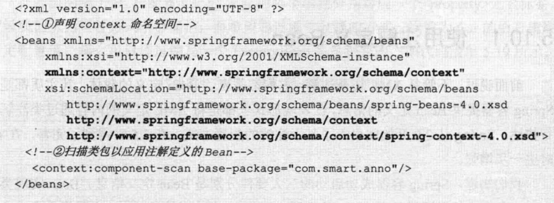

- 声明context的命名空间

- 指定需要扫描的基类包\<context:component-scan  base-package=" ">

  - resource-pattern属性可以**过滤出**指定的类

  - 过滤子元素

    - \<context:include-filter>表示要包含的目标类
    - \<context:exclude-filter>表示要排除的目标类

    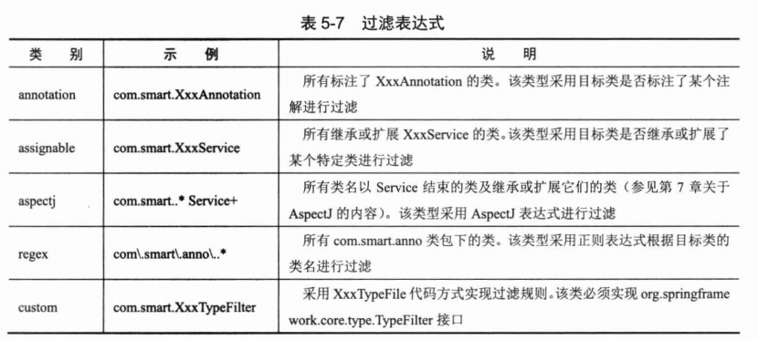

    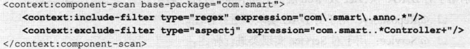

- use-default-filters属性：

  - true（默认），对所有标注@Component，@Controller，@Service，@Reposity的Bean进行扫描
  - false，仅扫描@Controller

#### 自动装配Bean

- @Autowired：ByType类型，当只有一个匹配的Bean时，自动注入

  - 可以对**成员变量**以及**方法的入参**进行标注

  - required属性：默认true，当找不到匹配的Bean，抛出NoSuchBenaDefinitionException的异常；

    ​			    false，设置为不抛出异常

  - 对集合类进行标注：自动将所有匹配类型的Bean都注入

    - 当集合是Map的时候，key是Bean的名称，value是实现指定类型的Bean
    - 可以在每一个实现类的定义前面加上@Order(value=1),确定加载顺序

  - 实现相同功能的注解：（没必要用）

    - @Resource：按名称匹配注入。要求提供一个Bean名称的属性，如果属性为空，自动采用标注出的变量名或者方法名为Bean的名称
    - @Inject：和Autowired一样按类型匹配注入，但是没有require属性

- @Qualifier：指定注入Bean名称

- 延迟依赖注入（两个地方都要加@Lazy）

  - 被注入的Bean前面加上@Lazy
  - 接受Bean的方法前面加@Lazy

#### Bean的作用范围及生命过程方法

- 作用范围：

  - 在Bean的前面@Scope("prototype/singleton")表示该类型Bean的作用范围
  - 在方法的前面@Scope("prototype/singleton")表示该方法返回的Bean的作用范围

- 初始方法：在方法前面@PostContruct

- 销毁方法：在方法前面@PreDestroy

  > 这里的初始方法和销毁方法是<bean>配置中的init-method和destroy-method
  >
  > 但是**这里的初始方法和销毁方法可以定义多个**

### 基于Java类的配置

- 定义一个配置类：@Configuration，说明这个类可以用于为Spring提供Bean的定义信息

  - 这个类的方法可以用@Bean注解，Bean的类型由方法返回类型决定，名称默认与方法名相同

    （也可以用@Bean(name="UserDao")这种格式显式制定Bean的名称）

    **@Bean所标注的方法体提供了Bean的实例化逻辑**

  - 任何标注了@Comfiguration的类，本身也相当于标注了@Component

- 基于Java类的配置信息启动Spring容器

  - 直接通过@Configuration类来启动Spring容器
    - 可以支持编码的方式加载多个@Configuration配置类，然后通过刷新容器来应用这些配置类
    - 也可以通过@Import将多个配置类组装到同一个配置类中，这样只需要注册组装好的配置类即可
  - 通过XML配置文件来引用@Configuration的配置：配置相当于@Component类一样，用\<context:component-scan>扫描到
  - 通过@Configuration配置类引用XML配置信息：
    - 在配置类定义前面加上@ImportResource("classpath:xxx/xxx/xxx/xxx.xml")
    - 在方法前面@Bean，可以为方法的参数注入xml中的Bean

### 基于Groovy DSL的配置

————

### 通过编码方式动态添加Bean

————

## Spring容器的高级主题

————

## AOP基础

有毒，这章不知道怎么做笔记

### 概念

连接点：两个信息确定（方法表示的程序的执行点、相对位置表示的方位）

​		eg：在Test.foo()执行前的连接点，那么执行点是Test.foo()，方位是该方法执行前的位置

切点：通过一些信息定位到连接点上

### 创建切面

## Spring对Dao的支持

### 配置一个数据源

1. DBCP数据源：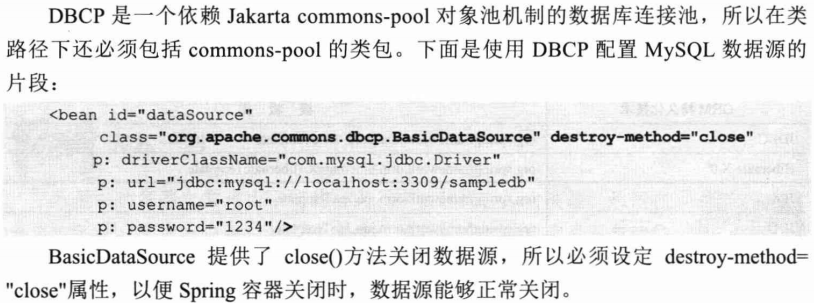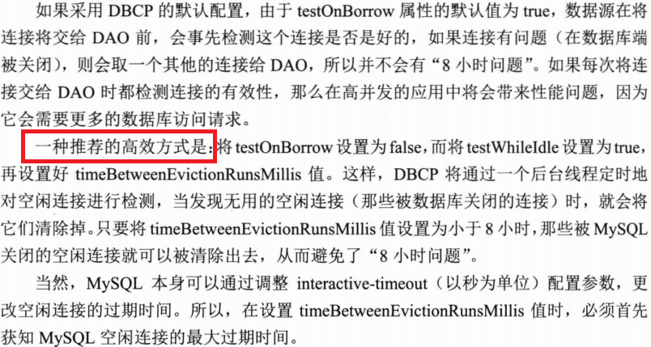
2. C3P0数据源: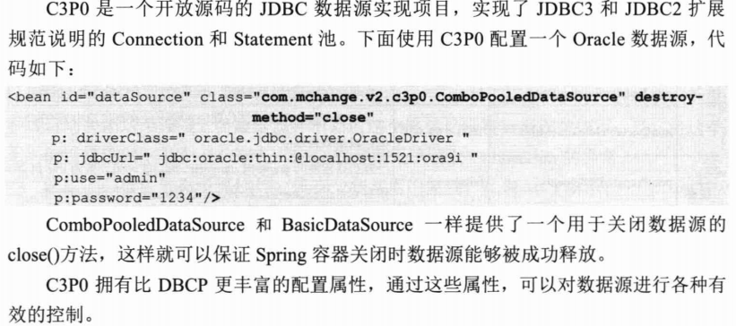

## 实战开发

### 解决中文乱码

- 使用Spring的编码转换过滤器，将请求信息的编码统一转换为UTF-8

  （这种方法对get请求无效）

```xml
	<filter>
		<filter-name>encodingFilter</filter-name>
		<filter-class>org.springframework.web.filter.CharacterEncodingFilter</filter-class>
		<init-param>
			<param-name>encoding</param-name>
			<param-value>UTF-8</param-value>
		</init-param>
		<init-param>
			<param-name>forceEncoding</param-name>
			<param-value>true</param-value>
		</init-param>
	</filter>
	<filter-mapping>
		<filter-name>encodingFilter</filter-name>
		<url-pattern>*.html</url-pattern>
	</filter-mapping>
	<filter-mapping>
		<filter-name>encodingFilter</filter-name>
		<url-pattern>*.jsp</url-pattern>
	</filter-mapping>
```

### 避免直接使用字面值常量

- 通过常量定义的方式予以规避
- 在一个包中定义应用级常量

### 统一管理异常体系

- 在exception包中定义业务异常类及系统异常等

### 系统架构

- 一个基础功能的模块，其他的再按照角色进行划分

### 类的设计

#### PO类

- BaseDomain是所有PO的基类，它实现了Serializable接口。

  ```java
  public class BaseDomain implements Serializable {
      //统一的toString方法
      public String toString() {
          return ToStringBuilder.reflectionToString(this);
      }
  }
  ```

  - 实现Serializable接口：JVM能够方便地将PO实例化到硬盘中，或者通过流的方式进行发送，为缓存、集群的功能带来便利
  - toString：可以通过Apache的ToStirngBuilder工具类来统一实现

#### DAO类

- 创建一个BaseDao\<T>

#### Service层

#### Web层

- 定义一个Controller的基类：BaseController，它提供其他Controller共有的一些方法，比如从Session中获取登录的用户对象、请求转向一个URL等。其他Controller继承于这个BaseController。

### 缓存

- 只使用内存的缓存：适合目标对象少且不常发生更改，比如论坛中的板块对象

  （缓存区中的对象永不过期）

- 硬盘缓存：书中的实例是，对象在闲置300秒后就从缓存中清除，且对象最大存活期限为30min，缓存区最大的实例个数为5000个

### 其他

- 书中建议使用UUID作为主键，因为使用自增主键可能有一些潜在的问题，比如在配置型应用中，会涉及配置模型数据导入导出的操作，此时容易造成主键冲突。（还没体会到额）

