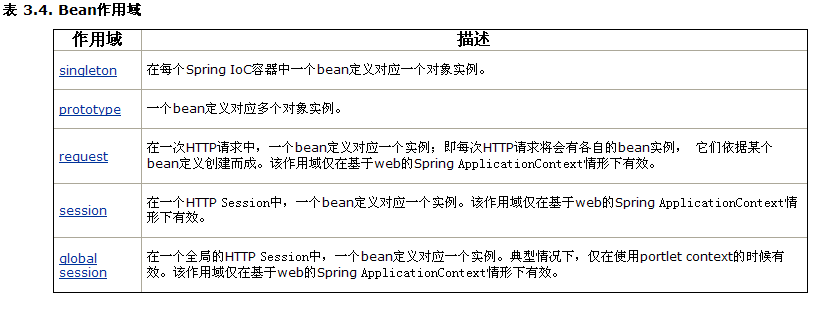
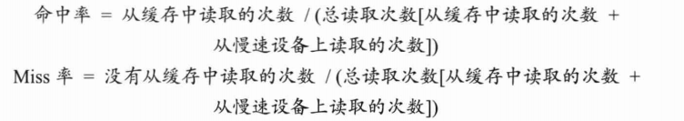

# Spring

- 容器框架，用于配置bean，并维持bean之间关系的框架。当我们需要使用某个bean的时候，我们可以getBean(id),使用即可。

  

- 概念：

  - ioc(inverse of controll ) 控制反转: 所谓控制反转就是把创建对象(bean),和维护对象(bean)的关系的权利从程序中转移到spring的容器(applicationContext.xml),而程序本身不再维护.
  - DI(dependency injection) 依赖注入: 实际上di和ioc是同一个概念，spring设计者认为di更准确表示spring核心技术

- Spring运行原理图

  

- application.xml中会配置很多个bean，这些bean会对应class会对应java类，通过getBean("id")把配置的id作为参数可以拿到java类的实例。

- bean中可以设置参数，如果参数后面跟有ref，就表示和其他的bean关联

## Spring Begin

1. 引入jar：最小配置spring.jar 该包把常用的jar都包括, 还要 写日志包 common-logging.jar

   - [spring各个jar的作用](http://www.cnblogs.com/BensonHe/p/3903050.html)

2. 创建Spring核心文件：applicationContext.xml，该文件中引入 xsd文件

   xsd:

   ```xml
   <?xml version="1.0" encoding="UTF-8"?>
   <beans xmlns="http://www.springframework.org/schema/beans"
          xmlns:xsi="http://www.w3.org/2001/XMLSchema-instance" xmlns:aop="http://www.springframework.org/schema/aop"
          xmlns:tx="http://www.springframework.org/schema/tx" xmlns:context="http://www.springframework.org/schema/context"
          xsi:schemaLocation="  
   http://www.springframework.org/schema/beans http://www.springframework.org/schema/beans/spring-beans-3.0.xsd  
   http://www.springframework.org/schema/tx http://www.springframework.org/schema/tx/spring-tx-3.0.xsd  
   http://www.springframework.org/schema/aop http://www.springframework.org/schema/aop/spring-aop-3.0.xsd  
   http://www.springframework.org/schema/context http://www.springframework.org/schema/context/spring-context-3.0.xsd">
       
   </beans>
   ```

   [解析](http://www.cnblogs.com/doit8791/p/5757798.html)

3. 配置Bean

   ```xml
   <!-- 在容器文件中配置bean(service/dao/domain/action/数据源) -->
   <bean id="userService" class="com.service.UserService">
   	<!-- 这里就体现出注入的概念. -->
   	<property name="name">
   		<value>韩顺平</value>
   	</property>
   </bean>
   <!--
   相当于：	
   	UserService userSerivce=new UserService();
   	userSerivce.setName("韩顺平");
   -->
   ```

   bean元素的作用：当我们的spring框架加载时候，spring就会自动的创建一个bean对象，并放入内存 

   - <property>里面装的是成员变量，name对应成员变量的属性名，value对应成员变量的值，ref是对另一个bean的引用作为成员变量

4. Test

   ```java
   //1.得到spring 的applicationContext对象(容器对象)
   ApplicationContext ac = new ClassPathXmlApplicationContext("applicationContext.xml");
   UserService us=(UserService) ac.getBean("userService");
   //getBean方法拿到实例之后就可以调用bean中的方法了
   ```

## 三种获得ApplicationContext的方法

1. ClassPathXmlApplicationContext :通过类路径

2. FileSystemXmlApplicationContext :通过文件路径

   举例:

   ```java
   ApplicationContext ac=new FileSystemXmlApplicationContext("D:\\...\\beans.xml");
   ```

3. XmlWebApplicationContext :从web系统中加载（tomcat启动时加载）

## Bean

### 获取bean

- 方式一：从ApplicationContex 应用上下文容器中获取bean

  ```java
  ApplicationContext ac=new ClassPathXmlApplicationContext("com/hsp/ioc/beans.xml");
  Check check = (Check) ac.getBean("checkLogin");
  ```

  - 如果使用ApplicationContext ，则配置的bean如果是 singlton不管是否使用，都被实例化  

     **好处就是可以预先加载,缺点就是耗内存**

  - 会预先加载所有的单例Bean，这样可以确保不需要等待他们被创建

- 方式二：从bean工厂中获取bean

  ```java
  BeanFactory factory = new XmlBeanFactory(new ClassPathResource("com/hsp/ioc/beans.xml"));
  factory.getBean("student");
  ```

  - 如果是 BeanFactory ,当获取beanfacotry时候，配置的bean不会马上被实例，当使用的时候，才被实例 

     **好处节约内存,缺点就是速度**

- 一般没有特殊要求，应当使用ApplicatioContext完成(90%)，一般方式二用于手机应用

### Bean的作用域（scope）



- 默认是singleton，单例的

- scope是singleton的时候如果使用（方式一）

  ```java
  ApplicationContext ac = new ClassPathXmlApplicationContext("applicationContext.xml")
  ```

  则spring就会把applicationContext.xml中的bean实例化，其他的情况下都需要getBean才会把相应的bean实例化

  - 如果希望不提前实例化singleton的Bean，可以通过lazy-init="true"来进行控制

    但是在某些情况下还是会提前实例化：如果该Bean被其他需要提前实例化的Bean所引用

- prototype：每次被引用或者getBean都是一个新的实例

  - 默认情况下，Spring容器在启动时不实例化prototype的Bean
  - 容器将prototype的Bean交给调用者后，就不再接管它的生命周期了

- request，session，global session是web开发会用到的

  - 配置:
  - 作用域：request，session和web中的对应
  - 作用域：global session类似于session，被Portlet Web应用的所有子Portlet共享，在非Protlet Web应用环境下等价于session。

### Bean的生命周期

1. 实例化bean：把bean实例化到内存。（当程序加载beans.xml文件，并且scope=singleton的时候）

2. 设置属性：调用bean的set方法设置属性

    可选项：（bean对应的类去实现对应的接口）

3. 通过setBeanName获取id号：需要实现bean名字关注接口（BeanNameAware）

4. 获得BeanFactory：需要实现bean工厂关注接口(BeanFactoryAware)

5. 获得ApplicationContext ：需要实现ApplicationContextAware接口

   实现setApplicationContext方法可以获得ApplicationContext 作为参数获得

   ```java
   //该方法传递ApplicationContext
   public void setApplicationContext(ApplicationContext arg0) throws BeansException {
     	//arg0是我们得到的ApplicationContext
   	System.out.println("setApplicationContext"+arg0);
   }
   ```

6. 后置处理器关联（before）：会自动去调用 Object postProcessBeforeInitialization方法 

   关联配置：

   ```xml
   <bean id="myBeanPostProcessor" class="自己后置处理器的全类名" />
   ```

7. 调用 afterPropertiesSet：需要实现InitializingBean 接口

8. 自定义初始化方法：通过\<bean init-method=”init” /> 配置

9. 后置处理器关联（after）：会自动去调用 Object postProcessAfterInitialization方法

10. 使用bean

11. 容器关闭

12. destory方法：需实现DisposableBean

13. 自定义销毁方法：在\<bean destory-method=”fun1”/> 调用

    >  实际开发中常见的（有可能用到）的是：1->2->6->10->9->11 

- 通过BeanFactory来获取bean对象：生命周期和Applicationcontext 不一样

  5、6、9都没有，即和ApplicationContextAware接口还有后置处理器相关的步骤

- 后置处理器：所有bean的创建都需要经过它，有点类似filter

### 装配bean

- 尽量使用scope = “singleton”, 不要使用prototype，因为这样会对我们的性能影响比较大

  #### 给集合类注入值

  - Array数组：

    ```xml
    <!-- 给数组注入值 -->
    <property name="empName">
    	<list>
    		<value>小明</value>
    		<value>小明明</value>
    		<value>小小明</value>
    	</list>
    </property>
    ```

  - List:(有序)

    ```xml
    <!-- 给list注入值 list 中可以有相当的对象 -->
    <property name="empList">
    	<list>
    	<!--ref表示引用其他的bean，如果是基本数据类型可以直接赋值-->
    		<ref bean="emp2" />
    		<ref bean="emp1"/>
    		<ref bean="emp1"/>
    		<ref bean="emp1"/>
    		<ref bean="emp1"/>
    		<ref bean="emp1"/>
    		<ref bean="emp1"/>
    	</list>
    </property>
    ```

  - Set：(无序，注入相同对象的时候只会保留最后一次注入结果)

    ```xml
    <!-- 给set注入值 set不能有相同的对象 -->
    <property name="empsets">
    	<set>
    		<ref bean="emp1" />
    		<ref bean="emp2"/>
    		<ref bean="emp2"/>
    		<ref bean="emp2"/>
    		<ref bean="emp2"/>
    	</set>
    </property>
    ```

  - Map：(有多个Key相同的时候，以最后一个注入为准)

    ```xml
    <!-- 给map注入值 map只有key不一样，就可以装配value -->
    <property name="empMaps">
    	<map>
    		<entry key="11" value-ref="emp1" /> 
    		<entry key="22" value-ref="emp2"/>
    		<entry key="33" value-ref="emp1"/>
    	</map>
    </property>
    ```
    ```xml
    <!--如果键和值都是对象，可以用<ref>标签配置-->
    <property name="empMaps">
    	<map>
          <entry>
            <key><value>11</value></key>
            <value>value11</value>
          </entry>
          <entry>
            <key><value>22</value></key>
            <value>value22</value>
          </entry>
    	</map>
    </property>
    ```

  - Properties： (结构就像Map\<Stirng, String>一样)

    ```xml
    <property name="pp">
    	<props>
    		<prop key="pp1">abcd</prop>
    		<prop key="pp2">hello</prop>
    	</props>
    </property>
    ```

  #### 内部bean

  缺点：无法在其他地方引用重用这个内部bean

  ```xml
  <bean id=”foo” class=”....Foo”>
  	<property name=”属性”>
  		<!—第一方法引用-->
  		<ref bean=’bean对象名’/>
        
  		<!—内部bean-->
  		<bean> 
  			<property></property>
  		</bean>
  	</property>
  </bean>
  ```

  #### 继承配置

  ```java
  public class Student 
  public class Gradate extends Student
  ```

  在xml中体现继承：

  ```xml
  <bean id="student" class="com.hsp.inherit.Student">
  	<property name="name" value="顺平" />
  	<property name="age" value="30"/>
  </bean>
  <!-- 配置Grdate对象 -->
  <bean id="grdate" parent="student" class="com.hsp.inherit.Gradate">
  	<!-- 如果自己配置属性name,age,则会替换从父对象继承的数据  -->
  	<property name="name" value="小明"/>
  	<property name="degree" value="学士"/>
  </bean>
  ```

  #### 通过构造函数注入值(上面的方法都是通过set方法注入的)

  beans.xml 关键代码:

  ```xml
  <!-- 配置一个雇员对象 -->
  <bean id="employee" class="com.hsp.constructor.Employee">
  	<!-- 通过构造函数来注入属性值 -->	
  	<constructor-arg index="0" type="java.lang.String" value="大明" />
  </bean>
  ```

  - index:第几个属性值
  - type:属性值类型
  - value:属性值

  #### 自动装配

  没有直接指定属性值的属性才会自动装配

  

  - byName：bean对应的类的属性名如果和其他bean的id相同，那么其他bean就会装配的bean中

  - byType：寻找和属性类型相同的bean,找不到则装配不上,找到多个会抛异常

  - constructor：查找和bean的构造参数（没有被装配到的参数）一致的一个或多个bean，若找不到或找

    ​			   到多个，抛异常。（按照参数的类型装配）（只调用没被赋值的属性组合成的构造方法）

  - default：需要在\<beans defualt-autorwire=“指定” />指定，bean默认的autowire就是指定的装配方法

    ​		（autorwire的默认值是no）

  - no：不自动装配

  #### 使用注解配置

  - 激活注解(在\<beans>中添加)

    ```xml
    <context:annotation-config/>
    ```

  #### 分散配置

  说明: 当通过 context:property-placeholder 引入 属性文件的时候，有多个需要使用 ","间隔

  ```xml
  <!-- 引入我们的db.properties文件 -->
  <context:property-placeholder location="classpath:com/hsp/dispatch/db.properties,classpath:com/hsp/dispatch/db2.properties"/>

  <!-- 配置一DBUtil对象 $占位符号 -->
  <bean id="dbutil" class="com.hsp.dispatch.DBUtil">
  <property name="name" value="${name}" />
  <property name="drivername" value="${drivername}" />
  <property name="url" value="${url}" />
  <property name="pwd" value="${pwd}" />
  </bean>

  <!-- 配置一DBUtil对象 -->
  <bean id="dbutil2" class="com.hsp.dispatch.DBUtil">
  <property name="name" value="${db2.name}" />
  <property name="drivername" value="${db2.drivername}" />
  <property name="url" value="${db2.url}" />
  <property name="pwd" value="${db2.pwd}" />
  </bean>
  ```

  db.properties:

  ```
  name=scott
  drivername=oracle:jdbc:driver:OracleDirver
  url=jdbc:oracle:thin:@127.0.0.1:1521:hsp
  pwd=tiger
  ```

  \<context:property-placeholder location=“                ”/>	引入属性文件

  ​			${          }									使用属性

## 代理

### 静态代理


静态代理角色分析

- 抽象角色：一般使用接口或者抽象类来决定
- 真实角色：被代理的角色
- 代理角色：代理真实角色，代理真实角色后一般会做一些附属操作
- 客户：使用代理角色来进行一些操作

优点：

- 使得真实角色处理的业务更加存粹，不再关注一些公共的事情
- 公共的业务由代理来完成，实现了业务的分工
- 公共事物发生拓展时变得更加集中和方便

缺点：

- 多了代理类，工作量变大了。开发效率降低了。

## 动态代理

- 动态代理角色同静态代理
- 动态代理的代理类是动态生成的

#### 接口代理 ：JDK动态代理

抽象角色

```java
public interface Rent {
    void rent();
}
```

真实角色

```java
public class Host implements Rent {
    @Override
    public void rent() {
        System.out.println("执行租房操作");
    }
}
```

代理角色

```java
public class ProxyRent implements InvocationHandler {
    private Object target;
    /**
     * 绑定委托对象并返回一个代理类
     * @param target
     * @return
     */
    public Object getProxy(Object target) {
      	//取得真实角色
        this.target = target;
        
      	//Proxy类是专门完成代理的操作类，可以通过此类为一个或多个接口动态地生成实现类
      	//ClassLoader loader：类加载器 
		//Class<?>[] interfaces：得到全部的接口 
		//InvocationHandler h：得到InvocationHandler接口的子类实例 
        return Proxy.newProxyInstance(target.getClass().getClassLoader(),
                target.getClass().getInterfaces(), this);   
      	//要绑定接口(这是一个缺陷，cglib弥补了这一缺陷)
    }

    @Override
    /**
     * 调用方法
     * Object proxy：指被代理的对象
     * Method method:要调用的方法
     * Object[] args:方法调用时需要用到的参数
     */
    public Object invoke(Object proxy, Method method, Object[] args)
            throws Throwable {
        Object result=null;
        System.out.println("事物开始");
        //执行方法
        result=method.invoke(target, args);
        System.out.println("事物结束");
        return result;
    }
}
```

客户

```java
    public static void main(String[] args) {
        ProxyRent proxyRent = new ProxyRent();
        Rent rent = (Rent) proxyRent.getProxy(new Host());
        rent.rent();
    }
```

#### 类代理：cglib

原理：对指定的目标类生成一个子类，并覆盖其中方法实现增强，但因为采用的是继承，所以不能对final修饰的类进行代理

抽象角色

```java
	public interface BookFacade {  
        public void addBook();  
    }  
```

真实角色

```java
    /** 
     * 这个是没有实现接口的实现类 
     */  
    public class BookFacadeImpl1 {  
        public void addBook() {  
            System.out.println("增加图书的普通方法...");  
        }  
    }  
```

```java
	/** 
     * 使用cglib动态代理 
     */  
    public class BookFacadeCglib implements MethodInterceptor {  
        private Object target;  
      
        /** 
         * 创建代理对象 
         * @param target 
         * @return 
         */  
        public Object getInstance(Object target) {  
            this.target = target;  
            Enhancer enhancer = new Enhancer();  
            enhancer.setSuperclass(this.target.getClass());  
            // 回调方法  
            enhancer.setCallback(this);  
            // 创建代理对象  
            return enhancer.create();  
        }  
      
        @Override  
        // 回调方法  
        public Object intercept(Object obj, Method method, Object[] args,  
                MethodProxy proxy) throws Throwable {  
            System.out.println("事物开始");  
            proxy.invokeSuper(obj, args);  
            System.out.println("事物结束");  
            return null;  
        }  
      
    }  

```

客户

```java
public class TestCglib {  
    public static void main(String[] args) {  
        BookFacadeCglib cglib=new BookFacadeCglib();  
        BookFacadeImpl1 bookCglib=(BookFacadeImpl1)cglib.getInstance(new BookFacadeImpl1());  
        bookCglib.addBook();  
    }  
}  
```

## AOP编程

AOP( aspect oriented programming ) 面向切面(方面)编程

是对所有对象或者是一类对象编程，核心是( 在**不**增加代码的基础上， **还**增加新功能 )

AOP在Spring中的作用:

1. 提供声明式事务
2. 允许用户实现自定义切面

> Spring AOP 就是将公共业务（如日志，安全等）的领域业务结合。当执行领域业务时将会把公共业务加进来。实现公共业务的重复利用，专注开发领域业务更加纯粹。

### 纵向编程和横向编程

- 纵向编程：自上而下jsp-->action-->service-->dao

- 横向编程：

  AOP：不增加代码的基础上，增加新功能（横向切割加入日志等功能）-->代理来实现

   	    好处同代理的好处！！！

### 名词解释

- 关注点：增加的某个业务。如日志、安全、缓存、事务等
- 切面：一个关注点的模块化，这个关注点可能会横切多个对象
- 连接点：方法的执行
- 通知：在切面的某个特定的连接点执行的动作
- 目标对象：被代理的对象
- 织入：一个过程，把切面连接到对象上并且创建被通知的对象的过程

### 步骤

1. 定义接口

   ```java
   public interface TestInterface {
       void sayHello();
   }
   ```

2. 编写对象（实现接口）--> 被代理对象=目标对象

   ```java
   public class TestImp implements TestInterface{
       private String name;

       @Override
       public void sayHello() {
           System.out.println("hello " + name);
       }
       //此处还有构造方法和getter/setter方法
   }
   ```

3. 编写通知（要实现通知相关的接口）

   ```java
   public class MyMethodBeforeAdvice implements MethodBeforeAdvice{
     	//method:被调用的方法对象
     	//objects:被调用的方法的参数
     	//o :目标对象（被代理的对象）
       @Override
       public void before(Method method, Object[] objects, Object o) throws Throwable {
           System.out.println("写入日志");
       }
   }
   ```

4. 在beans.xml中配置

   1. 配置通知

      ```xml
          <!-- 配置前置通知 -->
          <bean id="myMethodBeforeAdvice" class="com.spring.demo.MyMethodBeforeAdvice"/>
      ```

   2. 配置代理对象：是ProxyFactoryBean的实例

      1. 代理接口集
      2. 织入通知
      3. 配置被代理对象（目标对象）

      ```xml
          <!-- 配置代理对象 -->
          <bean id="proxyFactoryBean" class="org.springframework.aop.framework.ProxyFactoryBean">

              <!-- 代理接口集 -->
              <property name="proxyInterfaces">
                  <list>
                      <value>com.spring.demo.TestInterface</value>
                  </list>
              </property>

              <!-- 将通知织入代理对象 -->
              <property name="interceptorNames">
                  <list>
                      <value>myMethodBeforeAdvice</value>
                  </list>
              </property>

              <!-- 配置被代理对象，可以指定 -->
              <property name="target" ref="testImp"/>
              <!--<property name="target">-->
                  <!--<bean id="testImp" class="com.spring.demo.TestImp">-->
                      <!--<property name="name" value="tomcat" />-->
                  <!--</bean>-->
              <!--</property>-->
          </bean>
      ```

   3. Test

      ```java
      public class AopTest {
          @Test
          public void aopTest(){
      		ApplicationContext applicationContext = new ClassPathXmlApplicationContext("beans.xml");
            
              TestInterface testInterface = (TestInterface) applicationContext.getBean("proxyFactoryBean");
              testInterface.sayHello();
          }
      }
      ```

      - 通过getBean获得代理对象，然后强制转换为接口类型，就可以调用被代理对象的方法。

   很好，看完了尚学堂的视频，才知道韩顺平的方法那么复杂

   ### 方法二：基于xml

   - 要导入spring-aop包和spring-aspect包

   写两个增强类吧

   ```java
   public class LogBeforeAdvice implements MethodBeforeAdvice {
       @Override
       public void before(Method method, Object[] objects, Object o) throws Throwable {
           System.out.println("前置增强执行：" + method.getName() + "in" + o);
       }
   }
   ```

   ```java
   public class LogAfterAdvice implements AfterReturningAdvice {
       @Override
       public void afterReturning(Object o, Method method, Object[] objects, Object o1) throws Throwable {
           System.out.println("后置通知执行：" + method.getName() + " return " + o);
       }
   }
   ```

   被代理的接口及其实现类

   ```java
   public interface UserService {
       void add();
       void delete();
       void insert();
       void update();
   }
   ```

   ```java
   public class UserServiceImpl implements UserService {
       @Override
       public void add() {
           System.out.println("执行添加操作");
       }

       @Override
       public void delete() {
           System.out.println("执行删除操作");
       }

       @Override
       public void insert() {
           System.out.println("执行插入操作");
       }

       @Override
       public void update() {
           System.out.println("执行更新操作");
       }
   }
   ```

   aop-beans.xml

   ```xml
       <!-- 前置增强 -->
   	<bean id="beforeLog" class="com.spring.proxy.LogBeforeAdvice"/>
   	<!-- 后置增强 -->
       <bean id="AfterLog" class="com.spring.proxy.LogAfterAdvice"/>
   	<!-- 亲爱的接口 -->
       <bean id="userService" class="com.spring.proxy.UserServiceImpl"/>

       <aop:config>
         	        				 <!-- 切面路径，第一个*表示返回值，后面的是精确到方法的路径 -->
         	<!-- 定义切面 --> 								<!-- (..)表示匹配任何入参的方法 -->	
           <aop:pointcut id="firstAop" expression="execution(* com.spring.proxy.*.*(..))"/>
         	<!-- 前置增强 -->
           <aop:advisor advice-ref="beforeLog" pointcut-ref="firstAop"/>
         	<!-- 后置增强 -->
           <aop:advisor advice-ref="AfterLog" pointcut-ref="firstAop"/>
       </aop:config>
   ```

   ### 方法三：自定义方法实现AOP

   自定义方法前后执行的方法

   ```java
   public class MyAdvice {
       public void before(){
           System.out.println("方法前执行");
       }

       public void after(){
           System.out.println("方法后执行");
       }
   }
   ```

   aop-beans.xml配置

   ```xml
       <!-- 接口 -->
   	<bean id="userService" class="com.spring.proxy.UserServiceImpl"/>
   	<!-- 自定义增强类 -->
       <bean id="advice" class="com.spring.proxy.MyAdvice"/>
       <aop:config>
         	<!-- ref指定切面要使用的增强 -->
           <aop:aspect ref="advice">
             	<!-- 设置切面 -->
               <aop:pointcut id="secondAop" expression="execution(* com.spring.proxy.*.*())"/>
               <!-- 第一个before是表示方法前执行，第二个表示MyAdvice中的方法名 -->
             	<aop:before method="before" pointcut-ref="secondAop"/>
             	<!-- after解析同before -->
               <aop:after method="after" pointcut-ref="secondAop"/>
           </aop:aspect>
       </aop:config>
   ```

   被代理的接口及其实现类

   ```java
   public interface UserService {
       void add();
       void delete();
       void insert();
       void update();
   }
   ```

   ```java
   public class UserServiceImpl implements UserService {
       @Override
       public void add() {
           System.out.println("执行添加操作");
       }

       @Override
       public void delete() {
           System.out.println("执行删除操作");
       }

       @Override
       public void insert() {
           System.out.println("执行插入操作");
       }

       @Override
       public void update() {
           System.out.println("执行更新操作");
       }
   }
   ```

   ### 方法四：使用注解实现

   自定义增强

   ```java
   //标记
   @Aspect
   public class MyAdvice {
     	//前置方法，迟于环绕前
       @Before("execution(* com.spring.proxy.*.*())")
       public void before(){
           System.out.println("方法前执行");
       }
   	//后置方法，迟于环绕后
       @After("execution(* com.spring.proxy.*.*())")
       public void after(){
           System.out.println("方法后执行");
       }
     	//环绕方法
       @Around("execution(* com.spring.proxy.*.*())")
       public Object Around(ProceedingJoinPoint joinPoint) throws Throwable {
           System.out.println("环绕前执行");
           System.out.println(joinPoint.getSignature());
         	//使目标方法执行，不然就会执行不到目标方法
         	//o是目标方法返回的对象，如果目标方法是void，可以不return
           Object o = joinPoint.proceed();
           System.out.println("输出对象：" + o);
           System.out.println("环绕后执行");
           return o;
       }
   }
   ```

   配置

   ```xml
       <!-- 注入要被代理的接口 -->
   	<bean id="userService" class="com.spring.proxy.UserServiceImpl"/>
   	<!-- 注入自定义增强Bean -->
       <bean id="advice" class="com.spring.proxy.MyAdvice"/>
       <!-- 自动扫描注解 -->
       <aop:aspectj-autoproxy/>
   ```

   接口及其实现类

   ```java
   public interface UserService {
       String add();
   }
   ```

   ```java
   public class UserServiceImpl implements UserService {
       @Override
       public String add() {
           System.out.println("执行添加操作");
           return "add";
       }
   }
   ```

   ### 当有两个切面对一个点进行切割的时候

   需要在类上面加上`@Order` 来定义优先级，数值越小，优先级越高，假如Aspect1优先级比Aspect2高

   ### 代理方式

   - 如果用ProxyFactory的setInterfaces方法进行**指定目标接口代理**的话--JDK动态代理技术创建代理
   - 如果是针对类代理，就会使用Cglib代理
   - 此外，可以通过用ProxyFactory的setOptimize(true)方法优化代理方式，针对接口的代理也会采用Cglib

   ### 五种通知Advice

   | 通知类型   | 接口                                       | 描述           |
   | ------ | ---------------------------------------- | ------------ |
   | Around | org.aopalliance.intercept.MethodInterceptor | 拦截对目标方法调用    |
   | Before | Org.springframework.aop.MethodBeforeAdvice | 在目标方调用前调用    |
   | After  | Org.springframework.aop.AfterReturningAdvice | 在目标方法调用后调用   |
   | Throws | Org.springframework.aop.ThrowsAdvice     | 当目标方法抛出异常时调用 |

   ​			eg:环绕通知

   

   ​

   - Throws是个标签接口，里面没有任何方法和属性。

   - 引介通知（类级别，非方法级别）

     它不是在目标方法周围织入通知，而是为目标类创建新的方法和属性。

   

   ​	拦截方法：

   ​	配置：

   ​	测试：

   

   ### ProxyFactoryBean的属性配置

   


> 设置了proxyTargetClass = “true”属性之后无需再设置proxyInterfaces，设置了也会被忽略

## Mybatis整合Spring

```xml
<?xml version="1.0" encoding="UTF-8" ?>
<beans xmlns="http://www.springframework.org/schema/beans"
       xmlns:xsi="http://www.w3.org/2001/XMLSchema-instance"
       xmlns:context="http://www.springframework.org/schema/context"
       xmlns:p="http://www.springframework.org/schema/p" xmlns:aop="http://www.springframework.org/schema/aop"
       xmlns:tx="http://www.springframework.org/schema/tx"
       xsi:schemaLocation="http://www.springframework.org/schema/beans http://www.springframework.org/schema/beans/spring-beans-4.0.xsd
    http://www.springframework.org/schema/context http://www.springframework.org/schema/context/spring-context-4.0.xsd http://www.springframework.org/schema/aop http://www.springframework.org/schema/aop/spring-aop-4.0.xsd http://www.springframework.org/schema/tx http://www.springframework.org/schema/tx/spring-tx-4.0.xsd">
    <!--<context:component-scan base-package="com.blog" resource-pattern="**/dao/*.class"/>-->
    <context:component-scan base-package="com.blog.www.dao"/>
    <context:annotation-config/>
    <!-- 配置数据源 -->
    <context:property-placeholder location="classpath:db.properties"/>
    <bean id="dataSource"
          class="org.apache.commons.dbcp.BasicDataSource"
          destroy-method="close"
          p:driverClassName="${driver}"
          p:url="${url}"
          p:username="${name}"
          p:password="${password}"/>
    <!-- 配置SqlSessionFactory -->
    <bean id="sqlSessionFactory" class="org.mybatis.spring.SqlSessionFactoryBean">
        <property name="dataSource" ref="dataSource"/>
        <property name="configLocation" value="classpath:mybatis.xml"/>
        <property name="mapperLocations" value="classpath*:mapper/*.xml"/>
    </bean>

    <bean class="org.mybatis.spring.mapper.MapperScannerConfigurer">
        <property name="sqlSessionFactoryBeanName" value="sqlSessionFactory"/>
        <property name="basePackage" value="com.blog.www.dao"/>
    </bean>
    <!--<bean id="transactionManager"-->
          <!--class="org.springframework.jdbc.datasource.DataSourceTransactionManager"-->
          <!--p:dataSource-ref="dataSource"/>-->

    <!--<tx:annotation-driven transaction-manager="transactionManager"/>-->
</beans>
```

## 事务管理

### 事务管理基础

#### 数据库事务特性

- 数据库事务必须同时满足四个特性：

  - 原子性：一起成功和失败
  - 一致性：事务操作成功后，数据库所处的状态和她的业务规则一致
  - 隔离性：并发数据时，互不干扰。数据库规定了多种事务隔离级别，隔离级别越高，事务一致性越好，但是并发性越弱
  - 持久性：事务提交成功后，所有数据操作都必须持久化到数据库中

  > 数据库管理系统一般采用重执行日志来保证原子性、一致性和持久性。重执行日志记录了数据库变化的每一个动作，一旦事务发生错误就会根据重执行日志撤销操作。

#### 并发的问题

- 脏读：A和B两个线程，原数据600，B是修改数据500-->A查询数据500-->B撤销修改事务，数据600-->A按照查询结果减少100，数据为400，提交事务
- 不可重复读：A,B读取数据-->B修改数据，提交事务-->A再次读取数据，两个时间点读取数据不同
- 幻像读：A读取总数据-->B新增数据，提交事务-->A再次读取总数据，两个时间点读取总数据不同
- 第一类丢失更新：A、B开始事务，数据1000-->B修改数据500，提交事务-->A撤销事务，事务回滚，数据1000
- 第二类丢失更新：A、B开始事务，查询数据1000-->B减少100，数据900，提交事务-->A添加100，数据1100（丢失B线程的数据更新）

#### 数据库锁的机制：解决并发问题

#### 事务的隔离级别

- TransactionDefinition.ISOLATION_DEFAULT：这是默认值，表示使用底层数据库的默认隔离级别。对大部分数据库而言，通常这值就是TransactionDefinition.ISOLATION_READ_COMMITTED。
- TransactionDefinition.ISOLATION_READ_UNCOMMITTED：该隔离级别表示一个事务可以读取另一个事务修改但还没有提交的数据。该级别不能防止脏读和不可重复读，因此很少使用该隔离级别。
- TransactionDefinition.ISOLATION_READ_COMMITTED：该隔离级别表示一个事务只能读取另一个事务已经提交的数据。该级别可以防止脏读，这也是大多数情况下的推荐值。
- TransactionDefinition.ISOLATION_REPEATABLE_READ：该隔离级别表示一个事务在整个过程中可以多次重复执行某个查询，并且每次返回的记录都相同。即使在多次查询之间有新增的数据满足该查询，这些新增的记录也会被忽略。该级别可以防止脏读和不可重复读。
- TransactionDefinition.ISOLATION_SERIALIZABLE：所有的事务依次逐个执行，这样事务之间就完全不可能产生干扰，也就是说，该级别可以防止脏读、不可重复读以及幻读。但是这将严重影响程序的性能。通常情况下也不会用到该级别


### 声明式事务

#### 方法一：基于xml的配置

```xml
	<!-- 声明式事务配置 -->
    <!-- 声明事务管理器 -->
    <bean id="transactionManager"
          class="org.springframework.jdbc.datasource.DataSourceTransactionManager">
        <property name="dataSource" ref="dataSource">
        </property>
    </bean>
    <!--声明自己的事务-->
    <tx:advice id="txManager" transaction-manager="transactionManager">
      	<!-- 配置每个方法使用什么事务，以及事务的传播特性 -->
        <tx:attributes>
            <!-- 如果不存在事务，新建事务；如果存在事务，支持原来的事务 -->
            <tx:method name="add" propagation="REQUIRED"/>
            <!-- 只读 -->
            <tx:method name="select*" read-only="true"/>
        </tx:attributes>
    </tx:advice>
    <!-- 设置切面 -->
    <aop:config>
        <aop:pointcut expression="execution(* com.spring.proxy.StudentService.*(..))" id="pointcut"/>
        <aop:advisor advice-ref="txManager" pointcut-ref="pointcut"/>
    </aop:config>
```

- 切面一般设置在service层，而不是dao层，service才是事务处理的地方

#### 方法二：基于注解的配置

```xml
    <!-- 声明式事务配置：基于注解 -->
    <!--声明事务-->
    <bean id="txManager" class="org.springframework.jdbc.datasource.DataSourceTransactionManager">
        <property name="dataSource" ref="dataSource"/>
    </bean>
    <!--配置扫描器-->
    <tx:annotation-driven transaction-manager="txManager"/>
```

然后再需要织入的连接点、类上面加上注解`@Transactional`

无论是在xml或者是用注解，都可以设置一些属性值

### 事务的属性


### 传播行为：

| 传播行为          | 含义                                       |
| ------------- | ---------------------------------------- |
| REQUIRED(默认值) | 表示当前方法必须要在事务中，如果没有事务就新建一个，如果该方法被A调用，如果A存在事务就加进去 |
| SUPPORTS      | 如果单独调用B时没有事务，B就没有用事务去执行，如果A有事务调用了B，那么B就事务地执行 |
| MANDATORY     | A调用B时，如果A本身没有事务，则会抛出异常                   |
| REQUIRED_NEW  | 每一次都用一个新的事务管理器来执行                        |
| NOT_SUPPORTED | 总是不用事务管理器来执行，如果A本身有事务管理器，调用了B，B会将事务管理器挂起 |
| NEVER         | 总是不用事务来执行，一旦有一个事务，则会抛出异常                 |
| NESTED        | 比原来多嵌套一层事务                               |

## Spring Cache

### 概念

#### 缓存命中率



#### 过期策略

- FIFO：先进先出	first in first out
- LRU：最久未使用被移除    least recently used
- LFU：最少是用被移除    least frequently used
- TTL：存活期，从缓存中创建的时间点直至到期的一个时间段    time to live
- TTI：空闲期，一个数据多久没被访问就被移除    time to idle

### Spring中实现缓存

xml配置

```xml
    <!-- 启动基于注解的缓存驱动 -->
	<cache:annotation-driven/>
<!--这个配置项默认使用了定义为cacheManager的缓存管理器，SimpleCacheManager是这个缓存管理器的默认实现-->    

    <!-- 配置缓存处理器 -->
    <bean id="cacheManager" class="org.springframework.cache.support.SimpleCacheManager">
        <property name="caches">
            <list>
              	<!-- 默认缓存 -->
                <bean name="default" class="org.springframework.cache.concurrent.ConcurrentMapCacheFactoryBean"/>
              	<!-- 自定义缓存 -->
                <bean name="students" class="org.springframework.cache.concurrent.ConcurrentMapCacheFactoryBean"/>
            </list>
        </property>
    </bean>
```

搜索操作类

```java
@Service
public class StudentService {
    @Autowired
    private StudentDao studentDao;

    <!-- 先在students中查询匹配的缓存对象，如果存在直接返回
		 如果不存在，再在数据库中查询 	      
      -->
    @Cacheable("students")
    public StudentPo select(int id){
        System.out.println("从数据库中查找");
        return studentDao.select(id);
    }
}
```

#### 《Spring4.x》有基于XML的Cache声明:P506

### Spring Cache注解

- @Cacheable

  先在缓存中查找数据，如果找不到再去数据库找并缓存结果

  

- @CachePut

  首先执行方法，再将返回值放入缓存。（希望使用方法返回值更新缓存时使用）、

  用法、属性和@Cacheable基本一样

  > 注意：不能在同一个方法使用@CachePut和@Cacheable，因为他们有不同特性

- @CacheEvict

  从给定缓存显式移除一个值，默认情况下，这个注解在方法调用后运行

  除了和@Cacheable相同的三个属性，还有两个：

  

- @Caching

  组注解，基于上面三种注解的数组

- @CacheConfig

  类级别的全局缓存注解，上面4个都只是方法级别的

## Else

- 解耦：spring开发提倡接口编程,配合di技术降低层与层的耦合度

  eg：一个接口有两个实现类，接口的上一层是spring通过getBean("id")直接获得接口的实例，从而实现不同的功能。该接口实例对应的是哪个实现类取决于xml文件中class的配置，当需要修改成不同的功能的时候就可以直接修改xml文件中对应id的class的配置，不需要修改程序，达到层与层之间的分离。

## My Bug

- 使用后置处理器要return Bean。如果return null，装载Bean会失败，抛出空指针异常

  正确:

- 用@Autowired注入Bean，不可以用静态的setter方法

  >  静态变量、类变量不是对象的属性，而是一个类的属性，所以静态方法是属于类（class）的，普通方法才是属于实体对象（也就是New出来的对象）的，spring注入是在容器中实例化对象，所以不能使用静态方法

