# Spring MVC

## 第N个Helloworld

web.xml

- DispatcherServlet：接受所有请求，找到对应的请求处理器
- \<init-param>：spring配置文件

```xml
  <!-- 配置 DispatcherServlet -->
  <servlet>
    <servlet-name>dispatcherServlet</servlet-name>
    <servlet-class>org.springframework.web.servlet.DispatcherServlet</servlet-class>
    <!-- 配置 DispatcherServlet 的一个初始化参数: 配置 SpringMVC 配置文件的位置和名称 -->
    <!--
        实际上也可以不通过 contextConfigLocation 来配置 SpringMVC 的配置文件, 而使用默认的.
        默认的配置文件为: /WEB-INF/<servlet-name>-servlet.xml
    -->

    <init-param>
        <param-name>contextConfigLocation</param-name>
        <param-value>classpath:springmvc.xml</param-value>
    </init-param>

    <load-on-startup>1</load-on-startup>
  </servlet>

  <servlet-mapping>
    <servlet-name>dispatcherServlet</servlet-name>
    <url-pattern>/</url-pattern>
  </servlet-mapping>
```

springmvc.xml

```xml
    <!--配置自动扫描的包-->
    <context:component-scan base-package="com.spring.mvc" />

    <!--配置视图解析器：如何把handler方法返回的值解析为实际的物理视图-->
    <bean class="org.springframework.web.servlet.view.InternalResourceViewResolver">
        <property name="prefix" value="/WEB-INF/views/"></property>
        <property name="suffix" value=".jsp"/>
    </bean>
```

请求处理器

- @Controller：将该类标记为请求处理器
- @RequestMapping("")：映射请求URL
  - 在类定义处使用：提供初步的请求映射信息。相对于WEB应用的根目录
  - 在方法处使用：提供进一步的细分映射信息，相对于类定义处的URL。
  - 如果仅在方法中使用，则相对于WEB应用的根目录

```java
@RequestMapping("testRequestMapping")
@Controller
public class HelloWorld {

    /**
     * 1. 使用RequestMapping来映射请求URL
     * 2. 返回值会通过试图解析器解析为实际的物理视图
     *    对于InternalResourceViewResolver视图解析器，会做出如下解析：
     *    prefix + return Value + suffix  ---> 得到实际的物理视图，然后做转发操作
     * @return
     */
    @RequestMapping("helloWorld")
    public String sayHello(){
        System.out.println("HelloWorld");
        return "success";
    }
}
```

## 请求方式

DELETE和PUT发送请求方式

1. web.xml

```xml
  <!-- 配置HiddenHttpMethodFilter：可以把POST转化为DELETE和PUT请求 -->
  <filter>
    <filter-name>HiddenHttpMethodFilter</filter-name>
    <filter-class>org.springframework.web.filter.HiddenHttpMethodFilter</filter-class>
  </filter>

  <filter-mapping>
    <filter-name>HiddenHttpMethodFilter</filter-name>
    <url-pattern>/*</url-pattern>
  </filter-mapping>
```

2. 发送POST请求

   需要在发送POST请求时携带一个name="_method"的隐藏域，值为DELETE或者PUT

```jsp
<form action="/testRequestMapping/testRestDelete/1" method="post">
    <input type="hidden" name="_method" value="DELETE">
    <input type="submit">
</form>
```

3. controller

```java
    @RequestMapping(value = "/testRestDelete/{id}", method = RequestMethod.DELETE)
    public String testRestDelete(@PathVariable int id){
        System.out.println("delete" + id);
        return "success";
    }
```

- 使用@PathVariable可以让目标方法的到id（映射URL绑定的占位符）

## 注解

### @RequestMapping("URL")

- 参数：

  除了可以使用请求URL映射请求外，还可以使用请求方法、请求参数、请求头映射请求

  - value：请求URL

    支持Ant风格匹配符

    - ?：匹配文件名中的一个字符
    - *：匹配文件名中任意字符
    - **：匹配多层路径

  - method：支持哪种请求方法POST、GET

  - params：请求参数

  - heads：请求头信息

    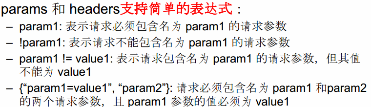

### @PathVariable

映射URL绑定的占位符

### @RequestParam

映射请求参数

jsp

```jsp
<a href="/testRequestMapping/testRequestParam?username=yongPhone&pwd=123456">HelloWorld</a>
```

controller

```java
    @RequestMapping("testRequestParam")
    public String testRequestParamHello(@RequestParam(value = "username") String name,
                                        @RequestParam(value = "pwd", required = false,
                                        defaultValue = "000") String pwd){
        System.out.println(name + pwd);
        return "success";
    }
```

- value 值即为请求参数的参数名
- required 该参数是否是必须的，默认值是true
- defaultValue 请求参数的默认值
- 有无@RequestParam注入的区别：
  - 无：按照入参类型匹配
  - 有：按照属性名匹配
    - 先按照@RequestParam后面括号的value匹配
    - 如果没有指定value，那么就按照入参的名字匹配

### @RequestHeader

映射请求头信息

用法及属性同@RequestParam

```java
    @RequestMapping("testRequestHeader")
    public String testRequestHeader(@RequestHeader(value = "Accept-Language") String language){
        System.out.println(language);
        return "success";
    }
```

### @CookieValue

映射一个Cookie值

用法及属性同@RequestParam

```java
    @RequestMapping("testCookieValue")
    public String testRequestCookie(@CookieValue(value = "Idea-3c8dea03") String value){
        System.out.println(value);
        return "success";
    }
```

### 使用POJO对象进行绑定请求参数值

Spring MVC 会按请求参数名和 POJO 属性名进行自动匹配，自动为该对象填充属性值（支持级联属性）

pojo

```java
public class User {
    private String name;
    private int age;
    private Adress adress;
	//getter and setter省略
}
```

```java
public class Adress {
    private String province;
    private String city;
	//getter and setter省略
}
```

jsp

```jsp
<form action="/testRequestMapping/testPojo">
    <input type="text" name="name">
    <input type="text" name="age">
    <input type="text" name="adress.province">
    <input type="text" name="adress.city">
    <input type="submit">
</form>
```

 controller

```java
    @RequestMapping("testPojo")
    public String testPojo(User user){
        System.out.println(user);
        return "success";
    }
```

### 使用Servlet原生API作为入参

MVC 的 Handler 方法可以接受下列Servlet API 类型的参数

- HttpServletRequest

-  HttpServletResponse

-  HttpSession

-  java.security.Principal

-  Locale

-  InputStream

-  OutputStream

-  Reader

- Writer 

  使用：直接在方法中传入参数即可

```java
    @RequestMapping("helloWorld")
    public String sayHello(HttpServletRequest request){
        System.out.println(request.getParameter("login"));
        System.out.println("HelloWorld");
        return "success";
    }
```

## 处理模型数据

Spring MVC 提供了几种途径输出模型数据：

### ModelAndView

处理方法返回类型为ModelAndView时，方法体即可通过该对象添加模型数据

- 返回值ModelAndView类型，其中包含视图和模型信息

  - 设置视图信息

    - void setView(View view)
    - void setVoidName(String viewName)

  - 设置模型信息

    - addObject(String attributeName, String attributeValue)
    - addAllObject(Map\<String, ?> modelMap)

    Spring MVC将model中的数据放入request的域对象中

```java
    @RequestMapping("testModelAndView")
    public ModelAndView testModelAndView(User user){
        ModelAndView modelAndView = new ModelAndView();
        System.out.println(user);
        Map<String, User> stringUserMap = new HashMap<>();
        stringUserMap.put("user", user);
        modelAndView.addAllObjects(stringUserMap);
        modelAndView.setViewName("success");
        return modelAndView;
    }
```

### Map及Model

目标方法可以添加Map（也可以是Model/ModelMap）类型的参数

Spring MVC在内部使用一个org.springframework.ui.Model 接口存储模型数据 

具体步骤：

1. Spring MVC 在调用方法前会创建一个隐含的模型对象作为模型数据的存储容器。
2. 如果方法的入参为 Map 或 Model 类型，Spring MVC 会将隐含模型的引用传递给这些入参。
3. 在方法体内，开发者可以通过这个入参对象访问到模型中的所有数据，也可以向模型中添加新的属性数据 

```java
    @RequestMapping("testMap")
    public String testModelAndView(Map map){
        map.put("name","huang");
        return "success";
    }
	//这样之后在success.jsp中就可以request.getAttribute("name")来获取值
```

### @SessionAttributes

在模型中对应的属性暂存到 HttpSession 中 

- value：通过属性名指定要放入session的属性
- types：通过模型属性的对象类型指定哪些模型属性要放在session中

**该注解应该放在类上面，而不能修饰方法** （除了注解，使用方式同Map及Model）

（属性其实同时放入了session和request中）

### @ModelAttribute

Spring MVC在调用目标处理方法前，会先逐个调用在方法级上标注了@ModelAttribute 的方法 

在方法的入参前使用 @ModelAttribute 注解：

- 可以从隐含对象中获取隐含的模型数据中获取对象，再将请求参数绑定到对象中，再传入入参
- 将方法入参对象添加到模型中 

运行流程：

1. 执行@ModelAttribute注解修饰的方法

2. Spring MVC 从Map 中取出User对象，并把表单的请求参数赋给User对象的对应属性

   （其实就是用表单的数据把数据库取出来的数据修改）

3. Spring MVC 把上述对象传入目标方法的参数

```java
	//@ModelAttribute修饰的方法中先执行
    @ModelAttribute
    public void getUser(Map<String, Object> map){
        User user = new User("Tom", 19);
        System.out.println("从数据库获取对象：" + user);
        map.put("user",user);
    }

	//@ModelAttribute的方法中，放入Map时的键需要和目标方法入参类型的第一个字母小写的字符串一致
    @RequestMapping("testModelAttribute")
    public String testModelAttribute(User user){
        System.out.println("修改：" + user);
        return "success";
    }
```

- 有@ModelAttribute标记的方法，会在每个目标方法执行前被SpringMVC调用

- @ModelAttribute注解也可以用来修饰目标方法POJO类型的入参

  ```java
      @RequestMapping("testModelAttribute")
      public String testModelAttribute(@ModelAttribute("aaa") User user){
          System.out.println("修改：" + user);
          return "success";
      }
  ```

  其value属性值有如下作用：

  1. SpringMVC 会使用value的属性值在implicitModel中查找对应的对象，若存在则会被直接传入目标方法的入参中
  2. SpringMVC 会value为key，POJO类型的对象值为value，存入到request中

  > 由@SessionAttributes引发的异常 
  >
  > 如果在处理类定义处标注了@SessionAttributes(“xxx”)，则尝试从会话中获取该属性，并将其赋给该入参，然后再用请求消息填充该入参对象。如果在会话中找不到对应的属性，则抛出HttpSessionRequiredException 异常 
  >
  > ```java
  > 	 * SpringMVC 确定目标方法 POJO 类型入参的过程
  > 	 * 1. 确定一个 key:
  > 	 * 1). 若目标方法的 POJO 类型的参数木有使用 @ModelAttribute 作为修饰, 则 key 为 POJO 类名第一个字母的小写
  > 	 * 2). 若使用了  @ModelAttribute 来修饰, 则 key 为 @ModelAttribute 注解的 value 属性值. 
  > 	 * 2. 在 implicitModel 中查找 key 对应的对象, 若存在, 则作为入参传入
  > 	 * 1). 若在 @ModelAttribute 标记的方法中在 Map 中保存过, 且 key 和 1 确定的 key 一致, 则会获取到. 
  > 	 * 3. 若 implicitModel 中不存在 key 对应的对象, 则检查当前的 Handler 是否使用 @SessionAttributes 注解修饰, 若使用了该注解, 且 @SessionAttributes 注解的 value 属性值中包含了 key, 则会从 HttpSession 中来获取 key 所对应的 value 值, 若存在则直接传入到目标方法的入参中. 若不存在则将抛出异常. 
  > 	 * 4. 若 Handler 没有标识 @SessionAttributes 注解或 @SessionAttributes 注解的 value 值中不包含 key,·· 则会通过反射来创建 POJO 类型的参数, 传入为目标方法的参数
  > 	 * 5. SpringMVC 会把 key 和 POJO 类型的对象保存到 implicitModel 中, 进而会保存到 request 中. 
  > ```
  >
  > 解决方式：
  >
  > 1. 把@SessionAttributes中的value属性值和@ModelAttribute的value属性值弄成不一样
  >
  > 2. @ModelAttribute修饰方法，在这个方法中添加属性模型
  >
  >    ```java
  >        //假设在类前面@SessionAttribute(value="user", value={String.class})
  >    	@ModelAttribute
  >        public void getUser(Map<String, Object> map){
  >            User user = new User("Tom", 19);
  >            System.out.println("从数据库获取对象：" + user);
  >            map.put("user",user);
  >        }
  >    ```
  >
  >    这样@ModelAttribute的方法在每个方法调用前执行，就不会有不存在key而抛出异常

### 使用矩阵变量绑定参数

## HttpMessageConverter\<T>

HttpMessageConverter\<T>是一个重要接口，负责将请求信息转换为一个**对象**（类型为T），将**对象**（类型为T）输出为响应信息

- Spring为HttpMessageConverter\<T>提供了众多实现类，见《精通Spring4.x》P575
- RequestMappingHandlerAdapter默认装配了下列HttpMessageConverter
  - StringHttpMessageConverter：将请求信息转换为字符串
  - ByteArrayHttpMessageConverter：读/写二进制数据
  - SourceHttpMessageConverter：读/写javax.xml.transform.Source类型的数据
  - AllEncompassingFormHttpMrssageConverter

### 使用HttpMessageConverter\<T>

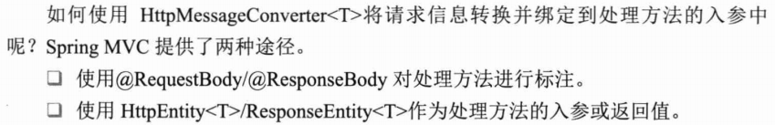

#### @RequestBody--有毒系列

有毒：用get请求是无法成功的，要用post请求

jsp表单：

```jsp
<form action="testRequestBody" method="post">
    <input name="name" value="haha">
    <input type="submit">
</form>
```

controller:

```java
    @RequestMapping(value = "/testRequestBody", method = RequestMethod.POST)
    public String testRequestBody(@RequestBody String requestBody){
        System.out.println(requestBody);
        return "success";
    }
```

#### @ResponseBody--优雅系列

据说，和前端对接，只要把数据@ResponseBody一下就可以了

```java
    @ResponseBody
    @RequestMapping(value = "/testResponseBody")
    public byte[] testResponseBody() throws IOException {
        File file = new File("D:\\黄永锋\\临时\\883049933962685952.jpg");
        byte[] bytes = FileCopyUtils.copyToByteArray(file);
        return bytes;
    }
```

- 有Response

#### @HttpEntity\<T>和@ResponseEntity\<T>

可以访问请求和响应的报头和报文体的数据

!!!记得发POST请求，用HttpEntity的时候

```java
    @RequestMapping(value = "/testEntity", method = RequestMethod.POST)
    public ResponseEntity<byte[]> testEntity(HttpEntity<String> httpEntity) throws IOException {
        long contentLength = httpEntity.getHeaders().getContentLength();
        System.out.println(httpEntity.getHeaders());
        System.out.println(contentLength);
        System.out.println(httpEntity.getBody());

        File file = new File("D:\\黄永锋\\临时\\883049933962685952.jpg");
        byte[] bytes = FileCopyUtils.copyToByteArray(file);
        ResponseEntity<byte[]> responseEntity = new ResponseEntity<byte[]>(bytes, HttpStatus.OK);
        return responseEntity;
    }
```

## 视图解析器

- Spring MVC 为逻辑视图名的解析提供了不同的策略，可以在 Spring WEB 上下文中配置一种或多种解析策略，并指定他们之间的先后顺序。每一种映射策略对应一个具体的视图解析器实现类。

  （orderNo属性可以指定解析器的优先顺序，值越小优先级越高）

-  视图解析器的作用比较单一：将逻辑视图解析为一个具体的视图对象 

- 所有的视图解析器都必须实现 ViewResolver 接口：

  常用：

  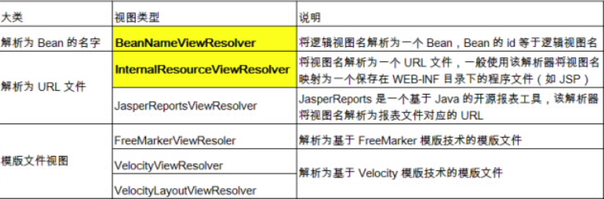

- SpringMVC 会按视图解析器顺序的优先顺序对逻辑视图名进行解析，直到解析成功并返回视图对象，否则将抛出 ServletException 异常  


自定义视图：

```java
//@Component是所有受Spring 管理组件的通用形式
@Component
public class HelloView implements View {
    @Override
    public String getContentType() {
        return null;
    }
    @Override
    public void render(Map<String, ?> map, HttpServletRequest httpServletRequest, HttpServletResponse httpServletResponse) throws Exception {
        httpServletResponse.getWriter().print("Hello:" + new Date());
    }
}
```

配置试图解析器：

```xml
    <!-- 配置视图解析器: 使用视图的名字来解析视图 -->
    <!-- order定义视图解析器的优先级 -->
    <bean class="org.springframework.web.servlet.view.BeanNameViewResolver">
        <property name="order" value="100"/>
    </bean>
```

测试：（根据返回值跳转到自己的视图）

```java
    @RequestMapping("/testView")
    public String testView(){
        return "helloView";
    }
```

## 转发和重定向

- 一般情况下，控制器方法返回字符串类型的值会被当成逻辑视图名处理

- 如果返回的字符串中带 forward: 或 redirect: 前缀时，SpringMVC 会对他们进行特殊处理：

  将 forward: 和redirect: 当成指示符，其后的字符串作为 URL 来处理	

  - redirect:success.jsp：会完成一个到 success.jsp 的重定向的操作
  - forward:success.jsp：会完成一个到 success.jsp 的转发操作 

  ```java
      @RequestMapping("/testRedirect")
      public String testRedirect(){
          return "success";
      }
  ```

## 处理静态资源

优雅的 REST 风格的资源URL 不希望带 .html 或 .do 等后缀

- 若将 DispatcherServlet 请求映射配置为 /，则 Spring MVC 将捕获WEB 容器的所有请求，包括静态资源的请求， Spring MVC 会将他们当成一个普通请求处理，因找不到对应处理器将导致错误。

### 方法一：\<mvc:default-servlet-handler>

- 可以在 SpringMVC 的配置文件中**配置\<mvc:default-servlet-handler/> 的方式解决静态资源**的问题：
  -  \<mvc:default-servlet-handler/> 将在 SpringMVC 上下文中定义一个DefaultServletHttpRequestHandler，它会对进入 DispatcherServlet 的请求进行筛查，如果发现是没有经过映射的请求，就将该请求交由 WEB应用服务器默认的 Servlet 处理，如果不是静态资源的请求，才由DispatcherServlet 继续处理
  -  一般 WEB 应用服务器默认的 Servlet 的名称都是 default。若所使用的WEB 服务器的默认 Servlet 名称不是 default，则需要通过 default-servlet-name 属性显式指定 
  -  \<mvc:default-servlet-handler/>将静态资源的处理经由Spring MVC框架交回Web应用服务器

```xml
    <!--防止其他请求404-->
	<mvc:annotation-driven/>

    <mvc:default-servlet-handler/>
```

### 方法二：\<mvn:resources/>

\<mvc:resources/>由Spring MVC框架自己处理静态资源，并且添加一些有用的附加功能

执行机制：

在接受到静态资源的请求时，会检查请求头的Last-Modified值。如果静态资源没有发生变化，则直接返回303状态响应码，指示客户端使用浏览器缓存的数据。

配置：

```xml
<mvc:resources mapping="/resources/**" location="/META-INF/" cache-period="31536000"/>
```

- location：
  - 指定静态资源的位置，可以是任何地方
  - 可以使用诸如`calsspath：` 等资源前缀指定资源位置
  - 可以使用逗号间隔多个资源路径
- mapping：
  - 将location中的`/META-INF/`  路径映射为`/resources` 路径
  - 如果用户直接通过url访问包含WEB-INF、META-INF的路径，那么Spring MVC会直接返回null，但是可以通过resources路径访问里面的静态资源
  - 一个逻辑路径表示的资源有可能在多个物理路径都存在，处理机制是，只要找到第一个匹配的资源就返回，查找顺序与物理路径在location中的配置顺序有关
- cache-period:
  - 设置资源在客户端浏览器的缓存有效时间，一般是设置为一年，以便充分利用客户端的缓存资源
- 静态资源更新怎么办：
  - 解决办法：在网页中引用静态的资源路径（逻辑路径mapping）添加应用的发布版本号，这样这些静态资源就会成为新的资源了
  - 在上面解决方案的基础上可以写一个ServlerContextAware的实现类，通过这个实现类返回版本号包含到\<mvc:resources/>中，详见《精通Spring4.x》P641

## \<mvn:annotation-driven />

- \<mvc:annotation-driven /> 会自动注册RequestMappingHandlerMapping、RequestMappingHandlerAdapter 与ExceptionHandlerExceptionResolver 三个bean。
- 还将提供以下支持：
  - 支持使用 ConversionService 实例对表单参数进行类型转换
  - 支持使用 @NumberFormat annotation、@DateTimeFormat注解完成数据类型的格式化
  - 支持使用 @Valid 注解对 JavaBean 实例进行 JSR 303 验证
  - 支持使用 @RequestBody 和 @ResponseBody 注解 

## 数据绑定流程

1. Spring MVC 主框架将 ServletRequest 对象及目标方法的入参实例传递给 WebDataBinderFactory 实例，以创建 DataBinder 实例对象
2. DataBinder 调用装配在 Spring MVC 上下文中的ConversionService 组件进行数据类型转换、数据格式化工作。将 Servlet 中的请求信息填充到入参对象中
3. 调用 Validator 组件对已经绑定了请求消息的入参对象进行数据合法性校验，并最终生成数据绑定结果BindingData 对象
4. Spring MVC 抽取 BindingResult 中的入参对象和校验错误对象，将它们赋给处理方法的响应入参 

### @InitBinder

- 由 @InitBinder 标识的方法，可以对 WebDataBinder 对象进行初始化。WebDataBinder 是 DataBinder 的子类，用于完成由表单字段到 JavaBean 属性的绑定
- @InitBinder方法不能有返回值，它必须声明为void。
- @InitBinder方法的参数通常是是 WebDataBinder 

```java
    @InitBinder
    public void init(WebDataBinder webDataBinder){
        System.out.println("------------------------");
        //由表单到javaBean属性的赋值过程中，不自动绑定对象中的某属性
        webDataBinder.setDisallowedFields("name");
    }
```

## 自定义类型转换器

ConversionService 是 Spring 类型转换体系的核心接口。

- 可以利用 ConversionServiceFactoryBean 在 Spring 的 IOC容器中定义一个 ConversionService. Spring 将自动识别出IOC 容器中的 ConversionService，并在 Bean 属性配置及Spring MVC 处理方法入参绑定等场合使用它进行数据的转换
- 可通过 ConversionServiceFactoryBean 的 converters 属性注册自定义的类型转换器 

自己写的转换器:

```java
@Component
public class UserConverter implements Converter<String, User>{
    @Override
    public User convert(String s) {    //把String转User
        User user = new User();
        if (s != null){
            String[] str = s.split("-");
            user = new User();
            user.setName(str[0]);
            user.setAge(Integer.parseInt(str[1]));
            user.setAdress(new Adress(str[2], str[3]));
            return user;
        }
        return user;
    }
}
```

配置：

```xml
    <mvc:annotation-driven conversion-service="conversionService"/>
    
    <!--配置conversionService-->
    <bean name="conversionService" class="org.springframework.context.support.ConversionServiceFactoryBean">
        <property name="converters">
            <list>
                <bean class="com.spring.mvc.UserConverter"/>
            </list>
        </property>
    </bean>
```

Spring 定义了 3 种类型的转换器接口，实现任意一个转换器接口都可以作为自定义转换器注册到ConversionServiceFactroyBean 中：

- Converter\<S,T>：将 S 类型对象转为 T 类型对象
- ConverterFactory：将相同系列多个 “同质” Converter 封装在一起。如果希望将一种类型的对象转换为另一种类型及其子类的对象（例如将 String 转换为 Number 及 Number 子类（Integer、Long、Double 等）对象）可使用该转换器工厂类
- GenericConverter：会根据源类对象及目标类对象所在的宿主类中的上下文信息进行类型转换 

## 数据格式化

按照格式输入，然后类型转换器将其转化为对应的类型

- `@NumberFormat`
- `@DateTimeFormat`

实体类User

```java
public class User {
    private String name;
    private int age;
    private Adress adress;

    @DateTimeFormat(pattern = "yyyy-mm-dd")
    private Date birthDay;

    @NumberFormat(pattern = "#,###.##")
    private int salary;
  
	//省略getter和setter
}

```

springmvc.xml

```xml
    
<!-- mvn:annotation-driven标签内部会默认创建ConversionService实例
	 把原来的Conversion实例在像下面那样改为
	 FormattingConversionServiceFactoryBean就可以了
-->
<mvc:annotation-driven conversion-service="conversionService"/>

	<bean name="conversionService" class="org.springframework.format.support.FormattingConversionServiceFactoryBean">
        <property name="converters">
            <list>
                <bean class="com.spring.mvc.UserConverter"/>
            </list>
        </property>
    </bean>
```

@DateTimeFormat和@NumberFormat的属性都是互斥的

- @DateTimeFormat属性：

  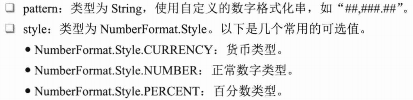

- @NumberFormat属性：

  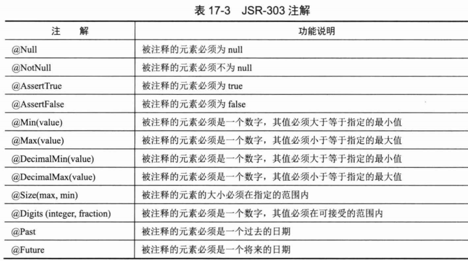

## 数据校验

#### JSR-303校验框架

- Spring本身并没有提供JSR-303的实现，所以必须将JAR-303的实现（如Hibernate Validator）的jar依赖


- Hibernate Validator在JSR-303的基础上添加：

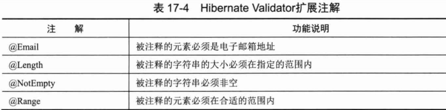

#### 在Spring MVC中数据校验

`<mvc:annotation-driven/>`会默认装配一个LocalValidatorFactoryBean，通过在处理方法的入参钱标注@Valid注解，即可让Spring MVC在完成数据绑定后执行数据校验工作。

User的age属性必须大于0

```java
public class User {
    private String name;

    @Min(0)
    private int age;

    private Adress adress;

    @DateTimeFormat(pattern = "yyyy-mm-dd")
    private Date birthDay;

    @NumberFormat(pattern = "#,###.##")
    private int salary;
}
```

Controller中测试一下

```java
    @RequestMapping("testFormat")
    public String testFormat(@Valid User user, Errors errors){
        System.out.println(errors);
        System.out.println(user);
        return "success";
    }
```

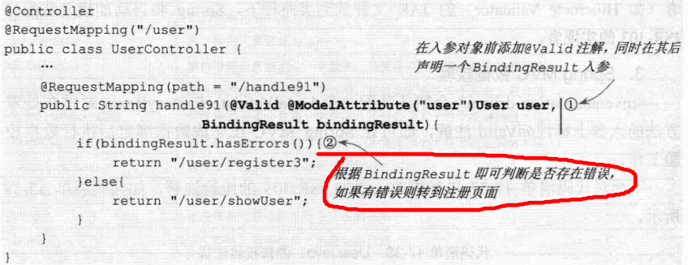

- Spring MVC 是通过对处理方法的签名的规约来保存验证结果的：前一个表单/命令对象的检验结果保存在其后的入参中，这个保存检验结果的入参必须为BindingResult或者Errors型的

- BindingResult/Errors有许多方法获得验证的结果信息

- 被检验的对象和结果对象是一对一关系

  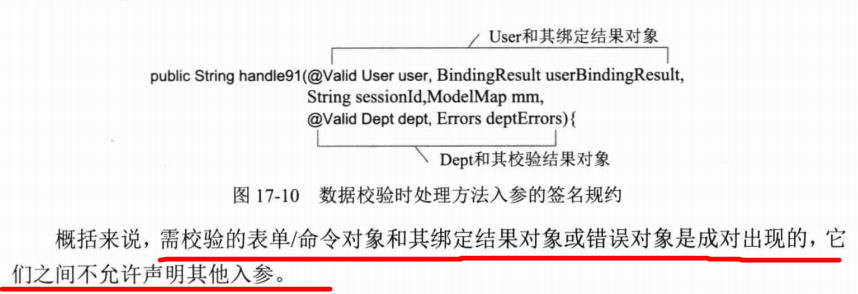

#### 在页面中检验校验结果

Spring除了将校验结果保存到BindingResult或者Errors对象中外，还将所有的校验结果保存到“隐藏模型”中。前端可以通过HttpServletRequest的属性列表获取校验错误信息，详见《精通Spring4.x》P607（反正我没成功）

## 国际化

国际化资源配置文件

```xml
    <bean id="messageSource" class="org.springframework.context.support.ResourceBundleMessageSource">
        <property name="basename" value="i18n"></property>
    </bean>
```

1. 在页面上能够根据浏览器对语言选择情况对文本、时间、数值本地化处理

   解决：使用jstl的fmt标签

i18n.properties

```
i18n.user=user
i18n.password=password
```

i18n_zh_CN.properties

```
i18n.user=用户名
i18n.password=密码
```

i18n_en_US.properties

```
i18n.user=user
i18n.password=password
```

添加fmt标签

```xml
<%@ taglib prefix="fmt" uri="http://java.sun.com/jsp/jstl/fmt" %>
```

jsp显示

```
<fmt:message key="i18n.user"></fmt:message>
<fmt:message key="i18n.password"></fmt:message>
```

2. 可以在Bean中获取国际化资源文件Locale对应的消息

   解决：在Bean中注入ResourceBundleMessageSource

```java
	@Autowired
    private ResourceBundleMessageSource messageSource;

	@RequestMapping("/i18n")
    public String testI18n(Locale locale){
        String val = messageSource.getMessage("i18n.user", null, locale);
        System.out.println(val);
        return "i18n";
    }
```

3. 通过超链接切换Locale，不再依赖于浏览器的语言设置情况

解决：配置LacalResolver和LocaleChangeInterceptor

配置：

```xml
    <!-- 配置SessionLocaleResolver -->
    <bean id="localeResolver" class="org.springframework.web.servlet.i18n.SessionLocaleResolver"/>
    <!-- 配置LocaleChanceInterceptor -->
    <mvc:interceptors>
        <bean class="org.springframework.web.servlet.i18n.LocaleChangeInterceptor"/>
    </mvc:interceptors>
```

jsp

```jsp
<a href="/i18n?locale=zh_CN">中文</a>
<br>
<a href="/i18n?locale=en_US">英文</a>
```

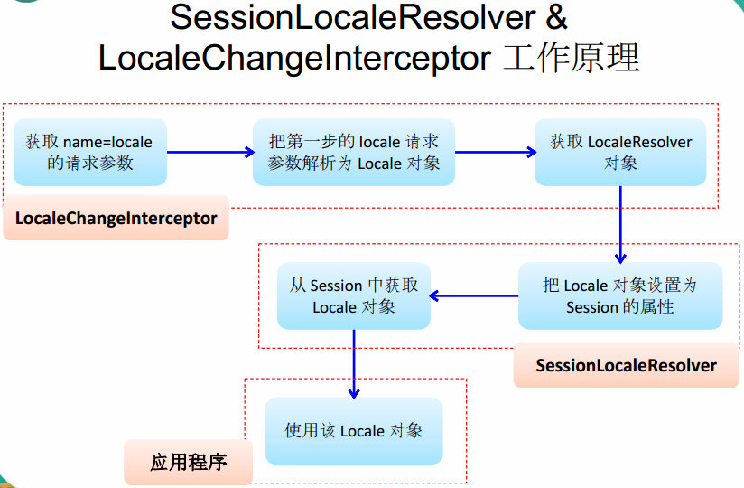

## 本地化

### 概念

web应用根据用户的浏览器设置判断客户端的本地化类型，比如“语言首选项”。

默认情况下，spring mvc 根据Accept-language参数判断客户端本地化类型，此外，它还提供了多种指定客户端本地化类型的方式，如cookie、session指定

- 当收到请求时，Spring MVC 会在上下文中找到一个本地化解析器（LocaleResolver），找到后可以使用它请求所对应的本地化类型信息
- Spring MVC 还允许装配一个动态更改本地化类型的拦截器，这样通过指定一个请求参数就可以控制单个请求的本地化类型
- 本地化解析器和拦截器都定义在`org.springframework.web.servlet.i18n`这个包中，可以在配置文件中配置

### 本地化解析器类型

#### AcceptHeaderLocaleResolver

根据报文头的Accept-Language参数确定本地化类型。

如果没有显式指定本地化解析器，默认用这个。

#### CookieLocaleResolver

用cookie保存本地化类型信息，只需要配置一个CookieLocaleResolver，DispatcherServler会自动识别并装配它

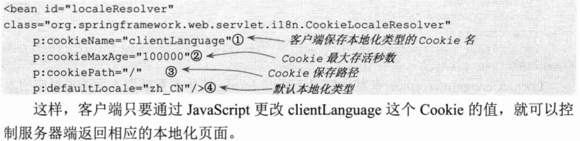

#### SessionLocaleResolver

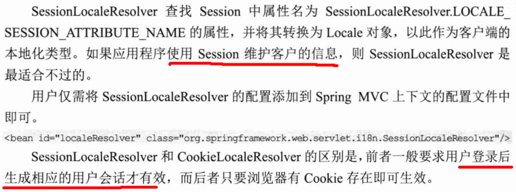

### LocaleChangeInterceptor

可以实现通过超链接切换Locale，不再依赖于浏览器的语言设置情况（上面国际化的第三点）

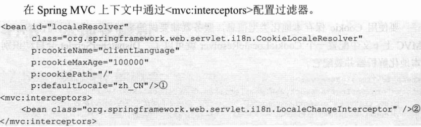

- 原理：LocaleChangeInterceptor拦截器从请求中获取本地化类型并设置给真正本地化解析器CookieLocaleResolver。
- 由于AcceptHeaferLocaleResolver是从请求报文头获取本地化信息的，因此不能被动态更改，所以只能选择CookieLocaleResolver或者SessionLocaleResolver

## 文件上传

1. 配置

   ```xml
       <!-- 配置MultipartResolver -->
       <bean id="multipartResolver" class="org.springframework.web.multipart.commons.CommonsMultipartResolver">
           <property name="defaultEncoding" value="UTF-8"/>
           <property name="maxUploadSize" value="1024000"/>
       </bean>
   ```

2. jsp:

   ```jsp
   <form action="/hello2/testFileUpload" method="post" enctype="multipart/form-data">
       <input type="file" name="file">
       <input type="text" name="desc">
       <input type="submit"/>
   </form>
   ```

3. controller:

   ```java
   	@RequestMapping("/hello2/testFileUpload")
       public String testFileUpload(@RequestParam("desc") String desc, @RequestParam("file")MultipartFile file) throws IOException {
           System.out.println(desc);
           System.out.println(file.getOriginalFilename());
           System.out.println("fileInputStream:" + file.getInputStream());
           return "success";
       }
   ```

   这波文件上传贼厉害！

## 使用拦截器

Spring MVC也可以使用拦截器对请求进行拦截处理，用户可以自定义拦截器来实现特定的功能，自定义的拦截器必须实现HandlerInterceptor接口

- preHandle()：这个方法在业务处理器处理请求之前被调用，在该方法中对用户请求 request 进行处理。如果程序员决定该拦截器对请求进行拦截处理后还要调用其他的拦截器，或者是业务处理器去进行处理，则返回true；如果程序员决定不需要再调用其他的组件去处理请求，则返回false。
- postHandle()：这个方法在业务处理器处理完请求后，但是DispatcherServlet 向客户端返回响应前被调用，在该方法中对用户请求request进行处理。
- afterCompletion()：这个方法在 DispatcherServlet 完全处理完请求后被调用，可以在该方法中进行一些资源清理的操作。 

自定义拦截器：

```java
public class FirstInterceptor implements HandlerInterceptor {
    //目标方法前被调用
    //如果return true 那么会执行后续的拦截器和方法
    //如果return false 那么后续的拦截器和目标方法都不会被调用
    //可以考虑做权限，日志，事务等
    @Override
    public boolean preHandle(HttpServletRequest httpServletRequest, HttpServletResponse httpServletResponse, Object o) throws Exception {
        return false;
    }

    //目标方法之后，渲染视图之前被调用
    //可以对请求域的属性或视图做出修改
    @Override
    public void postHandle(HttpServletRequest httpServletRequest, HttpServletResponse httpServletResponse, Object o, ModelAndView modelAndView) throws Exception {

    }

    //渲染视图之后被调用
    //释放资源
    @Override
    public void afterCompletion(HttpServletRequest httpServletRequest, HttpServletResponse httpServletResponse, Object o, Exception e) throws Exception {

    }
}
```

配置拦截器：

```xml
    <mvc:interceptors>
        <!-- 自定义拦截器 -->
      	<!-- 这样表示对所有资源拦截，也可以自己在子属性中指定资源拦截 -->
        <bean class="com.spring.mvc.FirstInterceptor"/>
        <!-- 配置LocaleChangeInterceptor,与本例无关 -->
        <bean class="org.springframework.web.servlet.i18n.LocaleChangeInterceptor"/>
	</mvc:interceptors>
```

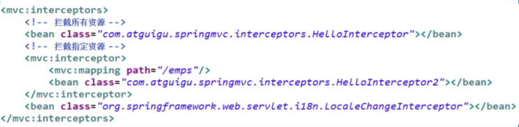

### 多个拦截器方法的拦截顺序

按配置先后顺序

preHandle顺序执行，postHandle、afterCompletion反序执行(其实就像过滤器那样，先进后出)

## 处理json数据

jar

- jackson-annotations
- jackson-core
- jackson-databind

在目标方法直接返回集合，加注解@Responsebody在方法前

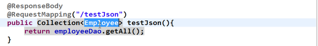

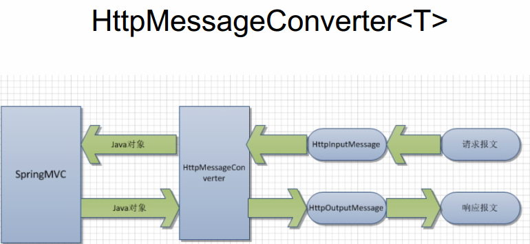

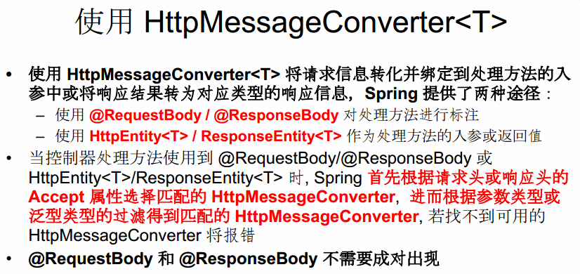

- @ResponseEntity可以用来做文件下载

## 异常处理

### HandlerExceptionResolver 

- Spring MVC 通过 HandlerExceptionResolver 处理程序的异常，包括 Handler 映射、数据绑定以及目标方法执行时发生的异常。
- SpringMVC 提供的 HandlerExceptionResolver 的实现类 
- 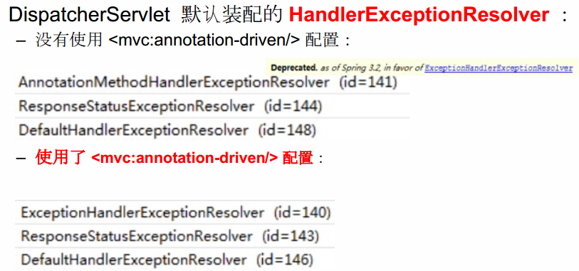

### ExceptionHandlerExceptionResolver 

- 主要处理 Handler 中用 @ExceptionHandler 注解定义的方法。
- @ExceptionHandler 注解定义的方法优先级问题：例如发生的是NullPointerException，但是声明的异常有RuntimeException 和 Exception，此候会根据异常的最近继承关系找到继承深度最浅的那个@ExceptionHandler注解方法，即标记了 RuntimeException 的方法
- ExceptionHandlerMethodResolver 内部若找不到@ExceptionHandler 注解的话，会找@ControllerAdvice 中的@ExceptionHandler 注解方法 

### ResponseStatusExceptionResolver 

在异常及异常父类中找到 @ResponseStatus 注解，然后使用这个注解的属性进行处理。

- 定义一个 @ResponseStatus 注解修饰的异常类
- 若在处理器方法中抛出了上述异常：若ExceptionHandlerExceptionResolver 不解析述异常。由于触发的异常 UnauthorizedException 带有@ResponseStatus注解。因此会被ResponseStatusExceptionResolver 解析到。最后响应HttpStatus.UNAUTHORIZED 代码给客户端。HttpStatus.UNAUTHORIZED 代表响应码401，无权限。关于其他的响应码请参考 HttpStatus 枚举类型源码 

自定义异常：

```java
@ResponseStatus(reason = "用户名密码不匹配",code = NOT_FOUND)
public class MyResponseException extends RuntimeException {

    public static final long serialVersionUID = -7034897190745766939L;

}
```

controller：

```java
    @RequestMapping("/hello2/testResponseException")
    public String TestResponseStatusException(@RequestParam("i") int i){
        if (i == 13) {
            System.out.println("exception");
            throw new MyResponseException();
        } else {
            System.out.println("success");
            return "success";
        }
    }
```

有毒系列：这样是可以的，但是把@ResponseStatus移到controller中的方法，i=13抛500异常，i!=13才抛自己定义的异常------->好的，我知道了，把ResponseStatus移动到方法前面，那么该方法执行完毕是一定会抛出自己定义的异常，但是如果自己在方法中有手动抛出异常就会有异常嵌套的错误

### DefaultHandlerExceptionResolver

对一些特殊的异常进行处理，比如NoSuchRequestHandlingMethodException、HttpRequestMethodNotSupportedException、HttpMediaTypeNotSupportedException、HttpMediaTypeNotAcceptableException等。 

### SimpleMappingExceptionResolver 

如果希望对所有异常进行统一处理，可以使用SimpleMappingExceptionResolver，它将异常类名映射为视图名，即发生异常时使用对应的视图报告异常 

配置

```xml
    <!-- 配置使用SimpleMappingException来映射异常 -->
    <bean class="org.springframework.web.servlet.handler.SimpleMappingExceptionResolver">
        <property name="exceptionMappings">
            <props>
                <!--success.jsp是指定异常跳转的页面-->
                <prop key="java.lang.ArrayIndexOutOfBoundsException">success</prop>
            </props>
        </property>
    </bean>
```

测试，故意制造数组溢出异常

```java
    @RequestMapping("/hello2/testSimpleMappingException")
    public String testSimpleException(@RequestParam int i){
       String[] strings = new String[10];
       System.out.println(strings[i]);
       return "success";
    }
```

## MVC执行过程

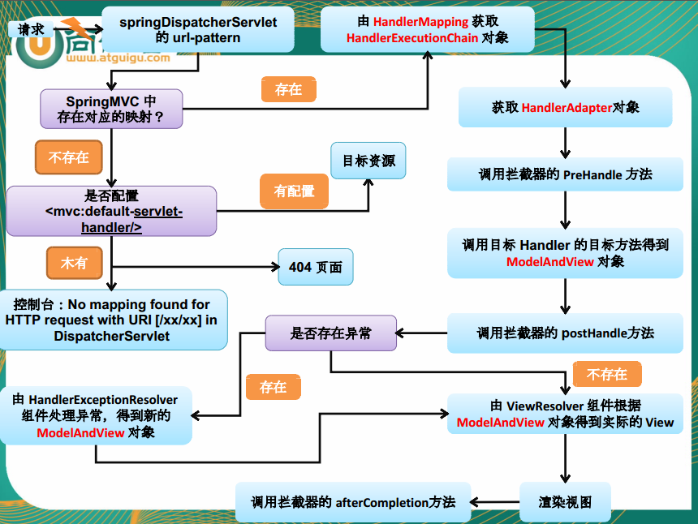

## 整合Spring和Spring MVC

- 用\<context:component-scan>中的子节点\<exclude-filter>\<include-filter>规定只能扫描的注解，视频中的例子是mvc的容器只扫描Controller和ControllerAdvice两个注解，然后Spring容器不扫描这两个注解

## 其他

### JSTL View

> 有关jstl的使用在第25个视频

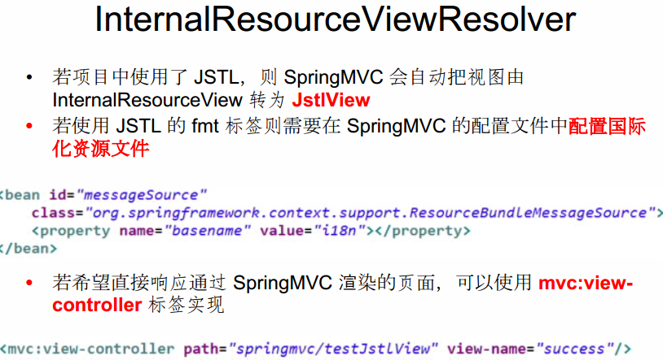

- 直接响应转发的页面，无需再经过Handler的方法\<mvc:view-controller>

```xml
<mvc:view-controller path="/success" view-name="success"/>
```

但是这样会造成别的请求页面找不到，在实际开发中通常都要配置mvc:annotation-driven 标签

```xml
<mvc:annotation-driven/>
```

##  RequestContextHolder的使用

Spring API 提供了工具类RequestContextHolder，能够在controller中获取request和session对象

使用方式：

web.xml中配置监听器

```xml
<listener>
	<listener-class>
		org.springframework.web.context.request.RequestContextListener
	</listener-class>
</listener>
```

controller使用：

```java
    @RequestMapping("/testRequestListener")
    public String testRequestListener(){
        HttpServletRequest request = ((ServletRequestAttributes)RequestContextHolder.getRequestAttributes()).getRequest();
        System.out.println(request.getRequestURL());
        return "success";
    }
```

### IDEA之有毒系列

自动生成的web.xml头文件有毒，配置不进listener

解决：换一个优秀的头文件就好了

```xml
<?xml version="1.0" encoding="UTF-8"?>
<web-app version="2.5" xmlns="http://java.sun.com/xml/ns/javaee"
	xmlns:xsi="http://www.w3.org/2001/XMLSchema-instance"
	xsi:schemaLocation="http://java.sun.com/xml/ns/javaee 
	http://java.sun.com/xml/ns/javaee/web-app_2_5.xsd">
	
	
</web-app>
```

## Spring MVC定时器的使用

1. 配置

   ```xml
       <!-- 定时删除任务 -->
       <task:annotation-driven/>

       <context:annotation-config/>
       <bean class="org.springframework.beans.factory.annotation.AutowiredAnnotationBeanPostProcessor"/>
       <context:component-scan base-package="com.blog.www.servlet"/>
   ```

   注意namespace

   ```xml
   xmlns:task="http://www.springframework.org/schema/task" 

   http://www.springframework.org/schema/task http://www.springframework.org/schema/task/spring-task-3.2.xsd
   ```

2. 定时器

   ```java
   @Component
   public class DeleteOnTime {
     //执行的时间间隔
     @Schedule(fixedDelay = 30000)
     public void deleteFile(){
       
     }
   }
   ```

## Spring IOC容器和Spring MVC IOC容器的关系

mvc的中的Bean可以引用spring中的Bean，反之不可以。

## 待解决的问题

1. 发送DELETE\PUT请求
2. 使用矩阵绑定参数


