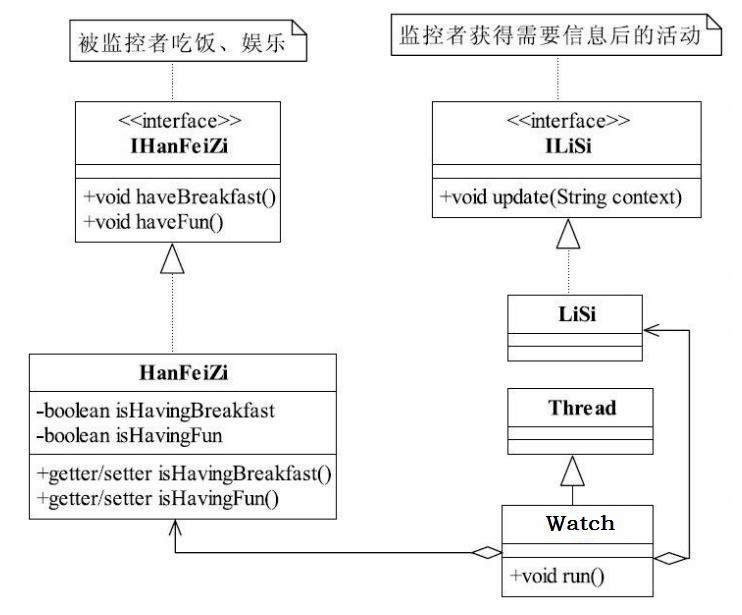
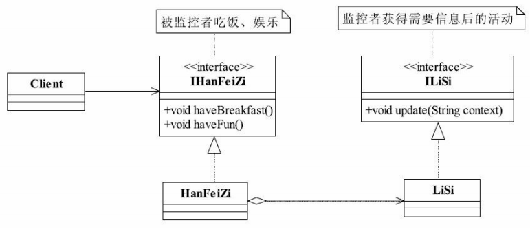
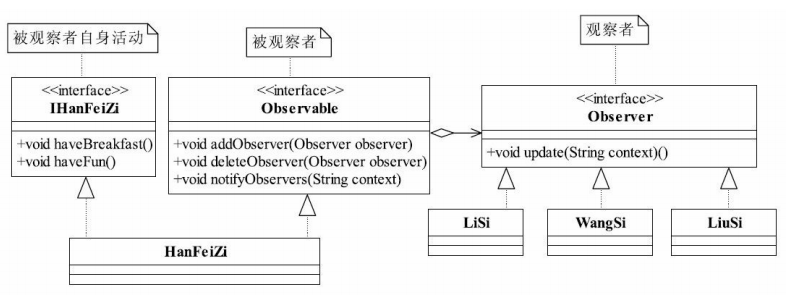
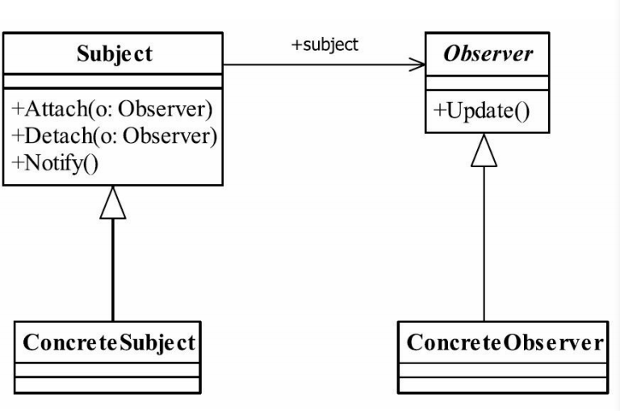

# 观察者模式

**场景：**

**李斯想要监控韩非子，看他在吃饭还是在玩，然后汇报给秦王**

- 解决方式一：开两条守护进程，一条监控是否在吃饭，另一条监控是否在玩

  

  ```java
  public class HanFeiZi implements IHanFeiZi{
      //韩非子是否在吃饭，作为监控的判断标准
      private boolean isHavingBreakfast = false;
      //韩非子是否在娱乐
      private boolean isHavingFun = false;
    
      //韩非子要吃饭了
      public void haveBreakfast(){
          System.out.println("韩非子:开始吃饭了...");
          this.isHavingBreakfast =true;
      }
    
      //韩非子开始娱乐了
      public void haveFun(){
          System.out.println("韩非子:开始娱乐了...");
          this.isHavingFun = true;
      }
      //以下是bean的基本方法，getter/setter
      //...
  }
  ```

  ```java
  public class Watch extends Thread {
      private HanFeiZi hanFeiZi;
      private LiSi liSi;
      private String type;

      //通过构造函数传递参数，我要监控的是谁，谁来监控，要监控什么
      public Watch(HanFeiZi _hanFeiZi, LiSi _liSi, String _type) {
          this.hanFeiZi = _hanFeiZi;
          this.liSi = _liSi;
          this.type = _type;
      }

      @Override
      public void run() {
          while (true) {
              if (this.type.equals("breakfast")) { //监控是否在吃早餐
                  //如果发现韩非子在吃饭，就通知李斯
                  if (this.hanFeiZi.isHavingBreakfast()) {
                      this.liSi.update("韩非子在吃饭");
                      //重置状态，继续监控
                      this.hanFeiZi.setHavingBreakfast(false);
                  }
              } else {//监控是否在娱乐
                  if (this.hanFeiZi.isHavingFun()) {
                      this.liSi.update("韩非子在娱乐");
                      this.hanFeiZi.setHavingFun(false);
                  }
              }
          }
      }
  }
  ```

  ```java
  public class Client {
      public static void main(String[] args) throws InterruptedException {
          //定义出韩非子和李斯
          LiSi liSi = new LiSi();
          HanFeiZi hanFeiZi = new HanFeiZi();
        
          //观察早餐
          Watch watchBreakfast = new Watch(hanFeiZi, liSi,"breakfast");
          //开始启动线程，监控
          watchBreakfast.start();
        
          //观察娱乐情况
          Watch watchFun = new Watch(hanFeiZi, liSi, "fun");
          watchFun.start();
        
          //然后我们看看韩非子在干什么
          Thread.sleep(1000); //主线程等待1秒后后再往下执行
          hanFeiZi.haveBreakfast();
          //韩非子娱乐了
          Thread.sleep(1000);
          hanFeiZi.haveFun();
      }
  }
  ```

  > volatile和synchronized

  开了两条线程，cpu占用比较高

- 解决方案二：

  

  ```java
      public class HanFeiZi implements IHanFeiZi{
          //把李斯声明出来
          private ILiSi liSi =new LiSi();
          //韩非子要吃饭了
          public void haveBreakfast(){
              System.out.println("韩非子:开始吃饭了...");
              //通知李斯
              this.liSi.update("韩非子在吃饭");
          }
          //韩非子开始娱乐了
          public void haveFun(){
              System.out.println("韩非子:开始娱乐了...");
              this.liSi.update("韩非子在娱乐");
          }
      }
  ```

  ```java
  public class Client {
      public static void main(String[] args) {
          //定义出韩非子
          HanFeiZi hanFeiZi = new HanFeiZi();
          //然后我们看看韩非子在干什么
          hanFeiZi.haveBreakfast();
          //韩非子娱乐了
          hanFeiZi.haveFun();
      }
  }
  ```

  - 改进版：

    

    - 增加Observable：

      实现该接口的都是被观察者

    - 修改ILiSI接口名称为Observer：

      接口更抽象化，所有实现该接口的都是观察者

  ```java
  public class HanFeiZi implements Observable ,IHanFeiZi{
      //定义个变长数组，存放所有的观察者
      private ArrayList<Observer> observerList = new ArrayList<Observer>();
      //增加观察者
      public void addObserver(Observer observer){
          this.observerList.add(observer);
      }
      //删除观察者
      public void deleteObserver(Observer observer){
          this.observerList.remove(observer);
      }
      //通知所有的观察者
      public void notifyObservers(String context){
          for(Observer observer:observerList){
              observer.update(context);
          }
      }
      //韩非子要吃饭了
      public void haveBreakfast(){
          System.out.println("韩非子:开始吃饭了...");
      //通知所有的观察者
          this.notifyObservers("韩非子在吃饭");
      }
      //韩非子开始娱乐了
      public void haveFun(){
          System.out.println("韩非子:开始娱乐了...");
          this.notifyObservers("韩非子在娱乐");
      }
  }
  ```

  ```java
  public class Client {
      public static void main(String[] args) {
          //三个观察者产生出来
          Observer liSi = new LiSi();
          Observer wangSi = new WangSi();
          Observer liuSi = new LiuSi();
          //定义出韩非子
          HanFeiZi hanFeiZi = new HanFeiZi();
          //我们后人根据历史，描述这个场景，有三个人在观察韩非子
          hanFeiZi.addObserver(liSi);
          hanFeiZi.addObserver(wangSi);
          hanFeiZi.addObserver(liuSi);
          //然后这里我们看看韩非子在干什么
          hanFeiZi.haveBreakfast();
      }
  }
  ```

## 观察者模式定义

也叫发布订阅模式，定义对象间一种一对多的依赖关系，使得每当一个对象改变状态，则所有依赖于它的对象都会得到通知并被自动更新。

通用类图：



- Subject

  被观察者，它必须能够动态地增加、取消观察者。

  仅仅完成作为被观察者必须实现的职责：管理观察者并通知观察者

- Observer

  观察者接收到消息后，即进行update（更新方法）操作，对接收到的信息进行处理

- ConcreteSubject

  具体的被观察者，定义被观察者自己的业务逻辑，同时定义对哪些事件进行通知

- ConcreteObserver

  观察者自己的处理逻辑

### 优点

1. 观察者和被观察者之间是抽象耦合

   使得增加观察者和被观察者都非常容易扩展

2. 可以建立一套触发机制

   我们去打猎->母鹿死了->母鹿的幼崽饿死了...

### 缺点

1. 一个观察者卡壳，会影响整体的执行效率
2. 多级触发时的效率不高


