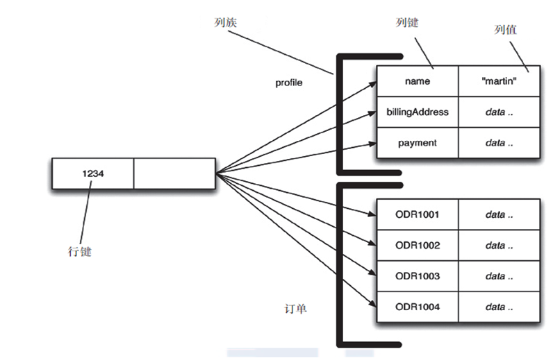
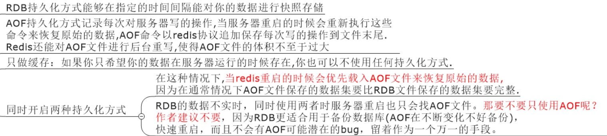

# Nosql && Redis

## Nosql

### 入门概述

#### 优秀的演变历程

1. 单机mysql自己嗨


2. Memcached+mysql+垂直拆分


3. mysql主从读写分离


3. 分表分库+水平拆分+mysql集群

- 在Memcached的高速缓存，MySQL的主从复制，读写分离的基础之上，这时MySQL主库的写压力开始出现瓶颈，而数据量的持续猛增，由于MyISAM使用表锁，在高并发下会出现严重的锁问题，大量的高并发MySQL应用开始使用InnoDB引擎代替MyISAM。

- Mysql表分区和MySQL Cluster集群

  

4. Today


>数据切分：
>
>- 水平切分
>
>  根据表中数据的逻辑关系，将同一张表中的数据按照某种条件拆分到多台数据库（主机）上面
>
>  - 优点
>    - 表关联基本能够在数据库端全部完成；
>    - 不会存在某些超大型数据量和高负载的表遇到瓶颈的问题；
>    - 应用程序端整体架构改动相对较少；
>    - 事务处理相对简单；
>    - 只要切分规则能够定义好，基本上较难遇到扩展性限制；
>  - 缺点
>    - 切分规则相对更为复杂，很难抽象出一个能够满足整个数据库的切分规则；
>    - 后期数据的维护难度有所增加，人为手工定位数据更困难；
>    - 应用系统各模块耦合度较高，可能会对后面数据的迁移拆分造成一定的困难。
>
>- 垂直切分
>
>  按照不同的表来切分到不同的数据库（主机）上
>
>  - 在架构设计中，各个功能模块相互之间的交互点越统一越少，系统的耦合度就越低，系统各个模块的维护性以及扩展性也就越好。这样的系统，实现数据的垂直切分也就越容易
>  - 优点
>    - 数据库的拆分简单明了，拆分规则明确；
>    - 应用程序模块清晰明确，整合容易；
>    - 数据维护方便易行，容易定位；
>  - 缺点
>    - 部分表关联无法在数据库级别完成，需要在程序中完成；
>    - 对于访问极其频繁且数据量超大的表仍然存在性能瓶颈，不一定能满足要求；
>    - 事务处理相对更为复杂；
>    - 切分达到一定程度之后，扩展性会遇到限制；
>    - 过读切分可能会带来系统过渡复杂而难以维护。
>
>数据切割整合方案的两个思路
>
>- 在每个应用程序模块中配置管理自己需要的一个（或者多个）数据源，直接访问各个数据库，在模块内完成数据的整合；
>- 通过中间代理层来统一管理所有的数据源，后端数据库集群对前端应用程序透明；
>  - 利用MySQLProxy实现数据切分及整合
>  - 利用Amoeba实现数据切分及整合
>  - 利用HiveDB实现数据切分及整合

###  大数据时代3V+互联网时代三高

海量Volume、多样Variety、实时Velocity+高并发、高可扩、高性能

### NoSql数据模型简介

聚合模型：

- KV键值

- Bson（和json类似）

- 列族

  顾名思义，是按列存储数据的。最大的特点是方便存储结构化和半结构化数据，方便做数据压缩，
  对针对某一列或者某几列的查询有非常大的IO优势

  

- 图族

  

### NoSQL数据库四大分类


- 四者对比


### 在分布式数据库中CAP原理+BASE

#### CAP

- Consistency：强一致性

- Availability：可用性

- Partition tolerance：分区容错性

  （分区容错性：当分布式系统或复杂的网络环境中，某一节点（或某一机房）不可用时，其余节点（机房）可以继续提供服务的程度）

> 传统的ACID:
>
> - Atomicity：原子性
> - Consistency：一致性
> - Isolation：独立性
> - Durability：持久性

- CAP中只能三进二

  - CA 传统Oracle数据库

  - AP 大多数网站架构的选择

    - 数据库事务一致性需求 

      很多web实时系统并不要求严格的数据库事务，对读一致性的要求很低， 有些场合对写一致性要求并不高，允许实现最终一致性

  - CP Redis、Mongodb


#### BASE

BASE是为了解决关系型数据库强一致性引起的问题而引起的可用性降低而提出的解决方案

Basically Available：基本可用

Soft state：软状态

Eventually consistent：最终一致

- 思想：通过让系统放松对某一时刻数据的一致性的要求换取系统整体伸缩和性能上的改观。因为大型系统往往由于地域分布和极高性能的要求，不可能采用分布式事务来完成这些指标，可以通过BASE来解决这个问题


- 分布式+集群简介

  - 分布式系统： 由多台计算机和通信的软件组件通过计算机网络连接（本地网络或广域网）组成，是建立在网络之上的软件系统，正是因为软件的特性，所以分布式系统具有高度的内聚性和透明性。

    因此，网络和分布式系统之间的区别更多是在于高层软件（特别是操作系统），而不是硬件

    - 分布式：不同的多台服务器上面部署不同的服务模块（工程），他们之间通过Rpc/Rmi之间通信和调用，通过分布式调度软件进行统一的调度，对外提供服务和访问。

  - 集群：不同的多台服务器上面部署着相同的服务模块，通过分布式调度软件进行统一的调度，对外提供服务和访问

#### Redis 杂项知识

- 单进程
  - 单进程模型来处理客户端的请求。对读写等事件的响应是通过对epoll函数的包装做到的。redis的实际处理速度完全依靠主进程的执行效率
  - epoll是linux内核为处理大批量文件描述符而作了改进的epoll，是linux下多路复用IO接口select/poll的增强版本。它能显著提高程序在大量并发连接中只有少量活跃的情况下的系统CPU利用率
- 默认是16个数据库，类似数组下标从0开始，初始默认就是使用0号库
  - select num：切换数据库
  - dbsize：查看查看当前数据库key的数量
  - flushdb：清空当前库
  - flushall：通杀全部库
- 统一密码管理，16个库都是同样的密码，要么都OK要么都连不上
- Redis的索引都是从0开始的
- 默认端口是6739

## Redis 数据类型

#### 五大数据类型

- String
  - String是Redis的最基本类型，一个Key，一个Value
  - String类型是二进制安全的，所有redis的String可以包含任何数据，比如jpg图片或者序列化的对象
  - 一个redis的字符串value最多可以是512m
- Hashs类似于java中的Map\<String, Object>，一个键值对的集合
- List
  - 底层是链表
- Set
  - 通过HashTable实现的
- Zset(sorted set)
  - 和Set不同在于Zset每个元素都会关联一个double类型的分数，redis通过分数来为集合中的成员进行从小到大的排序。
  - Zset中的成员是唯一的，到那时分数可以重复

### Redis 操作指令

#### 官方获取指令

http://reidisdoc.com/

#### 常用数据类型操作指令

- Key

  - keys *：查看当前库所有key
  - exists key：判断指定的key是否存在
  - move key db：把当前库中这个指定的key对应的数据移动到db库，当前库就没有了
  - expire key seconds：为给定的key设置过期时间
  - ttl key：查看给定的key还有多少秒过期，-1表示永不过期
  - type key：查看你的key是什么类型

- String

  - set/get/del/append/strlen
  - incr/decr/incrby/decrby（必须是对数字操作）
    - incr/decr  key：key对应的值加一/减一
    - incrby/decrby key number：key对应的值加/减number
  - getrange/setrange
    - getrange key num1 num2：获得字符串（key对应的值）从num1到num2的部分
    - setrange key num value：用value从num开始修改字符串（key对应的值）
  - setex(set with expire)/set(set if no  exit)：
    - setex key seconds value：设置带过期时间的key，动态设置
    - setnx key value：只有在 key 不存在时设置 key 的值
  - mset/mget/msetnx：
    - mset k1 v1 k2 v2...：设置多对key-value
    - mget k1 k2 k3...：同时获得多个key对应的值
    - msetnx k1 v1 k2 v2...：设置多对key-value，**当且仅当所有给定 key 都不存在**
  - getset
    - getset key newValue：将给定 key 的值设为 value ，并返回 key 的旧值(old value)

- List

  - lpush/rpush/lrange

    - lpush/rpush key vlaue：在list的头/尾添加元素
    - lrange key num1 num2：查看对应的list索引num1到num2的值

  - lpop/rpop

    - 移除列表中第一个/最后一个元素

  - lindex

    - lindex key index：通过索引获取列表中的元素

  - llen

    - llen key：获取列表的长度

  - lren

    - lren key num value：删除num个value对应的数据

  - ltrim

    - ltrim key from_index to_index：截取指定范围的值后再赋值给key

  - rpoplpush

    - rpoplpush 源列表 目标列表：移除列表的最后一个元素，并将该元素添加到另一个列表并返回

  - lset key index value

    - 对对应的链表中index索引的值进行设置

  - linsert key before/after value1 value2

    - 在list某个已有值的前后再添加具体值

  - 性能总结

    > 它是一个字符串链表，left、right都可以插入添加
    >
    > 如果键不存在，创建新的链表
    >
    > 如果键已存在，新增内容
    >
    > 如果值全移除，对应的键也就消失了
    >
    > 链表的操作无论是头和尾效率都极高，但假如是对中间元素进行操作，效率就很惨淡了

- Set

  

- Hash

  

- Zset

  

## Redis 持久化

### RDB(Redis DataBase)

在指定时间间隔内将内存中的数据集体快照写入磁盘，恢复时是直接将快照读到内存里

- Redis会单独创建（fork）一个子进程来进行持久化，会先将数据写入到一个临时文件中，待持久化过程都结束了，再用这个临时文件替换上次持久化好的文件，整个过程中，主进程是不进行IO操作的，这就确保了极高的性能

- 如果需要对大规模数据恢复，且对于数据的完整性不是那么敏感，那RDB的方式要比AOF更加高效。RDB的缺点是最后一次持久化的数据可能丢失

- rdb保存的是dump.rdb文件

  

- Fork

  作用就是复制一个与当前进程一样的进程。

  新进程的所有数据（变量、环境变量、程序计数器等）数值都和原进程一致，但是是一个全新的进程，并作为进程的子进程


### AOF(Append Only File)

**以日志的形式来追加每一条记录**，将Redis执行过的所有写指令记录下来（读操作不记录），只许追加文件但不可以改写文件，redis启动之初会读取该文件重新构建数据——redis重启的话就根据日志文件的内容将写指令从前到后执行一次以完成数据的恢复工作

- AOF保存的是appendonly.aof文件

#### AOF启动/修复/恢复


#### Rewrite重写

AOF采用文件追加的方式，文件会越来越大为避免出现此种情况，新增重写机制，当AOF文件的大小超过所设定的阀值时，redis就会启动AOF文件的内容压缩，只保留可以恢复数据的最小指令集，可以使用命令bgrewriteaof

- 重写原理

  AOF文件持续增长而过大时，会fork出一条新进程来将文件重写（也是先写临时文件最后再rename）。遍历新进程中的这些数据，每条记录都有一条set语句。重写aof文件的操作，并没有读取旧的aof文件，而是将整个内存中的数据库内容用指令的方式重新写了一个aof文件

- 触发机制

  Redis会记录上次重写时的AOF大小，默认配置是当AOF文件大小是上次rewrite后大小的一倍且文件大于64M(默认，一般设置为3g以上)时触发

#### 优劣

- 优势

  - 每修改同步：appendfsync always 

    同步持久化，每次发生数据更变会被立即记录到磁盘，性能较差但是数据完整性比较好

  - 每秒同步：appendfsync everysec

    异步操作，每秒记录

    如果有一秒内设备有gg，有数据丢失

  - 不同步：appendfsync no

    从不同步

- 劣势

  - 相同数据集的数据而言aof文件要远大于rdb文件，恢复速度慢于rdb
  - AOF运行效率要慢于rdb，每秒同步效率比较好，不同步效率和rdb相同


#### 总结：如何权衡Redis持久化的两种方式



- 性能建议
  - 因为RDB文件只用作后备用途，建议只在Slave上持久化RDB文件，而且只要15分钟备份一次就够了，只保留save 900 1这条规则。
  - 如果Enalbe AOF，好处是在最恶劣情况下也只会丢失不超过两秒数据，启动脚本较简单只load自己的AOF文件就可以了。代价一是带来了持续的IO，二是AOF rewrite的最后将rewrite过程中产生的新数据写到新文件造成的阻塞几乎是不可避免的。只要硬盘许可，应该尽量减少AOF rewrite的频率，AOF重写的基础大小默认值64M太小了，可以设到5G以上。默认超过原大小100%大小时重写可以改到适当的数值。
  - 如果不Enable AOF ，仅靠Master-Slave Replication 实现高可用性也可以。能省掉一大笔IO也减少了rewrite时带来的系统波动。代价是如果Master/Slave同时倒掉，会丢失十几分钟的数据，启动脚本也要比较两个Master/Slave中的RDB文件，载入较新的那个。新浪微博就选用了这种架构

## Redis 事务

可以一次执行多条命令，本质是一组命令的集合。

一个事物中的所有命令都会被序列化，按顺序地串行化执行而不会被其它命令插入，不许加塞

作用：一个队列中，一次性、顺序地、排他地执行一系列命令

- redis事务期间的错误

  - 事务期间的错误情况

  1. 命令入待执行命令队列失败，此时在`exec`前就会有错误：命令语法错误、内存不足等极端情况, 此时一般会中断事务，自动`discard`事务。（**试验不出这种状况，试验的时候它被当作了第二种情况处理**）

     ```
     127.0.0.1:6379> multi
     OK
     127.0.0.1:6379> set hello 1
     QUEUED
     127.0.0.1:6379> lget hello // 非法的命令导致错误
     (error) ERR unknown command 'lget'
     127.0.0.1:6379> exec
     (error) EXECABORT Transaction discarded because of previous errors.
     ```

  2. 在执行`exec`后部分命令可能失败：即使部分命令失败，其他命令仍将正常执行完成
     实例三：在执行`exec`后部分命令可能失败

     ```
     127.0.0.1:6379> multi
     OK
     127.0.0.1:6379> set hello 1
     QUEUED
     127.0.0.1:6379> lset hello 0 1 // 该命令可被执行，但执行失败
     QUEUED
     127.0.0.1:6379> exec
     1) OK
     2) (error) WRONGTYPE Operation against a key holding the wrong kind of value
     127.0.0.1:6379> get hello // 事务中的第一步执行成功
     "1"
     ```

### 事务命令


### Watch 监控

#### 锁类型

- 悲观锁

  每次拿数据去修改都会上锁，如果别人想拿到数据就会阻塞直到拿到锁。

  传统的关系型数据库里边就会用到很多这种锁的机制，比如行锁、表锁等，读锁、写锁等，都是在操作之前先上锁

- 乐观锁

  那数据去修改时不会上锁，但是在更新时会判断以下在此期间是否有人去更新这个数据，可以使用版本号等机制。乐观锁适用与多读类型，这样可以提高吞吐量。

  乐观锁策略：提交版本必须大于记录当前版本

  （数据库对每个记录会储存一个版本号的东西，如果提交版本小于记录当前版本，那么修改就不会成功）

- CAS

  - `watch`已监视的key，只允许在当前终端的`multi`和`exec`见被修改，其他情况的修改都将导致watch和此事务的失败。

  CAS的实现主要通过`watch`命令完成，也就是说在`watch`一个key后，其他终端修改此key的值时，都将触发当前事务的失败。

  实例：

  ```
  // clientA
  127.0.0.1:6379> watch hello
  OK
  127.0.0.1:6379> multi
  OK
  // clientB cocurrently set hello to 33
  127.0.0.1:6379> set hello 2
  QUEUED
  127.0.0.1:6379> exec // watched hello changed, exec will fail
  (nil)

  // clientB:
  127.0.0.1:6379> set hello 33
  OK

  // redis monitor
  1496247607.225085 [0 127.0.0.1:43168] "watch" "hello"
  1496247611.476334 [0 127.0.0.1:43168] "multi"
  1496247626.275239 [0 127.0.0.1:43216] "set" "hello" "33"
  1496247632.092549 [0 127.0.0.1:43168] "exec"

  ```

  注意：当前终端的`watch`和`multi`之间对key的修改，也会触发事务的失败。

  - 事务是因为watch的失败，那么整个事务就相当于原子操作，UI起失败


  - 如果有至少一个被监视的键在EXEC 执行之前被修改了， 那么*整个事务*都会被取消

  

### Redis事务的三个阶段

- 开启：以MULTI开始一个事务
- 入队：将多个命令入队到事务中，接到这些命令并不会立即执行，而是放到等待执行的事务队列里面
- 执行：由EXEC命令触发事务

### Redis事务的三个特性

- 单独的隔离操作：事务中的所有命令都会被序列化、按顺序地执行。事务在执行过程中不会被其他客户端发送过来的命令请求所打断
- 没有隔离级别的概念：队列中的命令没有提交之前都不会被实际的被执行，因为事务提交前任何指令都不会被实际执行，也就没有“事务内的查询要看到事务里更新，在事务外查询不能看到”这个问题
- 不保证原子性：redis同一个事务中如果有一条命令执行失败，其后的命令仍然会被执行，没有回滚

## Redis 的发布订阅

是什么？

进程之间的一种消息通信模式：发送者（pub）发送消息，订阅者（sub）接收消息


- 命令


- 案例

  先订阅后发布后才能收到消息，

  1 可以一次性订阅多个，SUBSCRIBE c1 c2 c3

  2 消息发布，PUBLISH c2 hello-redis

  3 订阅多个，通配符， PSUBSCRIBE new

  4 收取消息， PUBLISH new1 redis2015

## Redis 复制（Master/Slava）

- 主从复制：主机数据更新后根据配置和策略，自动同步到备机的Master/Slaver机制，Master以写为主，Slave以读为主

  可以实现：

  - 读写分离
  - 容灾恢复

- 怎么玩？

  1. 配从（库）不配主（库）
  2. 从库配置：slave 主库ip 主库端口
  3. 修改配置文件细节操作
     1. 拷贝多个redis.conf文件
     2. 开启daemonize yes
     3. 修改Pid，Log，Dump.rbd文件名字、指定端口

### 复制原理

1. slave启动成功连接到master后会发送一个sync命令
2. master接到命令启动后台的存盘进程，同时收集所有用于修改数据集的命令，在后台进程执行完毕之后，master将传送整个文件数据搭配slave，以完成一次完全同步
3. 全量复制：slave服务在接受到数据库文件数据后，将其存盘并加载到内存中
4. 增量复制：master继续将新的所有收集到的修改命令依此传给slave，完全同步
5. 但是只要是重新连接到master，一次完全同步（全量复制）将会被自动执行

### 常用模式【集群状态】

#### 一主二仆

一个Master两个Slave

1. 从机从某个时间开始为slave，那么主机之前的数据从机是否可以备份？

   可以。

2. 从机可以set吗？

    从机是不可以写操作的。

3. 主句挂了，从机会选举上位？还是原地等待？

   主机：SHUTDOWN 
   (1)从机的数据还在。
   (2)从机原地等待，角色还是slave。

4. 主机此时又回来了，此时集群状态？

   主机还是主机，从机还是从机。

5. 从机挂了，主机写操作，那么挂了的那个从机又重新启动，

   从机：SHUTDOWN
   从机：redis-server redis.conf
   从机此时回来是独立的主机，无法获得原主机的新的写操作。
   除非写入配置文件。

此时再SLAVEOF IP PORT
可以获得原主机新的写操作。

缺点：主机压力集中

#### 薪火相传

上一个slave是下一个slave的master，slave同样可以接受其他slaves的连接和同步请求，那么slave作为了链条中下一个master，可以有效减轻master的写压力

- 中途变更转向：会清除之前的数据，重新拷贝最新的

缺点：数据不会特别实时，毕竟要经过一层一层的主从传递下去

#### 反客为主

slave no one

使当前数据库停止与其他数据库同步，转成主数据库

反客为主

- 此时主机挂了，二从机一从机手动成为主机，另外一台从机手动从机

   主机:SHUTDOWN

  此时，原来的主机回来了，那么现在的体系是？
  新的主从是主从，原来的主机与新的主从无关

#### 哨兵模式

反客为主的自动版，能够后台监控主机是否故障，如果故障了根据投票数自动将从库转换为主库

- 使用步骤

  1. 调整结构，6379带着80、81

  2. 自定义的/myredis目录下新建sentinel.conf文件，名字绝对不能错

  3. 配置哨兵，填写内容

     sentinel monitor 被监控数据库名字(自己起名字) 127.0.0.1 6379 1

     （最后一个数字1，表示主机挂掉后salve投票看让谁接替成为主机，得票数多少后成为主机）

  4. 启动哨兵：`Redis-sentinel /myredis/sentinel.conf `

  5. 正常的主从关系

  6. 原有的master挂了

  7. 投票新选

  8. 重新主从继续开工,info replication查查看

  9. 问题：如果之前的master重启回来，会不会双master冲突？哨兵会将原来的主机变成从机

- 一组sentinel能同时控制多个Master

### 复制的缺点

- 复制延时：由于所有的写操作都是先在Master上操作，然后同步更新到Slave上，所以从Master同步到Slave机器有一定的延迟，当系统很繁忙的时候，延迟问题会更加严重，Slave机器数量的增加也会使这个问题更加严重。

### Redis的java客户端Jedis

- 依赖

```xml
<!-- https://mvnrepository.com/artifact/redis.clients/jedis -->
<dependency>
    <groupId>redis.clients</groupId>
    <artifactId>jedis</artifactId>
    <version>2.9.0</version>
</dependency>
```

- jedis的常用操作流程和命令行差不多

- JedisPool

  1. 获取Jedis实例需要从JedisPool中获取
  2. 用完Jedis实例需要返还给JedisPool
  3. 如果Jedis在使用过程中出错，则也需要还给JedisPool

  JedisPoolUtil.java

  ```java
  public class JedisPoolUtil {

      private static volatile JedisPool jedisPool = null;
      //被volatile修饰的变量不会被本地线程缓存，对该变量的读写都是直接操作共享内存。

      private JedisPoolUtil() {}

      public static JedisPool getJedisPoolInstance()
      {
          if(null == jedisPool)
          {
              synchronized (JedisPoolUtil.class)
              {
                  if(null == jedisPool)
                  {
                      JedisPoolConfig poolConfig = new JedisPoolConfig();
                      poolConfig.setMaxActive(1000);
                      poolConfig.setMaxIdle(32);
                      poolConfig.setMaxWait(100*1000);
                      poolConfig.setTestOnBorrow(true);

                      jedisPool = new JedisPool(poolConfig,"127.0.0.1");
                  }
              }
          }
          return jedisPool;
      }

      public static void release(JedisPool jedisPool,Jedis jedis)
      {
          if(null != jedis)
          {
              jedisPool.returnResourceObject(jedis);
          }
      }
  }
  ```

  Test

  ```java
  package com.atguigu.redis.test;
   
  import redis.clients.jedis.Jedis;
  import redis.clients.jedis.JedisPool;
   
  public class Test01 {
    public static void main(String[] args) {
       JedisPool jedisPool = JedisPoolUtil.getJedisPoolInstance();
       Jedis jedis = null;
       
       try 
       {
         jedis = jedisPool.getResource();
         jedis.set("k18","v183");
         
       } catch (Exception e) {
         e.printStackTrace();
       }finally{
         JedisPoolUtil.release(jedisPool, jedis);
       }
    }
  }
  ```

  ​