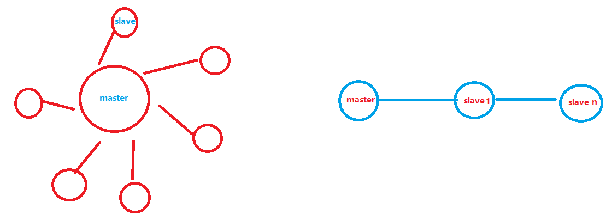
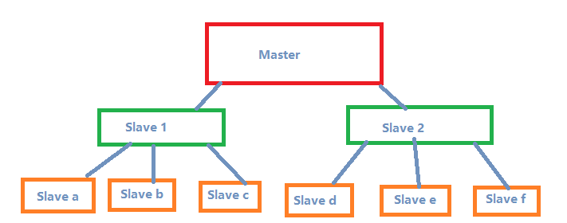
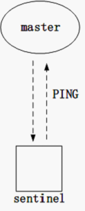
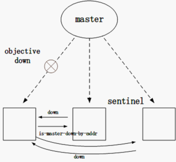
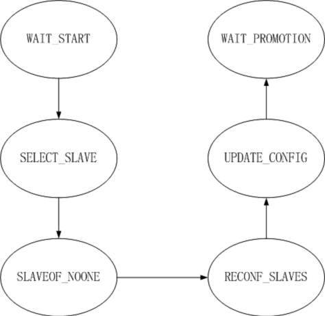
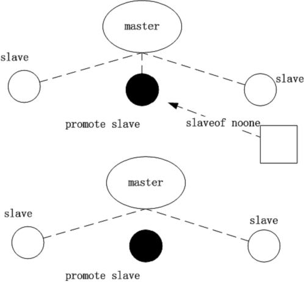
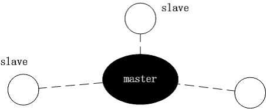
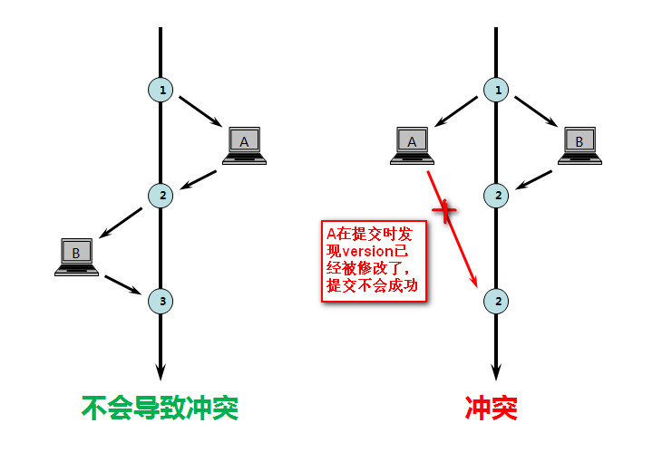
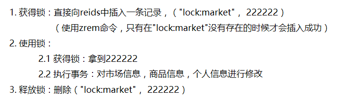
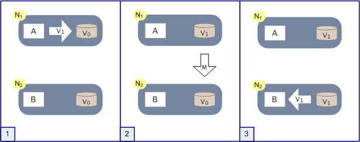

# Redis 分享

## Redis简介

- 远程内存数据库，速度非常快

- 可以存储键（key）和五种不同的值之间的映射

- 可以存储五种基本的数据结构：

  - STRING

  - LIST

  - SET

  - HASH

  - ZSET：有序集合，序是根据集合中每个元素对应的分值来排的

    > ["CL",332538627]
    >
    > ["JX", 352122599]
    >
    > ["JW",654481797]
    >
    > ["JS", 876833508]
    >
    > ["YF",1040488613]
    >
    > ["JY", 1169097469]
    >
    > ["ZX",1224213712]


## 主从复制

主机数据更新后根据配置和策略，自动同步到备机的master/slaver机制，Master以写为主，Slave以读为主

- 主从复制作用
  - 读写分离
  - 容灾恢复
- 两种建立主从关系的方法
  - 在从服务器的配置文件中指定slaveof host port
  - 从服务器发送SLAVEOF host port

### 常用模式



#### 主从节点



- Slave 1 和 Slave 2 是主从节点，可以分担主服务器的复制工作

### 哨兵模式

> sentinel是redis高可用的解决方案，sentinel系统（N个sentinel实例，N >= 1）可以监视一个或者多个redis master服务，以及这些master服务的所有从服务；当某个master服务下线时，自动将该master下的某个从服务升级为master服务替代已下线的master服务继续处理请求。

#### 在线状态监测

哨兵有两种判断用户在线的方法，主观和客观方法。

- 主观：依据是某个哨兵自己的信息
- 客观：依据是由其他监视此 Redis 服务器的哨兵的信息。



主观下线：哨兵凭借的自己的信息判断 Redis 服务器是否下线的方法，称为主观方法，即通过判断前面有提到的 PING 心跳等其他通信时间是否超时来判断主机是否下线。主观的信息有可能是错的。



客观下线：哨兵通过所有其他哨兵报告的主机在线状态来判定某主机是否下线

#### 故障修复

哨兵如果检测主机被大多数的哨兵判定为下线，就很可能会执行故障修复，重新选出一个主机。

故障修复分成了几个步骤完成，每个步骤对应一个状态。



##### WAIT_START

**目的：在哨兵中选出首领**

在哨兵服务器群中，有首领的概念，这个首领可以是系统管理员根据具体情况指定的，也可以是众多的哨兵中按一定的条件选出的。在 WAIT_STATE 中执行故障修复的哨兵首先确定自己是不是首领，如果不是故障修复会被拖延，到下一个定时程序再次检测自己是否为首领，超过一定时间会强制停止故障修复。

**怎么样才可以当选一个首领呢？**每一个哨兵都会有一个当前的配置版本号 current_-epoch，每一个哨兵手里都会有一票投给其中一个配置版本最高的哨兵，它的投票信息将会通过 is-master-down 命令交换。is-master-down 命令在故障修复的时候会被强制触发，收到它的哨兵将会进行投票并返回自己的投票结果，如此一来，执行故障修复的哨兵就能得到其他哨兵的投票结果，它就能确定自己是不是首领了。

##### SELECT_SLAVE

**目的：选出一台候选主机**

SELECT_SLAVE 的意图很明确，因为当前的主机（master）已经挂了，需要重新指定一个主机，候选的服务器就是当前挂掉主机的所有从机（slave）。

1. 当前执行故障修复的哨兵会遍历主机的所有从机，只有足够健康的从机才能被成为候选主机。

2. 如果经过筛选之后有多台从机，那么这些从机会按下面的条件排序：

   1. 从服务器按照 Redis 实例的 redis.conf 文件中配置的 slave-priority 排序。更低的优先级更偏爱。

      ```properties
      # The slave priority is an integer number published by Redis in the INFO output.
      # It is used by Redis Sentinel in order to select a slave to promote into a
      # master if the master is no longer working correctly.
      #
      # A slave with a low priority number is considered better for promotion, so
      # for instance if there are three slaves with priority 10, 100, 25 Sentinel will
      # pick the one with priority 10, that is the lowest.
      #
      # However a special priority of 0 marks the slave as not able to perform the
      # role of master, so a slave with priority of 0 will never be selected by
      # Redis Sentinel for promotion.
      #
      # By default the priority is 100.
      slave-priority 100
      ```

   2. 优先选择主从复制偏移量高的从机，即从机从主机复制的数据越多

   3. 优先选择有 run-id 的从机

   4. 如果上面条件都一样，那么将 run-id 按字典顺序排序

##### SLAVEOF_NOONE

**目的：让候选主机转变成主机**

我们知道，slaveof noone 命令可以让一个从机转变为一个主机，Redis 从机收到会做从从机到主机的转换。发送 slaveof noone 命令之后，哨兵还会向候选主机发送 config rewrite 让候选主机当前配置信息写入配置文件，以方便候选从机下次重启的时候可以恢复。



##### WAIT_PROMOTION

这一状态纯粹是为了等待上一个状态的执行结果（如候选主机的一些状态）被传播到此哨兵上

##### RECONF_SLAVES

**目的：让从机连接新主机**

这一状态主要做的是向其他非候选从机发送 slaveof promote_slave，即让候选主机成为他们的主机。其中会涉及几个 Redis 服务器状态的标记：SRI_RECONF_SENT，SRI_RECONF*INPROG，SRI*-RECONF_DONE，分别表示已经向从机发送 slaveof 命令，从机正在重新配置（这里需要一些时间），配置完成。同样，哨兵是通过 INFO 数据传输中获知这些状态变更的。


##### UPDATE_CONFIG

这里还存在最后一个状态 UPDATE_CONFIG。因为主机和从机发生了修改，所以 sentinel.masters 肯定需要修改，譬如主机的IP 地址和端口，所以最后的工作是将修改并整理哨兵服务器保存的信息。




还有一个问题：故障修复过程中，一直没有发送 SLAVEOF promoted_slave 给旧的主机，因为已经和旧的主机断开连接，哨兵没有选择在故障修复的时候向它发送任何的数据。但在故障修复的最后一个状态中，哨兵依旧有将旧的主机塞到新主机的从机列表中，所以哨兵还是会超时发送 INFO HELLO 等数据，对旧的主机抱有希望。如果因为网络环境的不佳导致的故障修复，那旧的主机很可能恢复过来，只是这时它是一台从机了。

## 锁

### 悲观锁

每次去拿数据的时候都认为别人会修改，所以每次在拿数据的时候都会上锁，这样别人想拿这个数据就会阻塞直到它拿到锁。

### 乐观锁

每次去拿数据的时候都认为别人不会修改，所以不会上锁，但是在更新的时候会判断一下在此期间别人有没有去更新这个数据

- 实现乐观锁：

  - 可以在数据初始化时指定一个版本号，每次对数据的更新操作都对版本号执行+1操作，并判断当前版本号是不是该数据的最新的版本号。

    ```sql
    1.查询出商品信息
    select (status,status,version) from t_goods where id=#{id}
    2.根据商品信息生成订单
    3.修改商品status为2
    update t_goods 
    set status=2,version=version+1
    where id=#{id} and version=#{version};
    ```



- Redis使用WATCH命令来对数据行进行加锁，WATCH命令只会在数据被其他客户端抢先修改了的情况下通知执行这个命令的客户端，而不会阻止其他客户端进行修改

  ```python
  # 购买某件商品
  def purchase_item(conn, buyerid, itemid, sellerid, lprice):
      #...
      		# 监视市场和买家个人信息发生的变化
              pipe.watch("market:", buyer)                

              # 检查商品信息是否发生变化，买家是否有足够的钱来买商品
              price = pipe.zscore("market:", item)        
              funds = int(pipe.hget(buyer, 'funds'))      
              if price != lprice or price > funds:        
                  pipe.unwatch()                          
                  return None

              # 将买家支付的钱转移给卖家，并将卖出的商品转移给买家
              pipe.multi()                                
              pipe.hincrby(seller, 'funds', int(price))   
              pipe.hincrby(buyerid, 'funds', int(-price)) 
              pipe.sadd(inventory, itemid)                
              pipe.zrem("market:", item)                  
              pipe.execute()                              
              return True
     #...
     # 事务如果执行失败，在一定的时间内会反复进行测试
  ```

> 乐观锁VS悲观锁
>
> - 悲观锁：在整个数据处理过程中，将数据处于锁定状态，悲观并发控制主要用于数据争用激烈的环境
>
>
> - 乐观锁：乐观并发控制相信事务之间的数据竞争的概率是比较小的，因此尽可能直接做下去，直到提交的时候才去锁定，所以不会产生任何锁和死锁。

### 分布式锁

简易锁

- 获得锁

  ```java
      public String acquireLock(Jedis conn, String lockName, long acquireTimeout){
          String identifier = UUID.randomUUID().toString();

          long end = System.currentTimeMillis() + acquireTimeout;
          while (System.currentTimeMillis() < end){
              if (conn.setnx("lock:" + lockName, identifier) == 1){
                  return identifier;
              }

              try {
                  Thread.sleep(1);
              }catch(InterruptedException ie){
                  Thread.currentThread().interrupt();
              }
          }

          return null;
      }
  ```

- 使用锁

  ```java
      private boolean purchaseItemWithLock(Jedis jedis, int buyerId, int itemId, int sellerId) {
          String buyer = "users:" + buyerId;
          String seller = "users:" + sellerId;
          String item = itemId + "." + sellerId;
          String inventory = "inventory:" + buyerId;
          String marketName = "market";

          String locked = acquireLock(jedis, marketName);
          if (locked == null) {
              return false;
          }

          try {
              Transaction transaction = jedis.multi();
              Response<Double> price = transaction.zscore(marketName, item);
              Response<String> funds = transaction.hget(buyer, "funds");
              if (price == null || (price.get() > Double.parseDouble(funds.get()))) {
                  return false;
              }
              transaction.hincrBy(seller, "funds", price.get().longValue());
              transaction.hincrBy(buyer, "funds", -price.get().longValue());
              transaction.sadd(inventory, String.valueOf(itemId));
              transaction.zrem(marketName, item);
              transaction.exec();
              return true;
          } finally {
              releaseLock(jedis, marketName, locked);
          }
      }
  ```

- 释放锁

  ```java
      public boolean releaseLock(Jedis conn, String lockName, String identifier) {
          String lockKey = "lock:" + lockName;

          while (true){
              conn.watch(lockKey);
              if (identifier.equals(conn.get(lockKey))){
                  Transaction trans = conn.multi();
                  trans.del(lockKey);
                  List<Object> results = trans.exec();
                  if (results == null){
                      continue;
                  }
                  return true;
              }

              conn.unwatch();
              break;
          }

          return false;
      }
  ```




> 细粒度锁
>
> 只需要修改以下lockName就可以了

> 带有超时限制的锁
>
> ```java
>     public String acquireLockWithTimeout(Jedis conn, String lockName, long acquireTimeout, long lockTimeout) {
>         String identifier = UUID.randomUUID().toString();
>         String lockKey = "lock:" + lockName;
>         int lockExpire = (int)(lockTimeout / 1000);
>
>         long end = System.currentTimeMillis() + acquireTimeout;
>         while (System.currentTimeMillis() < end) {
>             if (conn.setnx(lockKey, identifier) == 1){
>                 conn.expire(lockKey, lockExpire);
>                 return identifier;
>             }
>             if (conn.ttl(lockKey) == -1) {
>                 conn.expire(lockKey, lockExpire);
>             }
>
>             try {
>                 Thread.sleep(1);
>             }catch(InterruptedException ie){
>                 Thread.currentThread().interrupt();
>             }
>         }
>
>         // null indicates that the lock was not acquired
>         return null;
>     }
> ```

## 在分布式数据库中CAP原理

### 传统ACID

- A(Atomicity):原子性
- C(Consistency):一致性
- I(Isolation):独立性
- D(Durability):持久性

### CAP

- C(Consistency):强一致性

  在数据库系统中通常用事务（访问并可能更新数据库中各种数据项的一个程序执行单元）来保证数据的一致性和完整性。而在**分布式系统中，数据一致性往往指的是由于数据的复制，不同数据节点中的数据内容是否完整并且相同**

- A(Availability):可用性

  服务一直可用，而且是正常响应时间

- P(Partition tolerance):分区容错性

  分布式系统在遇到某节点或网络分区故障的时候，仍然能够对外提供满足一致性和可用性的服务

  > eg:
  >
  > 1. 有某一个或者几个机器宕掉了，其他剩下的机器还能够正常运转满足系统需求
  > 2. 机器之间有网络异常，将分布式系统分隔为独立的几个部分，各个部分还能维持分布式系统的运作，这样就具有好的分区容错性

#### CAP理论（三选二）

一个分布式系统最多只能同时满足一致性（Consistency）、可用性（Availability）和分区容错性（Partition tolerance）这三项中的两项

#### CAP理论的证明

证明的切入点

分布式和单机的区别——>区别在于多台机器之间要进行通信和数据传输

1. CAP基本场景

   

   分布式系统中有两个节点N1和N2

   A和B是分布式系统的两个部分，V是分布式系统的数据存储的两个子数据库

   - 在满足一致性的时候，N1和N2中的数据是一样的。
   - 在满足可用性的时候，用户不管是请求N1或者N2，都会得到立即响应。
   - 在满足分区容错性的情况下，N1和N2有任何一方宕机，或者网络不通的时候，都不会影响N1和N2彼此之间的正常运作。

2. 分布式系统正常运转流程

   

   用户向N1机器请求数据更新，程序A更新数据库Vo为V1，分布式系统将数据进行同步操作M，将V1同步的N2中V0，使得N2中的数据V0也更新为V1，N2中的数据再响应N2的请求

3. N1和N2之间的网络断开了

   

   有用户向N1发送数据更新请求，那N1中的数据V0将被更新为V1，此时N2的数据状态还是V0

   这个时候，有用户向N2发送数据读取请求，应用程序没办法立即给用户返回最新的数据V1

   有二种选择：

   - 牺牲数据一致性，响应旧的数据V0给用户
   - 牺牲可用性，阻塞等待，直到网络连接恢复，数据更新操作M完成之后，再给用户响应最新的数据V1

由此证明了要满足分区容错性的分布式系统，只能在一致性和可用性两者中，选择其中一个

如果说为了满足一致性和可用性而让B不可用的话，那就不满足分区容错性了

#### CAP的权衡

- 多数大型互联网应用的场景

  主机众多、部署分散，而且现在的集群规模越来越大，所以节点故障、网络故障是常态，而且要保证服务可用性，即保证P和A，舍弃C（退而求其次保证最终一致性）。

  > **BASE理论：**
  >
  > - 基本可用（Basically Available）
  >
  >   指分布式系统在出现故障的时候，允许损失部分可用性，即保证核心可用。
  >
  >   eg:电商大促时，为了应对访问量激增，部分用户可能会被引导到降级页面，服务层也可能只提供降级服务。这就是损失部分可用性的体现。
  >
  > - 软状态（ Soft State）
  >
  >   软状态是指允许系统存在中间状态，而该中间状态不会影响系统整体可用性。分布式存储中一般一份数据至少会有三个副本，允许不同节点间副本同步的延时就是软状态的体现。
  >
  > - 最终一致性（Eventual Consistency）
  >
  >   最终一致性是指系统中的所有数据副本经过一定时间后，最终能够达到一致的状态。

- 涉及到钱财这样不能有一丝让步的场景

  C必须保证

  - 保证CA，舍弃P，网络发生故障宁可停止服务
  - 保证CP，舍弃A，例如网络故障事只读不写